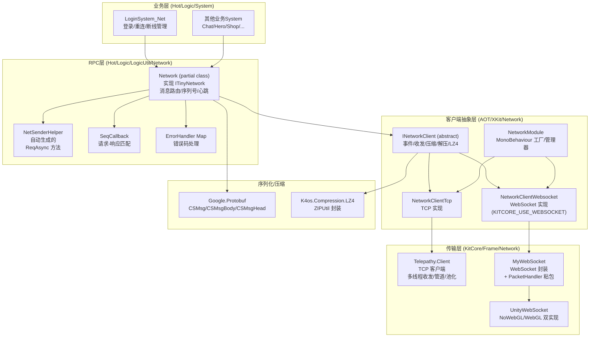
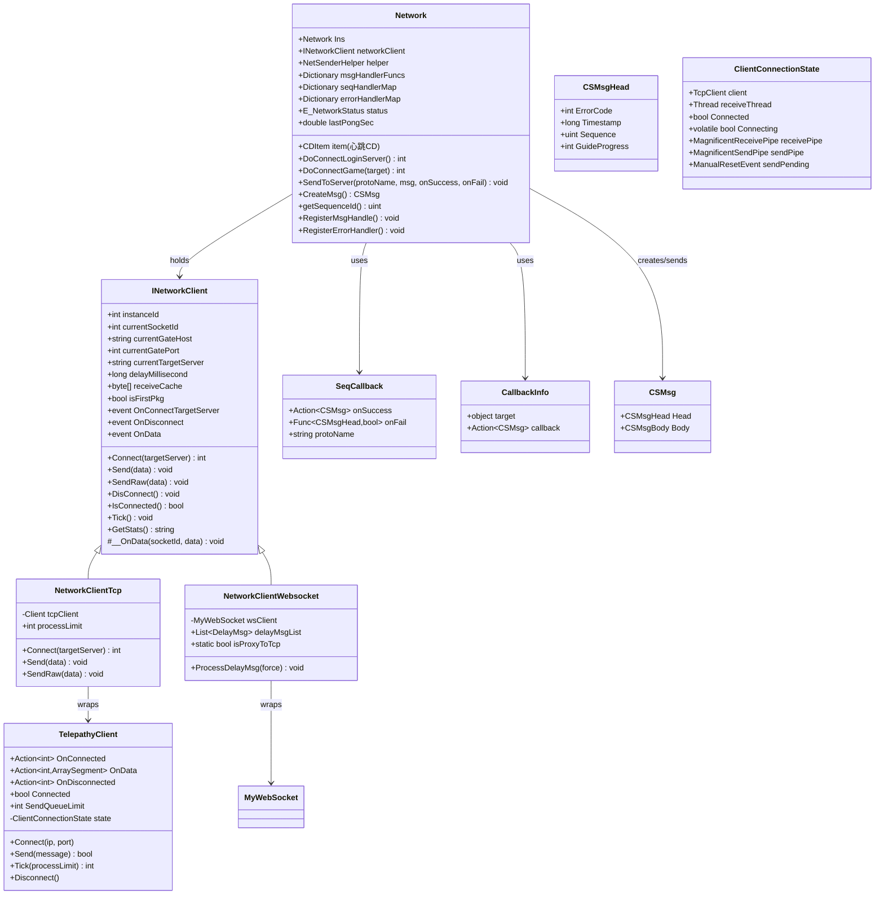
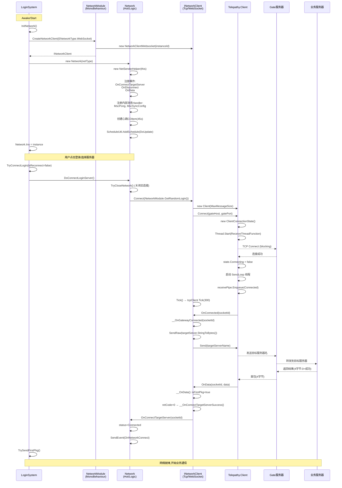
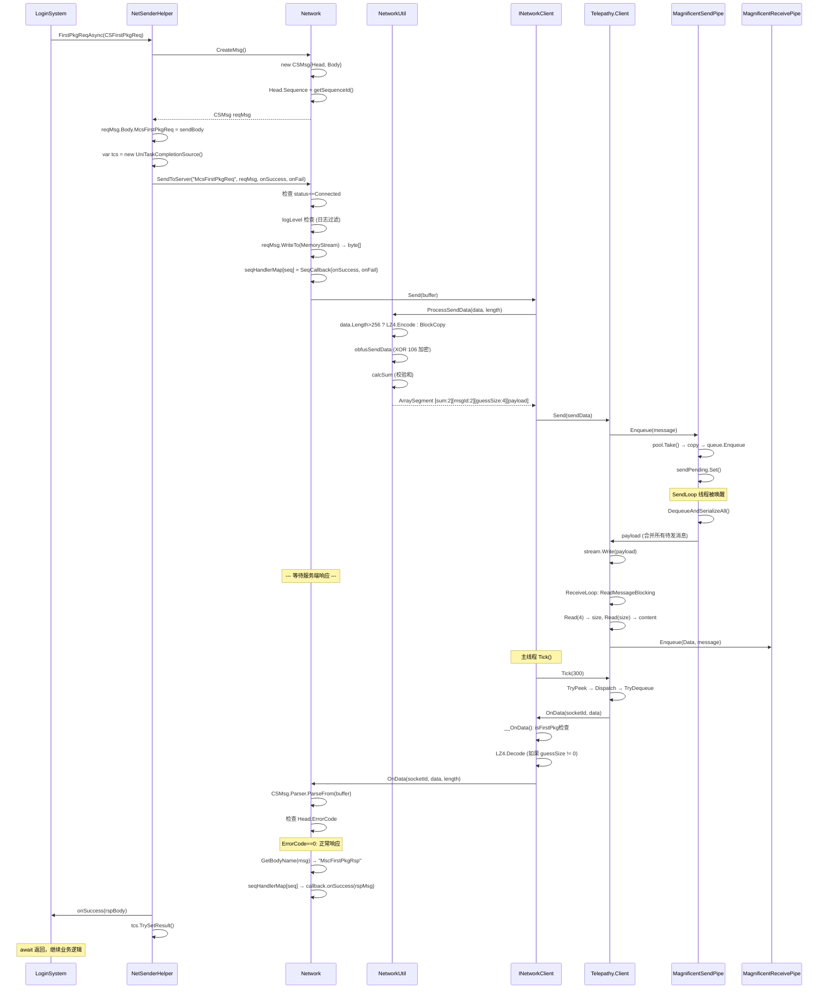
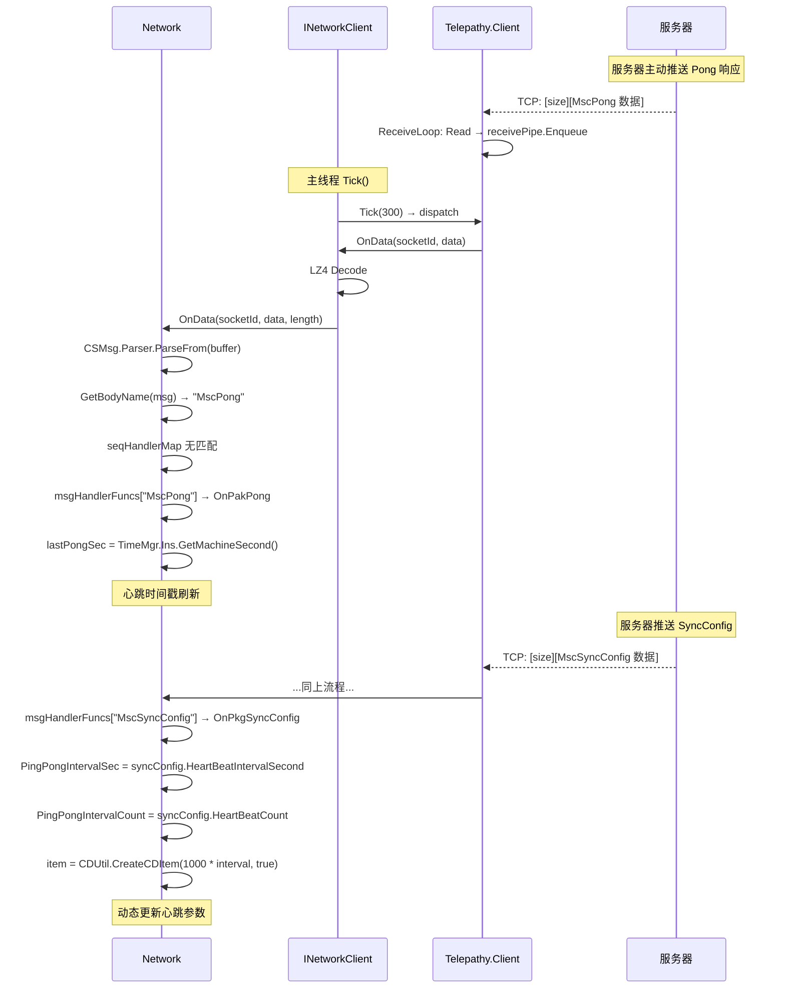
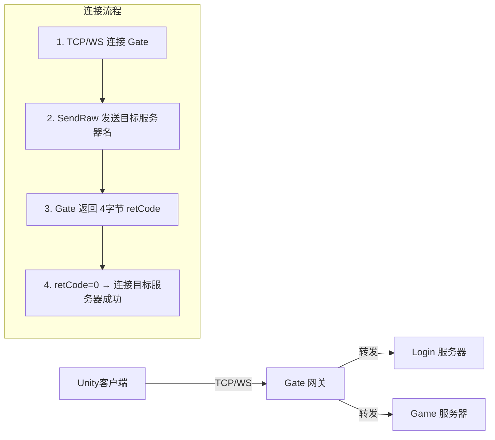

# 底层网络系统 — 架构文档

> 生成日期: 2026-06-24 | 源码分支: main | 基于实际代码分析

---

## 1. 总览

### 1.1 分层架构图



### 1.2 模块职责一览表

| 层 | 模块 | 路径 | 职责 |
|---|---|---|---|
| **传输层** | `Telepathy.Client` | `Assets/Libs/KitCore/.../Telepathy/Client.cs` | TCP Socket 连接/收发/断线；多线程架构（收/发独立线程）；消息管道（Pipe）线程安全传输；字节池（Pool）避免 GC |
| **传输层** | `MyWebSocket` | `Assets/Libs/KitCore/.../WS/MyWebSocket.cs` | WebSocket 封装层，连接管理，代理到 TCP 模式时处理粘包 |
| **传输层** | `PacketHandler` | `Assets/Libs/KitCore/.../WS/PacketHandler.cs` | WebSocket → TCP 代理模式的粘包/半包处理 |
| **传输层** | `UnityWebSocket` | `Assets/Libs/UnityWebSocket/` | WebSocket 底层库，分 NoWebGL/WebGL 双平台实现 |
| **客户端抽象层** | `INetworkClient` | `Assets/Scripts/AOT/.../INetworkClient.cs` | 抽象基类：定义 Connect/Send/SendRaw/DisConnect 接口；LZ4 解压；首包校验（Gate→Server 跳转确认） |
| **客户端抽象层** | `NetworkClientTcp` | `Assets/Scripts/AOT/.../NetworkClientTcp.cs` | TCP 实现：通过 Gate 连接 TargetServer；支持模拟延迟（delayMillisecond） |
| **客户端抽象层** | `NetworkClientWebsocket` | `Assets/Scripts/AOT/.../NetworkWebsocket.cs` | WebSocket 实现：直接 WebSocket 或代理到 TCP；支持延迟消息重放 |
| **客户端抽象层** | `NetworkModule` | `Assets/Scripts/AOT/.../NetworkModule.cs` | MonoBehaviour 单例：创建/管理 NetworkClient 实例；Gate/Login 地址池；Inspector 调试面板 |
| **客户端抽象层** | `NetworkUtil` | `Assets/Scripts/AOT/.../NetworkUtil.cs` | 地址解析；校验和计算；发包加密(XOR)；LZ4 压缩封装 |
| **RPC层** | `Network` | `Assets/Scripts/Hot/Logic/.../Network/Network.cs` (6个 partial 文件) | 核心网络管理器：连接管理、消息路由、心跳、断线处理、错误处理 |
| **RPC层** | `NetSenderHelper` | `Assets/Scripts/Hot/AutoGen/.../ClientNetSender.cs` | 自动生成：为每个 Req 消息生成 `*ReqAsync` 方法 |
| **序列化** | `Google.Protobuf` | `Assets/Libs/Protobuf/` | Protobuf 序列化/反序列化 |
| **压缩** | `ZipUtil` | `Assets/Libs/KitCore/.../CoreUtil/ZipUtil.cs` | LZ4 压缩/解压封装；OpenHarmony 平台使用 32 位模式 |

---

## 2. 核心数据结构

### 2.1 关键类/结构体 类图



### 2.2 字段/生命周期说明

| 类 | 字段 | 用途 | 生命周期 |
|---|---|---|---|
| `INetworkClient` | `receiveCache` | 接收数据的预分配缓冲 (128KB)，避免反复分配 | 伴随 NetworkClient 实例 |
| `INetworkClient` | `isFirstPkg` | 标记是否已收到首包（Gate→Server 跳转确认包） | Connect 时置 true，首包后置 false |
| `INetworkClient` | `currentSocketId` | 当前连接的 socket 标识，用于多连接时过滤过期消息 | Connect 时赋值，DisConnect 时清零 |
| `Network` | `seqHandlerMap` | 请求序列号 → 回调的映射，实现 Request-Response 配对 | 发 Req 时写入，收 Rsp 时查找并删除 |
| `Network` | `msgHandlerFuncs` | 消息名 → 回调的映射，用于监听 Push 消息（如 Sync） | RegisterMsgHandle 时添加，Destroy 时清空 |
| `Network` | `errorHandlerMap` | 错误码 → 处理函数的映射 | RegisterErrorHandler 时添加，Destroy 时清空 |
| `Network` | `item (CDItem)` | 心跳发送的 CD 计时器，间隔由服务器下发 | 构造函数创建，收 SyncConfig 时重建 |
| `Network` | `SequenceCounter` | 自增序列号生成器，> 1,073,741,824 时归 1 | 伴随 Network 实例 |
| `Telepathy.Client` | `state` | 连接状态对象，每次 Connect 新建一个（避免数据竞争） | Connect 时创建，Disconnect 时 Dispose |
| `MagnificentReceivePipe` | `poolList[3]` | 三级字节池 (1KB / 8KB / MaxMessageSize)，减少 GC | 伴随 Pipe 实例 |
| `MagnificentSendPipe` | `pool` | 发送字节池，消息入队时从池取 byte[]，出队发送后归还 | 伴随 Pipe 实例 |

---

## 3. 初始化流程

### 3.1 完整时序图（从启动到就绪）



### 3.2 各步骤触发时机

| 步骤 | 触发时机 | 关键代码 |
|---|---|---|
| `NetworkModule.Awake()` | Unity 场景加载时 | 设置 `Ins = this`，绑定 Telepathy 日志 |
| `LoginSystem.InitNetwork()` | Login 场景 Awake | `NetworkClientWebsocket.isProxyToTcp = false`，创建 Network 实例 |
| `Network 构造` | InitNetwork 中 | 注册所有内部 Handler，启动心跳 Schedule |
| `DoConnectLoginServer()` | 用户点击登录 / 断线重连 | 先 TryCloseNetwork 关闭旧连接，再 Connect |
| `INetworkClient.Connect()` | DoConnectLoginServer 内调用 | 获取随机 Gate 地址，创建 TCP/WS 客户端 |
| `Telepathy.Client.Connect()` | NetworkClientTcp.Connect 内 | 创建新的 ClientConnectionState，启动接收线程 |
| `__OnGatewayConnected` | TCP 连接 Gate 成功 | 发送目标服务器名（SendRaw） |
| `首包校验` | 收到服务端第一个 4 字节包 | `isFirstPkg=true`，校验 retCode，决定成功/失败 |
| `OnConnectTargetServer` | 首包 retCode==0 | 设置 `status=Connected`，发送 `OnNetworkConnect` 事件 |
| `TrySendFirstPkg()` | OnNetworkConnect 回调 | 发送客户端设备信息，建立业务会话 |

---

## 4. 核心业务流程

### 4.1 场景一：完整请求-响应调用链

以 `LoginSystem.TrySendFirstPkg()` 为例，展示从业务层到底层的完整链路。



**关键源码片段 (LoginSystem_Net.cs:55-77):**

```csharp
// 文件: Assets/Scripts/Hot/Logic/System/LoginSystem/LoginSystem_Net.cs:55-77
public void TrySendFirstPkg()
{
    if (isFirstPkgSent) return;
    if (!Network.Ins.IsConnected()) return;
    if (Network.Ins.currentServerType != E_ConnectServerType.Login) return;

    Network.Ins.helper.FirstPkgReqAsync(new CSFirstPkgReq()
    {
        ClientInfo = this.GetClientDeviceInfo(),
        LoginCommonData = this.GetLoginCommonData()
    }, rsp => { isFirstPkgSent = true; });
}
```

**关键源码片段 (ClientNetSender.cs — 自动生成的 ReqAsync 方法):**

```csharp
// 文件: Assets/Scripts/Hot/AutoGen/Gen/ClientNetSender/ClientNetSender.cs:46-77
public async UniTask<(CSMsgHead, SCTestRsp)> TestReqAsync(CSTestReq sendBody,
        Action<SCTestRsp> onSuccess = null, Func<CSMsgHead, bool> onFail = null, int guideProgress = 0)
{
    CSMsgHead retRspHead = null;
    SCTestRsp retRspBody = null;
    var tcs = new UniTaskCompletionSource();
    CSMsg reqMsg = network.CreateMsg();
    reqMsg.Head.GuideProgress = guideProgress;
    reqMsg.Body.McsTestReq = sendBody;

    network.SendToServer(CSMsgBody.BodyOneofOneofCase.McsTestReq.ToString(), reqMsg, (rspMsg) =>
    {
        retRspHead = rspMsg.Head;
        retRspBody = rspMsg.Body.MscTestRsp;
        tcs.TrySetResult();
        onSuccess?.Invoke(retRspBody);
    }, (rspHead) =>
    {
        retRspHead = rspHead;
        tcs.TrySetResult();
        if (onFail != null) return onFail(retRspHead);
        return false;
    });

    await tcs.Task;
    return (retRspHead, retRspBody);
}
```

**关键源码片段 (Network_BasicFunc.cs:43-107 — SendToServer):**

```csharp
// 文件: Assets/Scripts/Hot/Logic/LogicUtil/Network/Network/Network_BasicFunc.cs:43-107
public void SendToServer(string protoName, CSMsg reqMsg,
    Action<CSMsg> _onSuccess = null, Func<CSMsgHead, bool> _onFail = null)
{
    if (status != E_NetworkStatus.Connected)
    {
        if (LogicUtil.IsDebugOrEditor())
            LogMgr.Warn("[Net] pkg: SendToServer not valid:", protoName);
        return;
    }

    if (protoName.EndsWith("Req"))
        RequestWaitingPanel.Show();

    uint seq = reqMsg.Head.Sequence;
    if (_onSuccess != null)
    {
        this.seqHandlerMap[seq] = new SeqCallback
        {
            onSuccess = _onSuccess,
            onFail = _onFail,
            protoName = protoName
        };
    }

    using var ms = new MemoryStream();
    reqMsg.WriteTo(ms);
    byte[] buffer = ms.ToArray();
    this.networkClient.Send(buffer);
}
```

**关键源码片段 (NetworkUtil.cs:116-170 — ProcessSendData):**

```csharp
// 文件: Assets/Scripts/AOT/Main/XKit/Network/NetworkUtil/NetworkUtil.cs:116-170
public static ArraySegment<byte> ProcessSendData(byte[] data, int length)
{
    ArraySegment<byte> retData = null;
    if (data.Length > 256)
    {
        var guessUncompressedSize = tempSendCompressCache.Length - HeadSizeBeforePayload;
        var encodedLength = ZipUtil.Encode(
            data, 0, length,
            tempSendCompressCache, HeadSizeBeforePayload, guessUncompressedSize);
        Telepathy.Utils.IntToBytesLittleEndianNonAlloc(length, tempSendCompressCache, 4);
        retData = new ArraySegment<byte>(tempSendCompressCache, 0, HeadSizeBeforePayload + encodedLength);
    }
    else
    {
        Telepathy.Utils.IntToBytesLittleEndianNonAlloc(0, tempSendCompressCache, 4);
        Buffer.BlockCopy(data, 0, tempSendCompressCache, HeadSizeBeforePayload, length);
        retData = new ArraySegment<byte>(tempSendCompressCache, 0, HeadSizeBeforePayload + length);
    }

    NetworkUtil.obfusSendData(retData.Array, 8, retData.Count - 8);
    ushort sum = NetworkUtil.calcSum(retData.Array, CountOfCheckSeg, retData.Count - CountOfCheckSeg);
    Telepathy.Utils.ShortToBytesLittleEndianNonAlloc(sum, retData.Array, 0);

    return retData;
}
```

### 4.2 场景二：Push 消息接收（心跳 Pong / SyncConfig）



---

## 5. 模块间交互

### 5.1 数据流与依赖关系

```mermaid
flowchart TD
    subgraph "发送方向"
        A1[业务层<br/>构建业务 Req Body] --> A2[NetSenderHelper<br/>CreateMsg + 填充 Body]
        A2 --> A3[Network.SendToServer<br/>绑定 SeqCallback<br/>Protobuf 序列化]
        A3 --> A4[INetworkClient.Send<br/>LZ4 压缩 + XOR 加密<br/>+ 校验和]
        A4 --> A5[Telepathy/MyWebSocket<br/>入队 SendPipe<br/>发送线程写入 Socket]
    end

    subgraph "接收方向"
        B1[Telepathy/MyWebSocket<br/>接收线程读取 Socket<br/>入队 ReceivePipe] --> B2[INetworkClient.__OnData<br/>LZ4 解压<br/>首包判定]
        B2 --> B3[Network.OnReceive<br/>Protobuf 反序列化<br/>ErrorCode 检查]
        B3 --> B4{ErrorCode == 0?}
        B4 -->|是| B5{SeqCallback 存在?}
        B5 -->|是| B6[调用 onSuccess<br/>UniTask 完成]
        B5 -->|否| B7{msgHandlerFuncs 匹配?}
        B7 -->|是| B8[调用对应 Handler<br/>如 OnPakPong]
        B7 -->|否| B9[消息被丢弃]
        B4 -->|否| B10{SeqCallback.onFail?}
        B10 -->|已处理| B11[onFail 返回 true]
        B10 -->|未处理| B12[HandleErrorCode<br/>弹窗/飘字]
    end

    subgraph "生命周期管理"
        C1[NetworkModule.Update<br/>每帧 Tick] --> C2[networkClient.Tick]
        C2 --> C3[Telepathy.Tick<br/>dispatch pipe 消息]
        C3 --> C4[INetworkClient 事件回调]
        C4 --> C5[Network 层事件处理]
    end

    subgraph "心跳机制"
        D1[Network.DoUpdate<br/>每秒检查 CDItem] --> D2{CD 完成?}
        D2 -->|是| D3[helper.Ping<br/>发送 CSPing]
        D2 -->|否| D4[检查超时]
        D4 -->|lastPongSec > interval*count| D5[TryCloseNetwork]
    end
```



### 5.2 关键设计约定

| 约定 | 说明 | 代码证据 |
|---|---|---|
| **Gate 转发模式** | TCP 客户端不直连业务服务器，先连 Gate 服务器，发送目标服务器名，Gate 返回 4 字节确认码 | `NetworkClientTcp.__OnGatewayConnected` 调用 `SendRaw(currentTargetServer.StringToBytes())` |
| **首包协议** | 连接建立后第一个包是 4 字节 int（小端），0=成功，非 0=错误码 | `INetworkClient.__OnData` 中 `isFirstPkg` 分支 |
| **消息帧格式** | `[2:checksum][2:msgId][4:guessUncompressedSize][N:protobuf_payload]` | `NetworkUtil.ProcessSendData` 输出格式 |
| **大包压缩阈值** | 发送数据 > 256 字节时启用 LZ4 压缩 | `NetworkUtil.ProcessSendData` 中 `data.Length > 256` |
| **小端字节序** | 全网使用小端字节序 (LittleEndian) | `Telepathy.Utils` 全部使用 LittleEndian 方法 |
| **XOR 加密** | 校验和之后的数据段与 0x6A (106) 做 XOR | `NetworkUtil.obfusSendData` |
| **校验和范围** | 跳过前 2 字节（校验和本身存放位），对剩余数据计算 IP 校验和 | `NetworkUtil.calcSum` 中 `offset=CountOfCheckSeg(2)` |
| **引用计数面板** | `RequestWaitingPanel` 使用引用计数，支持并发请求 | `refCount++` / `refCount--`，到 0 才关闭 |
| **30 秒超时关闭** | RequestWaitingPanel 超时自动强制关闭 | `HideAllTimeout = 30.0f` |
| **WebSocket isProxyToTcp** | WebSocket 模式下可选代理到 TCP 服务器（4 字节长度前缀） | `MyWebSocket.Send` 中 `isProxyToTcp` 分支 |
| **连接前先关闭** | 每次 Connect 前调用 DisConnect 关闭旧连接 | `DoConnectLoginServer` / `DoConnectGame` 中先 `TryCloseNetwork()` |
| **socketId 过滤** | 每次 Connect 生成新 socketId，回调中检查 socketId 是否匹配，防止旧连接消息串扰 | `OnConnect`/`OnDisconnect`/`OnReceive` 中均有 `socketId != this.currentSocketId` 检查 |

### 5.3 平台差异

| 平台 | 差异点 | 源码位置 |
|---|---|---|
| **Editor** | 断线重连延迟 3s（比真机 1.5s 更宽松） | `LoginSystem_Net.cs:81-83` `ReConnectServerDelay` |
| **真机** | 断线重连延迟 1.5s | `LoginSystem_Net.cs:81-83` |
| **OpenHarmony** | LZ4 使用 32 位模式 (`Enforce32=true`) | `ZipUtil.cs:17` `UNITY_OPENHARMONY` |
| **WebGL** | UnityWebSocket 使用 WebGL 实现 (JavaScript 桥接) | `UnityWebSocket/Scripts/Runtime/Implementation/WebGL/WebSocket.cs` |
| **非 WebGL** | UnityWebSocket 使用 C# Socket 实现 | `UnityWebSocket/Scripts/Runtime/Implementation/NoWebGL/WebSocket.cs` |
| **KITCORE_USE_WEBSOCKET** | 条件编译宏，控制 WebSocket 相关代码是否编译 | `#if KITCORE_USE_WEBSOCKET` 遍布相关文件 |
| **KITCORE_NETWORK_ONLY_CALLBACK** | 条件编译：纯回调模式 vs UniTask 异步模式 | `ClientNetSender.cs` 中两种实现 |

### 5.4 内存管理策略

| 策略 | 实现位置 | 说明 |
|---|---|---|
| **对象池 (Pool\<T\>)** | `Telepathy/Pool.cs` | 泛型对象池，基于 `Stack<T>`，Take 时无则创建，Return 时 Push 回 |
| **三级字节池** | `MagnificentReceivePipe.poolList[3]` | Small(1KB) / Middle(8KB) / Large(MaxMessageSize)，按消息大小选择池 |
| **发送管道池化** | `MagnificentSendPipe.pool` | 每个入队消息从池取 byte[] 复制，出队发送后归还池 |
| **Peek+Dequeue 模式** | `MagnificentReceivePipe` | 先 TryPeek 处理，处理完再 TryDequeue 归还字节到池 |
| **预分配 receiveCache** | `INetworkClient.receiveCache = new byte[128*1024]` | 一次分配，反复使用，小消息直接解压到此缓冲 |
| **发送缓冲复用** | `NetworkUtil.tempSendCompressCache` | 静态数组，单线程使用（Unity 主线程） |
| **CSMsg 在 using 中创建** | `SendToServer` 中 `using var ms = new MemoryStream()` | MemoryStream 用完即释放 |
| **Disconnect 后不清 ReceivePipe** | `ClientConnectionState.Dispose` | 注释说明：Disconnected 消息仍需被 Tick 处理 |

---

## 6. 附录

### 6.1 源码路径索引表

| 模块 | 文件 | 说明 |
|---|---|---|
| **Telepathy 传输** | `Assets/Libs/KitCore/Scripts/Frame/Network/Telepathy/Client.cs` | TCP 客户端（多线程） |
| | `Assets/Libs/KitCore/Scripts/Frame/Network/Telepathy/Common.cs` | 公共基类（NoDelay, MaxMessageSize, Timeout） |
| | `Assets/Libs/KitCore/Scripts/Frame/Network/Telepathy/ConnectionState.cs` | 连接状态（TcpClient + SendPipe + ManualResetEvent） |
| | `Assets/Libs/KitCore/Scripts/Frame/Network/Telepathy/ThreadFunctions.cs` | 静态收发线程函数 |
| | `Assets/Libs/KitCore/Scripts/Frame/Network/Telepathy/EventType.cs` | 事件枚举（Connected/Data/Disconnected） |
| | `Assets/Libs/KitCore/Scripts/Frame/Network/Telepathy/MagnificentReceivePipe.cs` | 接收管道（三级字节池） |
| | `Assets/Libs/KitCore/Scripts/Frame/Network/Telepathy/MagnificentSendPipe.cs` | 发送管道（合并消息批量写入） |
| | `Assets/Libs/KitCore/Scripts/Frame/Network/Telepathy/Pool.cs` | 泛型对象池（Stack\<T\>） |
| | `Assets/Libs/KitCore/Scripts/Frame/Network/Telepathy/Utils.cs` | 小端序/大端序字节转换 |
| | `Assets/Libs/KitCore/Scripts/Frame/Network/Telepathy/NetworkStreamExtensions.cs` | ReadSafely / ReadExactly |
| **WebSocket 传输** | `Assets/Libs/KitCore/Scripts/Frame/Network/WS/MyWebSocket.cs` | WebSocket 封装层 |
| | `Assets/Libs/KitCore/Scripts/Frame/Network/WS/PacketHandler.cs` | TCP 粘包处理器 |
| | `Assets/Libs/UnityWebSocket/Scripts/Runtime/Core/IWebSocket.cs` | WebSocket 接口定义 |
| | `Assets/Libs/UnityWebSocket/Scripts/Runtime/Implementation/NoWebGL/WebSocket.cs` | 非 WebGL 平台实现 |
| | `Assets/Libs/UnityWebSocket/Scripts/Runtime/Implementation/WebGL/WebSocket.cs` | WebGL 平台实现 |
| **客户端抽象层** | `Assets/Scripts/AOT/Main/XKit/Network/NetworkClient/INetworkClient.cs` | 抽象基类 |
| | `Assets/Scripts/AOT/Main/XKit/Network/NetworkClient/NetworkClientTcp.cs` | TCP 实现 |
| | `Assets/Scripts/AOT/Main/XKit/Network/NetworkClient/NetworkWebsocket.cs` | WebSocket 实现 |
| | `Assets/Scripts/AOT/Main/XKit/Network/NetworkModule/NetworkModule.cs` | 工厂/管理器 |
| | `Assets/Scripts/AOT/Main/XKit/Network/NetworkModule/NetworkModule_Debug.cs` | 调试面板按钮 |
| | `Assets/Scripts/AOT/Main/XKit/Network/NetworkUtil/NetworkUtil.cs` | 地址解析/校验/加密/压缩 |
| **RPC 层** | `Assets/Scripts/Hot/Logic/LogicUtil/Network/Network/Network.cs` | 主文件：字段/构造/Destroy/DoUpdate |
| | `Assets/Scripts/Hot/Logic/LogicUtil/Network/Network/Network_BasicFunc.cs` | Connect/SendToServer/TryCloseNetwork |
| | `Assets/Scripts/Hot/Logic/LogicUtil/Network/Network/Network_BasicEvent.cs` | OnConnect/OnDisconnect/OnReceive |
| | `Assets/Scripts/Hot/Logic/LogicUtil/Network/Network/Network_BasicRegister.cs` | RegisterMsgHandle/RegisterErrorHandler/HandleErrorCode |
| | `Assets/Scripts/Hot/Logic/LogicUtil/Network/Network/Network_RegisterEvent.cs` | 内部消息Handler 注册/Pong/SyncConfig |
| | `Assets/Scripts/Hot/Logic/LogicUtil/Network/Network/Network_Util.cs` | getSequenceId/CreateMsg/GetBodyName |
| | `Assets/Scripts/Hot/Logic/LogicUtil/Network/Common.cs` | CallbackInfo/SeqCallback/E_ConnectServerType |
| | `Assets/Scripts/Hot/Logic/LogicUtil/Network/ErrorCodeNet.cs` | 错误码枚举 |
| **网络 UI** | `Assets/Scripts/Hot/Logic/LogicUtil/Network/NetworkUI/RequestWaitingPanel.cs` | 请求等待面板 |
| | `Assets/Scripts/Hot/Logic/LogicUtil/Network/NetworkUI/RequestWaitingPanel_Util.cs` | 等待面板工具方法 |
| **自动生成** | `Assets/Scripts/Hot/AutoGen/Gen/ClientNetSender/ClientNetSender.cs` | NetSenderHelper + ITinyNetwork |
| **事件定义** | `Assets/Scripts/Hot/Logic/Event/EventNetwork.cs` | OnNetworkConnect/OnNetworkDisConnect 等 |
| **压缩** | `Assets/Libs/KitCore/Scripts/Frame/CoreUtil/ZipUtil.cs` | LZ4 压缩/解压，OpenHarmony 适配 |

### 6.2 常用 API 速查表

| API | 所在类 | 说明 |
|---|---|---|
| `Network.Ins.DoConnectLoginServer()` | Network | 连接 Login 服务器 |
| `Network.Ins.DoConnectGame(address)` | Network | 连接 Game 服务器 |
| `Network.Ins.IsConnected()` | Network | 检查连接状态 |
| `Network.Ins.helper.XXXReqAsync(body)` | NetSenderHelper | 发送某业务请求（自动生成） |
| `Network.Ins.helper.Ping(new CSPing())` | NetSenderHelper | 发送心跳 |
| `Network.Ins.RegisterMsgHandle(protoName, cb, target)` | Network | 注册 Push 消息监听 |
| `Network.Ins.RegisterErrorHandler(errorCode, cb)` | Network | 注册错误码处理 |
| `Network.Ins.CreateMsg()` | Network | 创建带 Head/Body 的消息对象 |
| `RequestWaitingPanel.Show()` | RequestWaitingPanel | 显示等待面板（引用计数+1） |
| `RequestWaitingPanel.Hide()` | RequestWaitingPanel | 隐藏等待面板（引用计数-1） |
| `NetworkModule.Ins.DelaySecond` | NetworkModule | Inspector 调节模拟延迟（秒） |
| `NetworkModuole.Ins.SetGate_Login_Info(gates, logins)` | NetworkModule | 设置 Gate/Login 服务器地址列表 |

### 6.3 protobuf 消息结构速查

```
CSMsg
├── Head: CSMsgHead
│   ├── ErrorCode: int (0=成功)
│   ├── Timestamp: long (服务器毫秒时间戳)
│   ├── Sequence: uint (客户端序列号，用于请求-响应匹配)
│   └── GuideProgress: int (引导进度)
└── Body: CSMsgBody
    └── BodyOneofCase (oneof 字段)
        ├── McsPing / MscPong (心跳)
        ├── McsSyncConfig (同步配置)
        ├── McsFirstPkgReq / MscFirstPkgRsp (首包)
        ├── McsLoginReq / MscLoginRsp (登录)
        └── ... (其他业务消息)
```

### 6.4 网络连接架构



### 6.5 设计约定与注意事项

1. **线程模型**：Telepathy 使用三线程模型 — 主线程（Unity/Tick）、接收线程（ReceiveLoop）、发送线程（SendLoop）。管道（Pipe）是线程间通信的唯一桥梁，全部使用 `lock(this)` 保证线程安全。

2. **数据结构线程隔离**：`ClientConnectionState` 在每次 Connect 时全新创建，避免旧线程（dieing thread）的数据竞争。这是 Telepathy 设计的核心安全保证。

3. **消息合并发送**：`MagnificentSendPipe.DequeueAndSerializeAll` 将队列中的所有待发消息合并到一个 payload 数组，一次 `stream.Write` 写入，减少 TCP 系统调用次数。

4. **Peek+Dequeue 模式**：接收管道采用先 Peek 再 Dequeue 的模式 — Peek 时管道持有 byte[] 所有权，Dequeue 才归还给池。这保证了处理期间 byte[] 不会被重用。

5. **首包机制存在原因**：因为客户端连接的是 Gate（网关）而非直接连接业务服务器。Gate 需要知道客户端想连哪个业务服务器，所以客户端在 Gate 连接成功后立即发送目标服务器名字符串。Gate 返回 4 字节确认码（0=成功），此后才算真正连接到目标服务器。

6. **心跳参数动态下发**：心跳间隔（PingPongIntervalSec）和心跳超时次数（PingPongIntervalCount）不是硬编码的，由服务器通过 `MscSyncConfig` 消息动态下发。`Network.OnPkgSyncConfig` 收到后重建 CDItem。

7. **Sequence 计数器上限**：`SequenceCounter` 在超过 1,073,741,824 后归 1（不是归 0），保留一定安全余量。这个值足够支撑长时间运行而不溢出。

8. **压缩策略**：发送数据 ≤ 256 字节时不压缩（guessSize=0），接收端直接 BlockCopy；> 256 字节时使用 LZ4 压缩。接收端通过读 guessSize 字段判断是否需要解压。

9. **XOR 加密范围**：校验和之后的数据部分（跳过前 8 字节头部）与 0x6A 做异或。校验和本身不参与加密。加密范围 = `retData.Count - 8`。

10. **主动关闭不触发断线事件**：`DisConnect()` 会将 `currentSocketId` 清零，后续回调检查 socketId 不匹配时直接 return，从而抑制 `OnDisconnect` 事件。这是为了避免主动关闭被误认为网络异常。

11. **日志分级**：`__NetLogLevel` 支持按消息类型配置日志级别（NoPrint 到 HideAll），心跳消息（Ping/Pong）默认 Trace 级别，减少日志噪音。

12. **平台分支**：WebSocket 路径通过 `#if KITCORE_USE_WEBSOCKET` 条件编译控制，非 WebSocket 构建时这部分代码完全不存在。LZ4 在 OpenHarmony 平台强制执行 32 位模式（`LZ4Codec.Enforce32=true`）。

---

## 7. 完整源代码

### 文件: Assets/Libs/KitCore/Scripts/Frame/Network/Telepathy/Common.cs

```csharp
namespace Telepathy
{
    public abstract class Common
    {
        public bool NoDelay = true;
        public readonly int MaxMessageSize;
        public int SendTimeout = 5000;
        public int ReceiveTimeout = 0;

        protected Common(int MaxMessageSize)
        {
            this.MaxMessageSize = MaxMessageSize;
        }
    }
}
```

---

### 文件: Assets/Libs/KitCore/Scripts/Frame/Network/Telepathy/EventType.cs

```csharp
namespace Telepathy
{
    public enum EventType
    {
        Connected,
        Data,
        Disconnected
    }
}
```

---

### 文件: Assets/Libs/KitCore/Scripts/Frame/Network/Telepathy/Pool.cs

```csharp
using System;
using System.Collections.Generic;

namespace Telepathy
{
    public class Pool<T>
    {
        readonly Stack<T> objects = new Stack<T>();
        readonly Func<T> objectGenerator;

        public Pool(Func<T> objectGenerator)
        {
            this.objectGenerator = objectGenerator;
        }

        public T Take() => objects.Count > 0 ? objects.Pop() : objectGenerator();
        public void Return(T item) => objects.Push(item);
        public void Clear() => objects.Clear();
        public int Count() => objects.Count;
    }
}
```

---

### 文件: Assets/Libs/KitCore/Scripts/Frame/Network/Telepathy/Utils.cs

```csharp
namespace Telepathy
{
    public static class Utils
    {
        public static void IntToBytesBigEndianNonAlloc(int value, byte[] bytes, int offset = 0)
        {
            bytes[offset] = (byte) (value >> 24);
            bytes[offset + 1] = (byte) (value >> 16);
            bytes[offset + 2] = (byte) (value >> 8);
            bytes[offset + 3] = (byte) value;
        }

        public static int BytesToIntBigEndian(byte[] bytes, int offset)
        {
            return (bytes[offset] << 24) |
                   (bytes[1 + offset] << 16) |
                   (bytes[2 + offset] << 8) |
                   bytes[3 + offset];
        }

        public static void ShortToBytesLittleEndianNonAlloc(ushort value, byte[] bytes, int offset = 0)
        {
            bytes[offset + 1] = (byte) (value >> 8);
            bytes[offset] = (byte) value;
        }

        public static void IntToBytesLittleEndianNonAlloc(int value, byte[] bytes, int offset = 0)
        {
            bytes[offset + 3] = (byte) (value >> 24);
            bytes[offset + 2] = (byte) (value >> 16);
            bytes[offset + 1] = (byte) (value >> 8);
            bytes[offset] = (byte) value;
        }

        public static int BytesToIntLittleEndian(byte[] bytes, int offset)
        {
            return (bytes[3 + offset] << 24) |
                   (bytes[2 + offset] << 16) |
                   (bytes[1 + offset] << 8) |
                   bytes[offset];
        }
    }
}
```

---

### 文件: Assets/Libs/KitCore/Scripts/Frame/Network/Telepathy/NetworkStreamExtensions.cs

```csharp
using System;
using System.IO;
using System.Net.Sockets;

namespace Telepathy
{
    public static class NetworkStreamExtensions
    {
        public static int ReadSafely(this NetworkStream stream, byte[] buffer, int offset, int size)
        {
            try
            {
                return stream.Read(buffer, offset, size);
            }
            catch (IOException)
            {
                return 0;
            }
            catch (ObjectDisposedException)
            {
                return 0;
            }
        }

        public static bool ReadExactly(this NetworkStream stream, byte[] buffer, int amount)
        {
            int bytesRead = 0;
            while (bytesRead < amount)
            {
                int remaining = amount - bytesRead;
                int result = stream.ReadSafely(buffer, bytesRead, remaining);
                if (result == 0)
                    return false;
                bytesRead += result;
            }
            return true;
        }
    }
}
```

---

### 文件: Assets/Libs/KitCore/Scripts/Frame/Network/Telepathy/ConnectionState.cs

```csharp
using System.Net.Sockets;
using System.Threading;

namespace Telepathy
{
    public class ConnectionState
    {
        public TcpClient client;
        public readonly MagnificentSendPipe sendPipe;
        public ManualResetEvent sendPending = new ManualResetEvent(false);

        public ConnectionState(TcpClient client, int MaxMessageSize)
        {
            this.client = client;
            sendPipe = new MagnificentSendPipe(MaxMessageSize);
        }
    }
}
```

---

### 文件: Assets/Libs/KitCore/Scripts/Frame/Network/Telepathy/MagnificentSendPipe.cs

```csharp
using System;
using System.Collections.Generic;

namespace Telepathy
{
    public class MagnificentSendPipe
    {
        readonly Queue<ArraySegment<byte>> queue = new Queue<ArraySegment<byte>>();
        Pool<byte[]> pool;
        private int MaxMessageSize = 0;

        public MagnificentSendPipe(int MaxMessageSize)
        {
            pool = new Pool<byte[]>(() => new byte[MaxMessageSize]);
            this.MaxMessageSize = MaxMessageSize;
        }

        public int Count
        {
            get { lock (this) { return queue.Count; } }
        }

        public int PoolCount
        {
            get { lock (this) { return pool.Count(); } }
        }

        public int MemorySize
        {
            get { lock (this) { return pool.Count() * MaxMessageSize; } }
        }

        public void Enqueue(ArraySegment<byte> message)
        {
            lock (this)
            {
                byte[] bytes = pool.Take();
                Buffer.BlockCopy(message.Array, message.Offset, bytes, 0, message.Count);
                ArraySegment<byte> segment = new ArraySegment<byte>(bytes, 0, message.Count);
                queue.Enqueue(segment);
            }
        }

        public bool DequeueAndSerializeAll(ref byte[] payload, out int packetSize)
        {
            lock (this)
            {
                packetSize = 0;
                if (queue.Count == 0)
                    return false;

                packetSize = 0;
                foreach (ArraySegment<byte> message in queue)
                    packetSize += 4 + message.Count;

                if (payload == null || payload.Length < packetSize)
                    payload = new byte[packetSize];

                int position = 0;
                while (queue.Count > 0)
                {
                    ArraySegment<byte> message = queue.Dequeue();
                    Utils.IntToBytesLittleEndianNonAlloc(message.Count, payload, position);
                    position += 4;
                    Buffer.BlockCopy(message.Array, message.Offset, payload, position, message.Count);
                    position += message.Count;
                    pool.Return(message.Array);
                }

                return true;
            }
        }

        public void Clear()
        {
            lock (this)
            {
                while (queue.Count > 0)
                {
                    pool.Return(queue.Dequeue().Array);
                }
            }
        }
    }
}
```

---

### 文件: Assets/Libs/KitCore/Scripts/Frame/Network/Telepathy/MagnificentReceivePipe.cs

```csharp
using System;
using System.Collections.Generic;

namespace Telepathy
{
    public class MagnificentReceivePipe
    {
        struct Entry
        {
            public int connectionId;
            public EventType eventType;
            public ArraySegment<byte> data;

            public Entry(int connectionId, EventType eventType, ArraySegment<byte> data)
            {
                this.connectionId = connectionId;
                this.eventType = eventType;
                this.data = data;
            }
        }

        readonly Queue<Entry> queue = new Queue<Entry>();
        Pool<byte[]>[] poolList = new Pool<byte[]>[3];
        Dictionary<int, int> queueCounter = new Dictionary<int, int>();

        private const int SmallPoolSize = 1024;
        private const int MiddlePoolSize = 1024 * 8;
        private int MaxMessageSize = 0;

        public MagnificentReceivePipe(int MaxMessageSize)
        {
            this.MaxMessageSize = MaxMessageSize;
            poolList[0] = new Pool<byte[]>(() => new byte[SmallPoolSize]);
            poolList[1] = new Pool<byte[]>(() => new byte[MiddlePoolSize]);
            poolList[2] = new Pool<byte[]>(() => new byte[MaxMessageSize]);
        }

        private int getPoolIdx(int size)
        {
            if (size <= SmallPoolSize) return 0;
            else if (size <= MiddlePoolSize) return 1;
            return 2;
        }

        public int Count(int connectionId)
        {
            lock (this)
            {
                return queueCounter.TryGetValue(connectionId, out int count) ? count : 0;
            }
        }

        public int TotalCount
        {
            get { lock (this) { return queue.Count; } }
        }

        public int PoolCount
        {
            get
            {
                lock (this)
                {
                    return poolList[0].Count() + poolList[1].Count() + poolList[2].Count();
                }
            }
        }

        public int MemorySize
        {
            get
            {
                lock (this)
                {
                    return poolList[0].Count() * SmallPoolSize
                         + poolList[1].Count() * MiddlePoolSize
                         + poolList[2].Count() * MaxMessageSize;
                }
            }
        }

        public void Enqueue(int connectionId, EventType eventType, ArraySegment<byte> message)
        {
            lock (this)
            {
                ArraySegment<byte> segment = default;
                if (message != default)
                {
                    byte[] bytes = poolList[getPoolIdx(message.Count)].Take();
                    Buffer.BlockCopy(message.Array, message.Offset, bytes, 0, message.Count);
                    segment = new ArraySegment<byte>(bytes, 0, message.Count);
                }

                Entry entry = new Entry(connectionId, eventType, segment);
                queue.Enqueue(entry);

                int oldCount = Count(connectionId);
                queueCounter[connectionId] = oldCount + 1;
            }
        }

        public bool TryPeek(out int connectionId, out EventType eventType, out ArraySegment<byte> data)
        {
            connectionId = 0;
            eventType = EventType.Disconnected;
            data = default;

            lock (this)
            {
                if (queue.Count > 0)
                {
                    Entry entry = queue.Peek();
                    connectionId = entry.connectionId;
                    eventType = entry.eventType;
                    data = entry.data;
                    return true;
                }
                return false;
            }
        }

        public bool TryDequeue()
        {
            lock (this)
            {
                if (queue.Count > 0)
                {
                    Entry entry = queue.Dequeue();
                    if (entry.data != default)
                    {
                        poolList[getPoolIdx(entry.data.Count)].Return(entry.data.Array);
                    }
                    queueCounter[entry.connectionId]--;
                    if (queueCounter[entry.connectionId] == 0)
                        queueCounter.Remove(entry.connectionId);
                    return true;
                }
                return false;
            }
        }

        public void Clear()
        {
            lock (this)
            {
                while (queue.Count > 0)
                {
                    Entry entry = queue.Dequeue();
                    if (entry.data != default)
                    {
                        poolList[getPoolIdx(entry.data.Count)].Return(entry.data.Array);
                    }
                }
                queueCounter.Clear();
            }
        }
    }
}
```

---

### 文件: Assets/Libs/KitCore/Scripts/Frame/Network/Telepathy/ThreadFunctions.cs

```csharp
using System;
using System.Net.Sockets;
using System.Threading;

namespace Telepathy
{
    public static class ThreadFunctions
    {
        public static bool SendMessagesBlocking(NetworkStream stream, byte[] payload, int packetSize)
        {
            try
            {
                stream.Write(payload, 0, packetSize);
                return true;
            }
            catch (Exception exception)
            {
                Log.Info("[Telepathy] Send: stream.Write exception: " + exception);
                return false;
            }
        }

        public static bool ReadMessageBlocking(NetworkStream stream, int MaxMessageSize,
            byte[] headerBuffer, byte[] payloadBuffer, out int size)
        {
            size = 0;

            if (payloadBuffer.Length != 4 + MaxMessageSize)
            {
                Log.Error($"[Telepathy] ReadMessageBlocking: payloadBuffer needs to be of size 4 + MaxMessageSize = {4 + MaxMessageSize} instead of {payloadBuffer.Length}");
                return false;
            }

            if (!stream.ReadExactly(headerBuffer, 4))
                return false;

            size = Utils.BytesToIntLittleEndian(headerBuffer, 0);

            if (size > 0 && size <= MaxMessageSize)
            {
                return stream.ReadExactly(payloadBuffer, size);
            }
            Log.Warning("[Telepathy] ReadMessageBlocking: possible header attack with a header of: " + size + " bytes.");
            return false;
        }

        public static void ReceiveLoop(int connectionId, TcpClient client, int MaxMessageSize,
            MagnificentReceivePipe receivePipe, int QueueLimit)
        {
            NetworkStream stream = client.GetStream();
            byte[] receiveBuffer = new byte[4 + MaxMessageSize];
            byte[] headerBuffer = new byte[4];

            try
            {
                receivePipe.Enqueue(connectionId, EventType.Connected, default);

                while (true)
                {
                    if (!ReadMessageBlocking(stream, MaxMessageSize, headerBuffer, receiveBuffer, out int size))
                        break;

                    ArraySegment<byte> message = new ArraySegment<byte>(receiveBuffer, 0, size);
                    receivePipe.Enqueue(connectionId, EventType.Data, message);

                    if (receivePipe.Count(connectionId) >= QueueLimit)
                    {
                        Log.Warning($"[Telepathy] receivePipe reached limit of {QueueLimit} for connectionId {connectionId}. This can happen if network messages come in way faster than we manage to process them. Disconnecting this connection for load balancing.");
                        break;
                    }
                }
            }
            catch (Exception exception)
            {
                Log.Info("[Telepathy] ReceiveLoop: finished receive function for connectionId=" + connectionId + " reason: " + exception);
            }
            finally
            {
                stream.Close();
                client.Close();
                receivePipe.Enqueue(connectionId, EventType.Disconnected, default);
            }
        }

        public static void SendLoop(int connectionId, TcpClient client,
            MagnificentSendPipe sendPipe, ManualResetEvent sendPending)
        {
            NetworkStream stream = client.GetStream();
            byte[] payload = null;

            try
            {
                while (client.Connected)
                {
                    sendPending.Reset();

                    if (sendPipe.DequeueAndSerializeAll(ref payload, out int packetSize))
                    {
                        if (!SendMessagesBlocking(stream, payload, packetSize))
                            break;
                    }

                    sendPending.WaitOne();
                }
            }
            catch (ThreadAbortException) { }
            catch (ThreadInterruptedException) { }
            catch (Exception exception)
            {
                Log.Info("[Telepathy] SendLoop Exception: connectionId=" + connectionId + " reason: " + exception);
            }
            finally
            {
                stream.Close();
                client.Close();
            }
        }
    }
}
```

---

### 文件: Assets/Libs/KitCore/Scripts/Frame/Network/Telepathy/Client.cs

```csharp
using System;
using System.Net.Sockets;
using System.Threading;

namespace Telepathy
{
    class ClientConnectionState : ConnectionState
    {
        public Thread receiveThread;

        public bool Connected => client != null &&
                                 client.Client != null &&
                                 client.Client.Connected;

        public volatile bool Connecting;

        public readonly MagnificentReceivePipe receivePipe;

        public ClientConnectionState(int MaxMessageSize) : base(new TcpClient(), MaxMessageSize)
        {
            receivePipe = new MagnificentReceivePipe(MaxMessageSize);
        }

        public void Dispose()
        {
            client.Close();
            receiveThread?.Interrupt();
            Connecting = false;
            sendPipe.Clear();
            client = null;
        }
    }

    public class Client : Common
    {
        public Action<int> OnConnected;
        public Action<int, ArraySegment<byte>> OnData;
        public Action<int> OnDisconnected;

        public int SendQueueLimit = 10000;
        public int ReceiveQueueLimit = 10000;

        ClientConnectionState state;

        public bool Connected => state != null && state.Connected;
        public bool Connecting => state != null && state.Connecting;

        public int SendMemorySize => state != null ? state.sendPipe.MemorySize : 0;
        public int ReceiveMemorySize => state != null ? state.receivePipe.MemorySize : 0;
        public int SendPipeCount => state != null ? state.sendPipe.Count : 0;
        public int SendPipePoolCount => state != null ? state.sendPipe.PoolCount : 0;
        public int ReceivePipePoolCount => state != null ? state.receivePipe.PoolCount : 0;
        public int ReceivePipeCount => state != null ? state.receivePipe.TotalCount : 0;

        private static int _ID_COUNTER = 0;
        public int SocketID = 0;

        public Client(int MaxMessageSize) : base(MaxMessageSize)
        {
            this.SocketID = ++_ID_COUNTER;
        }

        static void ReceiveThreadFunction(ClientConnectionState state, string ip, int port,
            int MaxMessageSize, bool NoDelay, int SendTimeout, int ReceiveTimeout, int ReceiveQueueLimit)
        {
            Thread sendThread = null;

            try
            {
                state.client.Connect(ip, port);
                state.Connecting = false;

                state.client.NoDelay = NoDelay;
                state.client.SendTimeout = SendTimeout;
                state.client.ReceiveTimeout = ReceiveTimeout;

                sendThread = new Thread(() => {
                    ThreadFunctions.SendLoop(0, state.client, state.sendPipe, state.sendPending);
                });
                sendThread.IsBackground = true;
                sendThread.Start();

                ThreadFunctions.ReceiveLoop(0, state.client, MaxMessageSize,
                    state.receivePipe, ReceiveQueueLimit);
            }
            catch (SocketException exception)
            {
                Log.Info("[Telepathy] Client Recv: failed to connect to ip=" + ip + " port=" + port + " reason=" + exception);
            }
            catch (ThreadInterruptedException) { }
            catch (ThreadAbortException) { }
            catch (ObjectDisposedException) { }
            catch (Exception exception)
            {
                Log.Error("[Telepathy] Client Recv Exception: " + exception);
            }

            state.receivePipe.Enqueue(0, EventType.Disconnected, default);
            sendThread?.Interrupt();
            state.Connecting = false;
            state.client?.Close();
        }

        public void Connect(string ip, int port)
        {
            if (Connecting || Connected)
            {
                Log.Warning("[Telepathy] Client can not create connection because an existing connection is connecting or connected");
                return;
            }

            state = new ClientConnectionState(MaxMessageSize);
            state.Connecting = true;
            state.client.Client = null;

            state.receiveThread = new Thread(() => {
                ReceiveThreadFunction(state, ip, port, MaxMessageSize,
                    NoDelay, SendTimeout, ReceiveTimeout, ReceiveQueueLimit);
            });
            state.receiveThread.IsBackground = true;
            state.receiveThread.Start();
        }

        public void Disconnect()
        {
            if (Connecting || Connected)
            {
                state.Dispose();
            }
        }

        public bool Send(ArraySegment<byte> message)
        {
            if (Connected)
            {
                if (message.Count <= MaxMessageSize)
                {
                    if (state.sendPipe.Count < SendQueueLimit)
                    {
                        state.sendPipe.Enqueue(message);
                        state.sendPending.Set();
                        return true;
                    }
                    else
                    {
                        Log.Warning($"[Telepathy] Client.Send: sendPipe reached limit of {SendQueueLimit}. This can happen if we call send faster than the network can process messages. Disconnecting to avoid ever growing memory & latency.");
                        state.client.Close();
                        return false;
                    }
                }
                Log.Error("[Telepathy] Client.Send: message too big: " + message.Count + ". Limit: " + MaxMessageSize);
                return false;
            }
            Log.Warning("[Telepathy] Client.Send: not connected!");
            return false;
        }

        public int Tick(int processLimit, Func<bool> checkEnabled = null)
        {
            if (state == null)
                return 0;

            for (int i = 0; i < processLimit; ++i)
            {
                if (checkEnabled != null && !checkEnabled())
                    break;

                if (state.receivePipe.TryPeek(out int _, out EventType eventType, out ArraySegment<byte> message))
                {
                    try
                    {
                        switch (eventType)
                        {
                            case EventType.Connected:
                                OnConnected?.Invoke(SocketID);
                                break;
                            case EventType.Data:
                                OnData?.Invoke(SocketID, message);
                                break;
                            case EventType.Disconnected:
                                OnDisconnected?.Invoke(SocketID);
                                break;
                        }
                    }
                    catch (Exception e)
                    {
                        Log.Error("[Telepathy] Error: " + eventType + "  : " + e.ToString());
                    }

                    state.receivePipe.TryDequeue();
                }
                else break;
            }

            return state.receivePipe.TotalCount;
        }
    }
}
```

---

### 文件: Assets/Libs/KitCore/Scripts/Frame/Network/WS/PacketHandler.cs

```csharp
#if KITCORE_USE_WEBSOCKET
using System;

namespace KitCore.Frame.Network
{
    public class PacketHandler
    {
        private byte[] buffer = new byte[1024];
        private int bufferLength = 0;

        public void OnReceive(byte[] data, Action<byte[]> onPacket)
        {
            EnsureBufferCapacity(bufferLength + data.Length);

            Array.Copy(data, 0, buffer, bufferLength, data.Length);
            bufferLength += data.Length;

            while (bufferLength >= 4)
            {
                int packetLength = Telepathy.Utils.BytesToIntLittleEndian(buffer, 0);
                if (bufferLength >= 4 + packetLength)
                {
                    byte[] completePacket = new byte[packetLength];
                    Array.Copy(buffer, 4, completePacket, 0, packetLength);
                    Array.Copy(buffer, 4 + packetLength, buffer, 0,
                        bufferLength - 4 - packetLength);
                    bufferLength -= (4 + packetLength);
                    onPacket(completePacket);
                }
                else
                {
                    break;
                }
            }
        }

        private void EnsureBufferCapacity(int requiredCapacity)
        {
            if (buffer.Length < requiredCapacity)
            {
                int newCapacity = Math.Max(buffer.Length * 2, requiredCapacity);
                Array.Resize(ref buffer, newCapacity);
            }
        }
    }
}
#endif
```

---

### 文件: Assets/Libs/KitCore/Scripts/Frame/Network/WS/MyWebSocket.cs

```csharp
#if KITCORE_USE_WEBSOCKET
using System;
using UnityWebSocket;

namespace KitCore.Frame.Network
{
    public class MyWebSocket
    {
        private bool isProxyToTcp = false;
        public static int Counter = 0;
        public WebSocket socket;
        public int socketId = 0;

        public event Action<int> OnConnect;
        public event Action<int, byte[]> OnData;
        public event Action<int, string> OnDisconnect;

        private PacketHandler packetHandler;
        private bool isClosedCalled = false;

        public MyWebSocket(string url, bool isProxyToTcp)
        {
            this.isProxyToTcp = isProxyToTcp;
            if (isProxyToTcp)
            {
                packetHandler = new PacketHandler();
            }

            socket = new WebSocket(url);
            socket.OnOpen += this.HandleOnConnect;
            socket.OnMessage += this.HandleOnMessage;
            socket.OnClose += this.HandleOnClose;
            socket.OnError += this.HandleOnError;
            socketId = ++Counter;
        }

        public void ConnectAsync()
        {
            isClosedCalled = false;
            socket.ConnectAsync();
        }

        public void HandleOnConnect(object t, OpenEventArgs e)
        {
            OnConnect?.Invoke(this.socketId);
        }

        public void HandleOnClose(object t, CloseEventArgs e)
        {
            if (this.isClosedCalled) return;
            this.isClosedCalled = true;
            OnDisconnect?.Invoke(this.socketId, e.Reason);
        }

        public void HandleOnError(object t, ErrorEventArgs e)
        {
            if (this.isClosedCalled) return;
            this.isClosedCalled = true;
            OnDisconnect?.Invoke(this.socketId, e.Message);
        }

        private void OnFullPacket(byte[] data)
        {
            OnData?.Invoke(this.socketId, data);
        }

        public void HandleOnMessage(object t, MessageEventArgs e)
        {
            if (e.IsBinary)
            {
                if (isProxyToTcp)
                {
                    packetHandler.OnReceive(e.RawData, this.OnFullPacket);
                }
                else
                {
                    OnData?.Invoke(this.socketId, e.RawData);
                }
            }
            else if (e.IsText)
            {
                LogMgr.Error("onMessage", e.Data);
            }
        }

        public void Disconnect()
        {
            socket.CloseAsync();
        }

        public bool IsConnected()
        {
            if (socket == null) return false;
            if (socket.ReadyState == WebSocketState.Open) return true;
            return false;
        }

        public void Send(byte[] data)
        {
            if (isProxyToTcp)
            {
                byte[] withLenData = new byte[data.Length + 4];
                Telepathy.Utils.IntToBytesLittleEndianNonAlloc(data.Length, withLenData);
                Buffer.BlockCopy(data, 0, withLenData, 4, data.Length);
                socket.SendAsync(withLenData);
            }
            else
            {
                socket.SendAsync(data);
            }
        }
    }
}
#endif
```

---

### 文件: Assets/Scripts/AOT/Main/XKit/Network/NetworkClient/INetworkClient.cs

```csharp
using System;
using K4os.Compression.LZ4;
using KitCore.Frame;

namespace XKit
{
    public abstract class INetworkClient
    {
        public int instanceId;
        public ENetworkType networkType;
        protected byte[] receiveCache = new byte[NetworkUtil.MaxReceiveMessageSize];

        public string currentGateHost;
        public int currentGatePort;
        public string currentTargetServer;
        protected bool isFirstPkg = true;
        public int currentSocketId = 0;

        public event Action<int> OnConnectTargetServer;
        public event Action<int, string> OnDisconnect;
        public event Action<int, byte[], int> OnData;

        public abstract int Connect(string _targetServer);
        public abstract void SendRaw(byte[] data);
        public abstract void Send(byte[] data);
        public abstract bool IsConnected();
        public abstract void DisConnect();

        protected void TriggerOnGatewayConnect(int socketId)
        {
            LogMgr.Debug(
                $"[Net] Connect Gate Success [{currentGateHost}:{currentGatePort} => {currentTargetServer}], id:{socketId}");
        }

        protected void TriggerOnConnectTargetServerSuccess(int socketId)
        {
            LogMgr.Debug(
                $"[Net] Connect Target Server Success [{currentGateHost}:{currentGatePort} => {currentTargetServer}], id:{this.currentSocketId}");
            TriggerManager.Trigger(E_TriggerType.on_net_connect_target_server_success);
            OnConnectTargetServer?.Invoke(socketId);
        }

        protected void TriggerOnConnectTargetServerFail(int socketId, int errorCode)
        {
            LogMgr.Debug(
                $"[Net] Connect Target Server Fail, ErrorCode: {errorCode}, [{currentGateHost}:{currentGatePort} => {currentTargetServer}], id:{this.currentSocketId}");
        }

        protected void TriggerOnDisconnect(int socketId, string reason)
        {
            LogMgr.Debug(
                $"[Net] OnDisconnected [{currentGateHost}:{currentGatePort} => {currentTargetServer}], id:{socketId} reason:{reason}");
            TriggerManager.Trigger(E_TriggerType.on_net_disconnect, socketId);
            OnDisconnect?.Invoke(socketId, reason);
        }

        protected void TriggerOnData(int socketId, byte[] data, int length)
        {
            OnData?.Invoke(socketId, data, length);
        }

        public abstract void __OnGatewayConnected(int socketId);
        public abstract void __OnDisconnected(int socketId, string reason);
        public abstract void __OnConnectTargetServerSuccess(int socketId);
        public abstract void __OnConnectTargetServerFail(int socketId, int errorCode);

        public void __OnData(int socketId, ArraySegment<byte> data)
        {
            if (this.currentSocketId == 0) return;
            if (this.currentSocketId != socketId)
            {
                LogMgr.Warn("TcpClient OnData Error: socketId not match", this.currentSocketId, socketId);
                return;
            }

            countOfReceive++;
            totalReceive += NetworkUtil.__calcSizeTcp(true, data.Count);

            if (isFirstPkg)
            {
                isFirstPkg = false;
                if (data.Count != 4)
                {
                    __OnConnectTargetServerFail(socketId, -1);
                    return;
                }

                int retCode = Telepathy.Utils.BytesToIntLittleEndian(data.Array, 0);
                if (retCode == 0)
                {
                    __OnConnectTargetServerSuccess(socketId);
                }
                else
                {
                    __OnConnectTargetServerFail(socketId, retCode);
                }
                return;
            }

            const int offset = 2;
            const int protobufDataStartAt = 6;
            int protobufDataLength = data.Count - protobufDataStartAt;

            var guessedOutputLength = Telepathy.Utils.BytesToIntLittleEndian(data.Array, offset);

            if (guessedOutputLength != 0)
            {
                if (guessedOutputLength > NetworkUtil.MaxReceiveMessageSize)
                {
                    if (guessedOutputLength > NetworkUtil.MaxReceiveMessageSize * 100)
                    {
                        LogMgr.Error(
                            $"guessedOutputLength is too large:  guessedOutputLength:{guessedOutputLength} , protobufDataLength:{protobufDataLength}");
                        return;
                    }

                    byte[] unzipData = new byte[guessedOutputLength];
                    int decoded = LZ4Codec.Decode(data.Array, protobufDataStartAt, protobufDataLength,
                        unzipData, 0, guessedOutputLength);
                    if (decoded != guessedOutputLength)
                    {
                        LogMgr.Error(
                            $"Decode error decoded: {decoded}, guessedOutputLength:{guessedOutputLength} , protobufDataLength:{protobufDataLength}");
                        return;
                    }

                    TriggerOnData(socketId, unzipData, guessedOutputLength);
                }
                else
                {
                    int decoded = LZ4Codec.Decode(data.Array, protobufDataStartAt, protobufDataLength,
                        receiveCache, 0, guessedOutputLength);
                    if (decoded != guessedOutputLength)
                    {
                        LogMgr.Error(
                            $"Decode error decoded: {decoded}, guessedOutputLength:{guessedOutputLength} , protobufDataLength:{protobufDataLength}");
                        return;
                    }
                    TriggerOnData(socketId, receiveCache, guessedOutputLength);
                }
            }
            else
            {
                Buffer.BlockCopy(data.Array, protobufDataStartAt, receiveCache, 0, protobufDataLength);
                TriggerOnData(socketId, receiveCache, protobufDataLength);
            }
        }

        public long delayMillisecond = 0;
        public abstract void Tick();
        public abstract string GetStats();

        public long totalReceive = 0;
        public long countOfReceive = 0;
        public long totalSend = 0;
        public long countOfSend = 0;

        public void ResetSendReceiveInfo()
        {
            totalReceive = 0;
            countOfReceive = 0;
            totalSend = 0;
            countOfSend = 0;
        }
    }
}
```

---

### 文件: Assets/Scripts/AOT/Main/XKit/Network/NetworkClient/NetworkClientTcp.cs

```csharp
using System;
using KitCore.Basic;
using KitCore.Frame;
using Telepathy;

namespace XKit
{
    public class NetworkClientTcp : INetworkClient
    {
        private Client tcpClient;
        public int processLimit = 300;

        public NetworkClientTcp(ENetworkType _networkType, int instanceId)
        {
            networkType = _networkType;
            this.instanceId = instanceId;
        }

        public override int Connect(string _targetServer)
        {
            DisConnect();
            if (_targetServer.Length == 0)
            {
                LogMgr.Error("Connect server is Empty");
                return 0;
            }

            currentTargetServer = _targetServer;
            isFirstPkg = true;

            string _gateAddress = NetworkModule.Ins.GetRandomGate();
            LogMgr.Info($"Connect Gate: {_gateAddress}  targetServer:{_targetServer}");
            if (!NetworkUtil.SplitAddress(_gateAddress, out var _gateHost, out var _gatePort))
            {
                LogMgr.Error($"Address Error  gate:{_gateAddress}, targetServer:{_targetServer}");
                return 0;
            }

            currentGateHost = _gateHost;
            currentGatePort = _gatePort;
            tcpClient = new Client(NetworkUtil.MaxReceiveMessageSize);
            tcpClient.OnConnected = __OnGatewayConnected;
            tcpClient.OnDisconnected = (v) => { this.__OnDisconnected(v, ""); };
            tcpClient.OnData = __OnData;

            tcpClient.Connect(currentGateHost, currentGatePort);
            currentSocketId = tcpClient.SocketID;

            return currentSocketId;
        }

        public override void SendRaw(byte[] data)
        {
            if (tcpClient == null) return;

            countOfSend++;
            totalSend += NetworkUtil.__calcSizeTcp(true, data.Length + 4);

            if (data.Length > NetworkUtil.MaxReceiveMessageSize)
            {
                LogMgr.Error("Send Error: Pkg too large", data.Length);
                return;
            }
            tcpClient.Send(data);
        }

        public override void Send(byte[] data)
        {
            if (tcpClient == null) return;

            var sendData = NetworkUtil.ProcessSendData(data, data.Length);

            if (sendData.Count > NetworkUtil.MaxReceiveMessageSize)
            {
                LogMgr.Error("Send Error: Pkg too large", data.Length, sendData.Count);
                return;
            }

            countOfSend++;
            totalSend += NetworkUtil.__calcSizeTcp(true, sendData.Count + 4);
            tcpClient.Send(sendData);
        }

        public override bool IsConnected()
        {
            if (tcpClient == null) return false;
            return tcpClient.Connected;
        }

        public override void DisConnect()
        {
            tcpClient?.Disconnect();
            currentSocketId = 0;
        }

        public override void __OnGatewayConnected(int socketId)
        {
            TriggerOnGatewayConnect(socketId);
            SendRaw(currentTargetServer.StringToBytes());
        }

        public override void __OnDisconnected(int socketId, string reason)
        {
            if (tcpClient != null && socketId != currentSocketId) return;
            TriggerOnDisconnect(socketId, reason);
        }

        public override void __OnConnectTargetServerSuccess(int socketId)
        {
            TriggerOnConnectTargetServerSuccess(socketId);
        }

        public override void __OnConnectTargetServerFail(int socketId, int errorCode)
        {
            TriggerOnConnectTargetServerFail(socketId, errorCode);
        }

        private long lastTickTime = 0;

        public override void Tick()
        {
            if (tcpClient == null) return;

            if (delayMillisecond == 0)
            {
                tcpClient.Tick(processLimit);
            }
            else
            {
                long currentTickTime = TimeMgr.Ins.GetMachineMillisecond();
                if (currentTickTime - lastTickTime > delayMillisecond)
                {
                    lastTickTime = currentTickTime;
                    var rangeValue = RandUtil.Default.RandomInt(0, 100);
                    if (rangeValue < 20)
                    {
                        tcpClient.Tick(1);
                    }
                    else if (rangeValue < 70)
                    {
                        tcpClient.Tick(RandUtil.Default.RandomInt(1, 10));
                    }
                    else
                    {
                        tcpClient.Tick(RandUtil.Default.RandomInt(1, processLimit));
                    }
                }
            }
        }

        public override string GetStats()
        {
            if (tcpClient == null) return "IsNull";
            return
                $"RM: {tcpClient.ReceiveMemorySize / 1024f / 1024f:f2} MB; SM: {tcpClient.SendMemorySize / 1024f / 1024f:f2} MB; " +
                $"R [Pipe: {tcpClient.ReceivePipeCount}; Pool: {tcpClient.ReceivePipePoolCount}];  " +
                $"S [Pipe: {tcpClient.SendPipeCount}; Pool: {tcpClient.SendPipePoolCount}]";
        }
    }
}
```

---

### 文件: Assets/Scripts/AOT/Main/XKit/Network/NetworkClient/NetworkWebsocket.cs

```csharp
#if KITCORE_USE_WEBSOCKET

using System;
using System.Collections.Generic;
using KitCore.Frame;
using KitCore.Frame.Network;
using UnityEngine.Networking;

namespace XKit
{
    public class DelayMsg
    {
        public int socketId;
        public byte[] data;
        public long receiveTimeMS;

        public DelayMsg(int _socketId, byte[] _data, long _receiveTimeMS)
        {
            socketId = _socketId;
            data = _data;
            receiveTimeMS = _receiveTimeMS;
        }
    }

    public partial class NetworkClientWebsocket : INetworkClient
    {
        public static bool isProxyToTcp = true;
        private MyWebSocket wsClient;
        public List<DelayMsg> delayMsgList = new List<DelayMsg>();

        public NetworkClientWebsocket(ENetworkType _networkType, int instanceId)
        {
            networkType = _networkType;
            this.instanceId = instanceId;
        }

        public override int Connect(string _targetServer)
        {
            DisConnect();
            if (_targetServer.Length == 0)
            {
                LogMgr.Error("Connect server is Empty");
                return 0;
            }

            currentTargetServer = _targetServer;
            isFirstPkg = true;

            currentGateHost = NetworkModule.Ins.GetRandomGate();
            currentTargetServer = _targetServer;
            isFirstPkg = true;
            string connectUrl = $"{currentGateHost}?backend={UnityWebRequest.EscapeURL(_targetServer)}";
            LogMgr.Info("Connect", connectUrl);
            wsClient = new MyWebSocket(connectUrl, NetworkClientWebsocket.isProxyToTcp);
            currentSocketId = wsClient.socketId;
            wsClient.OnConnect += this.__OnGatewayConnected;
            wsClient.OnDisconnect += (_id, _reason) => { this.__OnDisconnected(_id, _reason); };
            wsClient.OnData += (_id, _data) => { this.OnDataWrap(_id, _data); };
            wsClient.ConnectAsync();

            return currentSocketId;
        }

        protected void OnDataWrap(int socketId, byte[] data)
        {
            if (this.currentSocketId == 0) return;
            if (this.currentSocketId != socketId)
            {
                LogMgr.Warn("OnData Error: socketId not match", this.currentSocketId, socketId);
                return;
            }

            if (this.delayMillisecond > 0)
            {
                byte[] copyData = new byte[data.Length];
                Buffer.BlockCopy(data, 0, copyData, 0, data.Length);
                delayMsgList.Add(new DelayMsg(socketId, copyData, TimeMgr.Ins.GetMachineMillisecond()));
            }
            else
            {
                ProcessDelayMsg(true);
                this.__OnData(socketId, data);
            }
        }

        public override void SendRaw(byte[] data)
        {
            if (wsClient == null) return;
            countOfSend++;
            totalSend += data.Length;
            wsClient.Send(data);
        }

        public override void Send(byte[] data)
        {
            if (wsClient == null) return;

            var sendData = NetworkUtil.ProcessSendData(data, data.Length);
            if (sendData.Count > NetworkUtil.MaxReceiveMessageSize)
            {
                LogMgr.Error("Send Error: Pkg too large", sendData.Count);
                return;
            }

            this.SendRaw(sendData.ToArray());
        }

        public override bool IsConnected()
        {
            return wsClient?.IsConnected() ?? false;
        }

        public override void DisConnect()
        {
            wsClient?.Disconnect();
            currentSocketId = 0;
        }

        public override void __OnGatewayConnected(int socketId)
        {
            TriggerOnGatewayConnect(socketId);
        }

        public override void __OnDisconnected(int socketId, string reason)
        {
            if (wsClient == null) return;
            if (wsClient != null && socketId != currentSocketId) return;
            TriggerOnDisconnect(socketId, reason);
        }

        public override void __OnConnectTargetServerSuccess(int socketId)
        {
            TriggerOnConnectTargetServerSuccess(socketId);
        }

        public override void __OnConnectTargetServerFail(int socketId, int errorCode)
        {
            TriggerOnConnectTargetServerFail(socketId, errorCode);
        }

        public void ProcessDelayMsg(bool force)
        {
            if (delayMsgList.Count <= 0) return;

            long currentTime = TimeMgr.Ins.GetMachineMillisecond();
            for (int i = 0; i < delayMsgList.Count; i++)
            {
                var delayMsg = delayMsgList[i];
                if (!force && currentTime - delayMsg.receiveTimeMS < delayMillisecond)
                {
                    break;
                }

                delayMsgList.RemoveAt(i);
                i--;
                __OnData(delayMsg.socketId, delayMsg.data);
            }
        }

        public override void Tick()
        {
            this.ProcessDelayMsg(false);
        }

        public override string GetStats()
        {
            if (wsClient == null) return "null";
            return
                $"Id: {instanceId}-{currentSocketId} " +
                $"R: {CoreUtil.GetReadableSize(totalReceive)}  S: {CoreUtil.GetReadableSize(totalSend)}";
        }
    }
}
#endif
```

---

### 文件: Assets/Scripts/AOT/Main/XKit/Network/NetworkModule/NetworkModule.cs

```csharp
using System.Collections.Generic;
using KitCore.Basic;
using KitCore.Frame;
using Sirenix.OdinInspector;
using UnityEngine;

namespace XKit
{
    public enum ENetworkType
    {
        TCP = 1,
        WebSocket = 2,
    }

    public partial class NetworkModule : MonoBehaviour
    {
        public static NetworkModule Ins;
        public static int InstanceCounter = 0;
        public List<INetworkClient> networkClientList = new List<INetworkClient>();

        private float _delaySecond = 0;

        [ShowInInspector]
        public float DelaySecond
        {
            get { return _delaySecond; }
            set
            {
                _delaySecond = value;
                foreach (var network in networkClientList)
                {
                    network.delayMillisecond = (long)(_delaySecond * 1000);
                }
            }
        }

        public List<string> gateList = new();
        public List<string> loginList = new();

        public void SetGate_Login_Info(List<string> _gateList, List<string> _loginList)
        {
            gateList = _gateList;
            loginList = _loginList;
        }

        public string GetRandomGate()
        {
            return gateList[RandUtil.Default.RandomInt(0, gateList.Count)];
        }

        public string GetRandomLogin()
        {
            return loginList[RandUtil.Default.RandomInt(0, loginList.Count)];
        }

        public INetworkClient CreateNetworkClient(ENetworkType type)
        {
            INetworkClient network = null;
            switch (type)
            {
                case ENetworkType.TCP:
                    network = new NetworkClientTcp(type, ++NetworkModule.InstanceCounter);
                    break;
#if KITCORE_USE_WEBSOCKET
                case ENetworkType.WebSocket:
                    network = new NetworkClientWebsocket(type, ++NetworkModule.InstanceCounter);
                    break;
#endif
            }

            network.delayMillisecond = (long)(DelaySecond * 1000);
            this.networkClientList.Add(network);
            return network;
        }

        public bool DeleteNetworkClient(int instanceId)
        {
            for (int i = 0; i < networkClientList.Count; i++)
            {
                if (networkClientList[i].instanceId == instanceId)
                {
                    TryCloseNetworkInstance(instanceId);
                    networkClientList.RemoveAt(i);
                    return true;
                }
            }

            LogMgr.Error("DeleteNetworkInstance not found", instanceId);
            return false;
        }

        public INetworkClient GetNetworkByInstanceId(int instanceId)
        {
            for (int i = 0; i < networkClientList.Count; i++)
            {
                if (networkClientList[i].instanceId == instanceId)
                {
                    return networkClientList[i];
                }
            }
            return null;
        }

        public INetworkClient GetNetworkByIdx(int idx)
        {
            if (idx >= networkClientList.Count) return null;
            return networkClientList[idx];
        }

        public void TryCloseNetworkInstance(int instanceId, bool withRemove = false)
        {
            for (int i = 0; i < networkClientList.Count; i++)
            {
                if (networkClientList[i].instanceId == instanceId)
                {
                    if (networkClientList[i].IsConnected())
                    {
                        networkClientList[i].DisConnect();
                    }

                    if (withRemove)
                    {
                        networkClientList.RemoveAt(i);
                    }
                    return;
                }
            }
        }

        public void CloseAll(bool withClear, bool forceTriggerJS)
        {
            foreach (var network in networkClientList)
            {
                if (network.IsConnected())
                {
                    int tempCurrentId = network.currentSocketId;
                    network.DisConnect();
                }
            }

            if (withClear)
            {
                networkClientList.Clear();
            }
        }

        public void Awake()
        {
            Ins = this;
            Telepathy.Log.Info = (content) => { LogMgr._DoLog(false, content, LogMgr.LogLevel.Debug); };
            Telepathy.Log.Warning = (content) => { LogMgr._DoLog(false, content, LogMgr.LogLevel.Warn); };
            Telepathy.Log.Error = (content) => { LogMgr._DoLog(false, content, LogMgr.LogLevel.Error); };
        }

        public void Update()
        {
            foreach (var network in networkClientList)
            {
                network.Tick();
            }
        }

        public void OnDestroy()
        {
            CloseAll(true, false);
        }
    }
}
```

---

### 文件: Assets/Scripts/AOT/Main/XKit/Network/NetworkUtil/NetworkUtil.cs

```csharp
using System;
using KitCore.Frame;

namespace XKit
{
    public partial class NetworkUtil
    {
        public static int MaxReceiveMessageSize = 128 * 1024;
        public const int CountOfCheckSeg = 2;

        public static bool SplitAddress(string address, out string host, out int port)
        {
            String[] arr = address.Split(':');
            if (arr.Length < 2)
            {
                host = "";
                port = 0;
                return false;
            }

            host = arr[0];
            port = Int32.Parse(arr[1]);
            return true;
        }

        public static ushort calcSum(byte[] data, int offset, int payloadCountWithOutSum)
        {
            int sum = 0;
            int length = payloadCountWithOutSum;
            int index = offset;
            while (length > 1)
            {
                sum = sum + (((int)(data[index])) << 8) + (int)(data[index + 1]);
                index += 2;
                length -= 2;
            }

            if (length > 0)
            {
                sum += (int)(data[index]);
            }

            sum += sum >> 16;
            return (ushort)(~sum);
        }

        public static void obfusSendData(byte[] data, int offset, int count)
        {
            if (offset + count > data.Length)
            {
                LogMgr.Error($"processData error: {offset} {count} ---> {data.Length}");
            }

            byte xorBit = 106;

            int end = offset + count;
            for (int i = offset; i < end; i++)
            {
                data[i] ^= xorBit;
            }
        }

        public static int __calcSizeTcp(bool calcWithDefaultTCPHead, int __size)
        {
            if (calcWithDefaultTCPHead)
            {
                if (__size < 46)
                {
                    __size = 46;
                }
                else
                {
                    __size += 40;
                }
            }

            return __size;
        }

        protected static int HeadSizeBeforePayload = 8;
        private static byte[] tempSendCompressCache = new byte[1024 * 128 + HeadSizeBeforePayload];

        public static ArraySegment<byte> ProcessSendData(byte[] data, int length)
        {
            ArraySegment<byte> retData = null;
            if (data.Length > 256)
            {
                var guessUncompressedSize = tempSendCompressCache.Length - HeadSizeBeforePayload;

                try
                {
                    var encodedLength = ZipUtil.Encode(
                        data, 0, length,
                        tempSendCompressCache, HeadSizeBeforePayload, guessUncompressedSize);
                    if (encodedLength <= 0)
                    {
                        LogMgr.Error("Send Error: LZ4 Encode Error", length, encodedLength);
                        return null;
                    }
                    Telepathy.Utils.IntToBytesLittleEndianNonAlloc(length, tempSendCompressCache, 4);
                    retData =
                        new ArraySegment<byte>(tempSendCompressCache, 0, HeadSizeBeforePayload + encodedLength);
                }
                catch (Exception e)
                {
                    LogMgr.Error("Send Error: LZ4 Encode Error", length, e.ToString());
                    return null;
                }
            }
            else
            {
                Telepathy.Utils.IntToBytesLittleEndianNonAlloc(0, tempSendCompressCache, 4);
                Buffer.BlockCopy(data, 0, tempSendCompressCache, HeadSizeBeforePayload, length);
                retData = new ArraySegment<byte>(tempSendCompressCache, 0, HeadSizeBeforePayload + length);
            }

            NetworkUtil.obfusSendData(retData.Array, 8, retData.Count - 8);
            ushort sum = NetworkUtil.calcSum(retData.Array, CountOfCheckSeg, retData.Count - CountOfCheckSeg);
            Telepathy.Utils.ShortToBytesLittleEndianNonAlloc(sum, retData.Array, 0);

            return retData;
        }
    }
}
```

---

### 文件: Assets/Scripts/Hot/Logic/LogicUtil/Network/Common.cs

```csharp
using System;
using NetProto;

namespace Hot.Logic {

    public enum __NetLogLevel {
        NoPrint = -1,
        Trace = 0,
        Debug = 1,
        Info = 2,
        Warning = 3,
        Error = 4,
        HideAll = 5,
    }

    public class CallbackInfo {
        public object target;
        public Action<CSMsg> callback;
    }

    public class SeqCallback {
        public Action<CSMsg> onSuccess;
        public Func<CSMsgHead, bool> onFail;
        public string protoName;
    }

    public enum E_ConnectServerType {
        None = 0,
        Login = 1,
        Game = 2
    }
}
```

---

### 文件: Assets/Scripts/Hot/Logic/LogicUtil/Network/ErrorCodeNet.cs

```csharp
namespace Hot.Logic
{
    public enum ErrorCodeNet
    {
        ServerError = 9000500,
        ParamError = 9000550,
        ProtoNotDefined = 9000551,
        LoginAtOtherPlace = 9001002,
        AccountNotFound = 9001010,
        VersionNotMatch = 9001020,
        LoginGameAuthFailed = 9001012,
        NoDevilMember = 9001843,
    }
}
```

---

### 文件: Assets/Scripts/Hot/Logic/LogicUtil/Network/Network/Network.cs

```csharp
using System;
using System.Collections.Generic;
using AutoGen.Net;
using KitCore.Frame;
using NetProto;
using XKit;

namespace Hot.Logic
{
    public enum E_NetworkStatus
    {
        None = 0,
        Connecting = 1,
        Connected = 2,
        Closing = 3,
    }
    public partial class Network : IEnableEvent, ITinyNetwork
    {
        public static Network Ins = null;
        public INetworkClient networkClient;
        public int instanceId;
        public NetSenderHelper helper;

        public Dictionary<string, CallbackInfo> msgHandlerFuncs;
        public Dictionary<uint, SeqCallback> seqHandlerMap;
        public Dictionary<int, Action<CSMsgHead>> errorHandlerMap;

        public CDItem item;
        public double lastPongSec;
        public E_ConnectServerType currentServerType;
        public int currentSocketId;
        public E_NetworkStatus status = E_NetworkStatus.None;

        private bool isDestroyed = false;
        private bool inReconnectedLogin = false;
        private Dictionary<string, __NetLogLevel> protoLogMap = new();

        public Network(ENetworkType netType)
        {
            this.helper = new NetSenderHelper(this);
            this.networkClient = NetworkModule.Ins.CreateNetworkClient(netType);

            this.networkClient.OnDisconnect += this.OnDisconnect;
            this.networkClient.OnConnectTargetServer += this.OnConnect;
            this.networkClient.OnData += this.OnReceive;

            this.currentServerType = E_ConnectServerType.Login;
            this.currentSocketId = this.networkClient.currentSocketId;
            this.instanceId = this.networkClient.instanceId;

            this.msgHandlerFuncs = new Dictionary<string, CallbackInfo>();
            this.errorHandlerMap = new Dictionary<int, Action<CSMsgHead>>();
            this.seqHandlerMap = new Dictionary<uint, SeqCallback>();

            this.item = CDUtil.CreateCDItem(1000 * PingPongIntervalSec, true);
            this.lastPongSec = TimeMgr.Ins.GetMachineSecond();
            this._DoRegistMsgHandler();

            ScheduleUtil.Default.AddSchedule(this.DoUpdate, this, 1);

            this.initProtoLogLevel();
            DoRegisterEvent();
        }

        private int PingPongIntervalSec = 45;
        private int PingPongIntervalCount = 4;

        public void ExitGame()
        {
            this.Destroy();
        }

        public void Destroy()
        {
            if (this.isDestroyed) return;
            this.isDestroyed = true;

            DoUnRegisterEvent();

            this.TryCloseNetwork();
            this.currentSocketId = 0;
            this.currentServerType = E_ConnectServerType.None;

            this.msgHandlerFuncs.Clear();
            this.errorHandlerMap.Clear();
            this.seqHandlerMap.Clear();

            if (!NetworkModule.Ins.DeleteNetworkClient(this.instanceId))
            {
                LogMgr.Error("[Net] delete network failed", this.instanceId);
            }
        }

        public bool CheckNetStatus()
        {
            if (status == E_NetworkStatus.Connecting) return true;
            if (this.IsConnected()) return true;
            return false;
        }

        public void DoUpdate(float dt)
        {
            if (!this.IsConnected()) return;

            if (this.item.IsCDFinished())
            {
                this.item.ResetCD();
                this.helper.Ping(new CSPing());
            }

            double timeGap = TimeMgr.Ins.GetMachineSecond() - this.lastPongSec;
            if (timeGap > PingPongIntervalSec * PingPongIntervalCount)
            {
                this.TryCloseNetwork();
            }
        }

        private void initProtoLogLevel()
        {
            this.protoLogMap[CSMsgBody.BodyOneofOneofCase.McsPing.ToString()] = __NetLogLevel.Trace;
            this.protoLogMap[CSMsgBody.BodyOneofOneofCase.MscPong.ToString()] = __NetLogLevel.Trace;
        }

        public void AddProtoLogLevel(string protoName, __NetLogLevel logLevel)
        {
            this.protoLogMap[protoName] = logLevel;
        }

        public void DeleteProtoLogLevel(string protoName)
        {
            this.protoLogMap.Remove(protoName);
        }

        public __NetLogLevel getProtoLogLevel(string protoName)
        {
            if (this.protoLogMap.ContainsKey(protoName))
            {
                return this.protoLogMap[protoName];
            }
            return __NetLogLevel.Debug;
        }
    }
}
```

---

### 文件: Assets/Scripts/Hot/Logic/LogicUtil/Network/Network/Network_BasicFunc.cs

```csharp
using System;
using System.IO;
using Google.Protobuf;
using KitCore.Frame;
using NetProto;
using XKit;

namespace Hot.Logic
{
    public partial class Network
    {
        public int DoConnectLoginServer()
        {
            ConnectWaitingPanel.ForceClose();
            this.TryCloseNetwork();

            this.currentSocketId = this.networkClient.Connect(NetworkModule.Ins.GetRandomLogin());
            this.currentServerType = E_ConnectServerType.Login;
            this.status = E_NetworkStatus.Connecting;
            return this.currentSocketId;
        }

        public int DoConnectGame(string targetServer)
        {
            this.TryCloseNetwork();

            this.currentSocketId = this.networkClient.Connect(targetServer);
            this.currentServerType = E_ConnectServerType.Game;
            this.status = E_NetworkStatus.Connecting;

            return this.currentSocketId;
        }

        public void SendToServer(string protoName, CSMsg reqMsg,
            Action<CSMsg> _onSuccess = null, Func<CSMsgHead, bool> _onFail = null)
        {
            if (status != E_NetworkStatus.Connected)
            {
                if (LogicUtil.IsDebugOrEditor())
                {
                    LogMgr.Warn("[Net] pkg: SendToServer not valid:", protoName);
                }
                return;
            }

            if (LogMgr.logLevel <= LogMgr.LogLevel.Debug)
            {
                __NetLogLevel logLevel = this.getProtoLogLevel(protoName);
                switch (logLevel)
                {
                    case __NetLogLevel.Trace:
                        LogMgr.Trace("[Net] pkg: SendToServer ",
                            TimeMgr.Ins.Format(TimeMgr.Ins.GetServerMilliSecond(), "hh:mm:ss.S"),
                            protoName, " msg: ", reqMsg.Body.ToString());
                        break;
                    case __NetLogLevel.Debug:
                        LogMgr.Debug(
                            $"[Net] pkg: SendToServer {TimeMgr.Ins.Format(TimeMgr.Ins.GetServerMilliSecond(), "hh:mm:ss.S")}",
                            protoName, " msg: ", reqMsg.Body.ToString());
                        break;
                }
            }

            if (protoName.EndsWith("Req"))
            {
                RequestWaitingPanel.Show();
            }
            else
            {
                if (_onSuccess != null)
                {
                    LogMgr.Error("[Net] Non-req request doesn't need onSuccess callback", protoName);
                }
            }

            uint seq = reqMsg.Head.Sequence;
            if (_onSuccess != null)
            {
                this.seqHandlerMap[seq] = new SeqCallback
                {
                    onSuccess = _onSuccess,
                    onFail = _onFail,
                    protoName = protoName
                };
            }

            using var ms = new MemoryStream();
            reqMsg.WriteTo(ms);
            byte[] buffer = ms.ToArray();
            this.networkClient.Send(buffer);
        }

        public void TryCloseNetwork()
        {
            if (status == E_NetworkStatus.Connected || status == E_NetworkStatus.Connecting)
            {
                this.status = E_NetworkStatus.Closing;
            }
            this.networkClient.DisConnect();
        }

        public bool IsConnected()
        {
            if (this.networkClient.IsConnected() &&
                status != E_NetworkStatus.Connected &&
                status != E_NetworkStatus.Connecting)
            {
                LogMgr.Error("[Net] Network status inconsistent: ", this.networkClient.IsConnected(), status);
            }
            return this.networkClient.IsConnected();
        }
    }
}
```

---

### 文件: Assets/Scripts/Hot/Logic/LogicUtil/Network/Network/Network_BasicEvent.cs

```csharp
using System.Linq;
using Cysharp.Threading.Tasks;
using KitCore.Frame;
using NetProto;
using XKit;

namespace Hot.Logic
{
    public partial class Network
    {
        public void OnConnect(int socketId)
        {
            if (socketId != this.currentSocketId)
            {
                LogMgr.Error("[Net] OnConnect socket id not match", socketId, this.currentSocketId);
                return;
            }

            this.status = E_NetworkStatus.Connected;
            RequestWaitingPanel.ForceClose();
            this.SendEvent(new OnNetworkConnect()
            {
                serverType = this.currentServerType,
            });

            this.lastPongSec = TimeMgr.Ins.GetMachineSecond();
            TimeMgr.Ins.__Reset();
        }

        public void OnDisconnect(int socketId, string reason)
        {
            LogMgr.Info($"[Net] OnDisconnect {socketId}  this.currentSocketId:{this.currentSocketId}, reason: {reason}");
            if (socketId != this.currentSocketId) return;

            this.status = E_NetworkStatus.None;
            this.SendEvent(new OnNetworkDisConnect()
            {
                serverType = this.currentServerType,
            });
        }

        public void OnReceive(int socketId, byte[] buffer, int length)
        {
            if (socketId != this.currentSocketId)
            {
                LogMgr.Warn("[Net] OnReceive socketId not match", socketId, this.currentSocketId);
                return;
            }

            CSMsg rspMsg = CSMsg.Parser.ParseFrom(buffer, 0, length);

            uint reqSeqId = rspMsg.Head.Sequence;
            SeqCallback seqCallbackInfo =
                this.seqHandlerMap.ContainsKey(reqSeqId) ? this.seqHandlerMap[reqSeqId] : null;
            if (seqCallbackInfo != null)
            {
                this.seqHandlerMap.Remove(reqSeqId);
            }

            if (rspMsg.Head.ErrorCode != 0)
            {
                RequestWaitingPanel.Hide();
                var errorInfo = this.GetErrorCodeInfo(rspMsg.Head.ErrorCode);
                int errorCode = errorInfo.errorCode;
                bool isError = errorInfo.isError;

                if (errorCode == (int)ErrorCodeNet.AccountNotFound) isError = false;
                if (errorCode == (int)ErrorCodeNet.VersionNotMatch) isError = false;

                string errorStr = "";
                var errorCfg = Cfg.Ins.error_code.get((uint)errorCode);
                if (errorCfg != null) errorStr = errorCfg.Msg;

                if (isError)
                {
                    if (AotUtil.IsDebug())
                        LogMgr.Error($"[Net] Receive err pak: errCode: {errorCode} {errorStr}  {SceneUtil.GetCurrentSceneName()} \ncontext: {this.getDebugContext()}");
                    else
                        LogMgr.Warn($"[Net] Receive err pak: errCode: {errorCode} {errorStr}  {SceneUtil.GetCurrentSceneName()} \ncontext: {this.getDebugContext()}");
                }
                else
                {
                    LogMgr.Warn($"[Net] Receive warning pak: errCode: {errorCode} {errorStr}  {SceneUtil.GetCurrentSceneName()} \ncontext: {this.getDebugContext()}");
                }

                string preReqProtoName = "";
                if (seqCallbackInfo != null) preReqProtoName = seqCallbackInfo.protoName;

                bool isErrorBeDone = false;
                if (seqCallbackInfo != null)
                {
                    if (seqCallbackInfo.onFail != null)
                        isErrorBeDone = seqCallbackInfo.onFail(rspMsg.Head);
                }

                if (!isErrorBeDone)
                {
                    this.HandleErrorCode(rspMsg.Head, errorStr, rspMsg.Head.Msg, preReqProtoName).Forget();
                }

                return;
            }

            if (rspMsg.Body == null)
            {
                LogMgr.Error("[Net] error in Receive msg , msg ");
                return;
            }

            string protoName = GetBodyName(rspMsg);
            if (string.IsNullOrEmpty(protoName))
            {
                LogMgr.Error("[Net] pkg: Receive: null \n" + rspMsg.ToString());
            }

            if (LogMgr.logLevel <= LogMgr.LogLevel.Debug)
            {
                __NetLogLevel logLevel = this.getProtoLogLevel(protoName);
                switch (logLevel)
                {
                    case __NetLogLevel.Trace:
                        LogMgr.Trace(
                            $"[Net] pkg: Receive: {KitCore.Frame.TimeMgr.Ins.Format(rspMsg.Head.Timestamp, "hh:mm:ss.S")} {protoName} size: {LogicUtil.BytesToReadable(length)}",
                            rspMsg.Body.ToString());
                        break;
                    case __NetLogLevel.Debug:
                        LogMgr.Debug(
                            $"pkg: Receive: {KitCore.Frame.TimeMgr.Ins.Format(rspMsg.Head.Timestamp, "hh:mm:ss.S")} {protoName}   size: {LogicUtil.BytesToReadable(length)}",
                            rspMsg.Body.ToString());
                        break;
                }
            }

            if (this.currentServerType == E_ConnectServerType.Game)
            {
                TimeMgr.Ins.SyncServerTime(rspMsg.Head.Timestamp);
            }

            if (protoName.EndsWith("Rsp"))
            {
                RequestWaitingPanel.Hide();
            }

            bool used = false;
            if (seqCallbackInfo != null)
            {
                if (seqCallbackInfo.onSuccess != null)
                {
                    seqCallbackInfo.onSuccess(rspMsg);
                    used = true;
                }
            }

            if (used) return;

            if (protoName == "SCSyncTime")
            {
                TimeMgr.Ins.ForceSyncServerTime(rspMsg.Head.Timestamp);
                return;
            }

            CallbackInfo callbackByName =
                this.msgHandlerFuncs.ContainsKey(protoName) ? this.msgHandlerFuncs[protoName] : null;
            if (callbackByName != null)
            {
                callbackByName.callback.Invoke(rspMsg);
            }
        }
    }
}
```

---

### 文件: Assets/Scripts/Hot/Logic/LogicUtil/Network/Network/Network_BasicRegister.cs

```csharp
using System;
using System.Collections.Generic;
using System.IO;
using Cysharp.Threading.Tasks;
using Google.Protobuf;
using Hot.Logic.UI;
using KitCore.Frame;
using NetProto;
using XKit;

namespace Hot.Logic
{
    public partial class Network
    {
        public void RegisterErrorHandler(int errorCode, Action<CSMsgHead> callback)
        {
            if (this.errorHandlerMap.ContainsKey(errorCode))
            {
                LogMgr.Error("[Net] RegisterErrorHandler error duplicated", errorCode);
                return;
            }
            this.errorHandlerMap[errorCode] = callback;
        }

        public (int errorCode, bool isError) GetErrorCodeInfo(int errorCodeTemp)
        {
            int errorCode = errorCodeTemp >> 1;
            bool isError = (errorCodeTemp % 2 == 1);
            return (errorCode, isError);
        }

        public async UniTask HandleErrorCode(CSMsgHead rspMsgHead, string _errorStrInCfg,
            string _errorStrInHead, string preReqProtoName)
        {
            int errorCodeTemp = rspMsgHead.ErrorCode;
#if UNITY_EDITOR
            if (errorCodeTemp / 2 == E_NetworkErrorCode.AccountNotFound)
                LogMgr.Warn($"[Net] try HandleErrorCode: {errorCodeTemp}=>{_errorStrInCfg} currentServerType: {this.currentServerType}  preReq: {preReqProtoName}  {_errorStrInHead} ");
            else
                LogMgr.Error($"[Net] try HandleErrorCode: {errorCodeTemp}=>{_errorStrInCfg} currentServerType: {this.currentServerType}  preReq: {preReqProtoName}  {_errorStrInHead} ");
#else
            LogMgr.Warn($"[Net] try HandleErrorCode: {errorCodeTemp}=>{_errorStrInCfg} currentServerType: {this.currentServerType}  preReq: {preReqProtoName}  {_errorStrInHead} ");
#endif

            var errorInfo = GetErrorCodeInfo(errorCodeTemp);
            int errorCode = errorInfo.errorCode;
            bool isError = errorInfo.isError;

            string errorStr = _errorStrInCfg;
            if (!string.IsNullOrEmpty(_errorStrInHead))
            {
                errorStr = _errorStrInHead;
            }

            isError = false;

            if (this.errorHandlerMap.ContainsKey(errorCode))
            {
                this.errorHandlerMap[errorCode](rspMsgHead);
                return;
            }
            LogMgr.Debug("[Net] unhandled error: ", errorCodeTemp);
            if (isError)
            {
                if (AotUtil.IsDebug())
                    LogMgr.Error("[Net] server error", errorCode, errorStr);
                else
                    LogMgr.Warn("[Net] server error", errorCode, errorStr);
                await MessageBox.Create(E_MessageBoxType.Ok, errorStr, null);
            }
            else
            {
                NTUtil.ShowCenter(errorStr);
            }
        }

        public void RegisterMsgHandle(string protoName, Action<CSMsg> cb, object target)
        {
            if (this.msgHandlerFuncs.ContainsKey(protoName))
            {
                LogMgr.Error("[Net] RegisterMsgHandle duplicate", protoName);
                return;
            }
            this.msgHandlerFuncs[protoName] = new CallbackInfo { target = target, callback = cb };
        }

        public void UnRegisterMsgHandle(string protoName)
        {
            if (!this.msgHandlerFuncs.ContainsKey(protoName))
            {
                LogMgr.Info("[Net] UnRegisterMsgHandle error", protoName);
                return;
            }
            this.msgHandlerFuncs.Remove(protoName);
        }

        public void UnRegisterMsgHandleByTarget(object target)
        {
            List<string> deleteList = new List<string>();
            foreach (var kvp in this.msgHandlerFuncs)
            {
                if (kvp.Value.target == target) deleteList.Add(kvp.Key);
            }
            foreach (string key in deleteList)
            {
                this.msgHandlerFuncs.Remove(key);
            }
        }

        private void UnRegisterMsgHandleByCallback(Action<CSMsg> callback, object target)
        {
            List<string> deleteList = new List<string>();
            foreach (var kvp in this.msgHandlerFuncs)
            {
                if (kvp.Value.callback == callback && kvp.Value.target == target)
                    deleteList.Add(kvp.Key);
            }
            foreach (string key in deleteList)
            {
                this.msgHandlerFuncs.Remove(key);
            }
        }
    }
}
```

---

### 文件: Assets/Scripts/Hot/Logic/LogicUtil/Network/Network/Network_RegisterEvent.cs

```csharp
using System;
using System.IO;
using Google.Protobuf;
using KitCore.Frame;
using NetProto;
using XKit;

namespace Hot.Logic
{
    public partial class Network
    {
        public void DoRegisterEvent()
        {
        }

        public void DoUnRegisterEvent()
        {
        }

        private void _DoRegistMsgHandler()
        {
            this.RegisterMsgHandle(CSMsgBody.BodyOneofOneofCase.MscPong.ToString(), this.OnPakPong, this);
            this.RegisterMsgHandle(CSMsgBody.BodyOneofOneofCase.MscSyncConfig.ToString(), this.OnPkgSyncConfig, this);
        }

        public void OnPakPong(CSMsg msg)
        {
            this.lastPongSec = TimeMgr.Ins.GetMachineSecond();
        }

        public void OnPkgSyncConfig(CSMsg msg)
        {
            var syncConfig = msg.Body.MscSyncConfig;
            PingPongIntervalCount = syncConfig.HeartBeatCount;
            PingPongIntervalSec = syncConfig.HeartBeatIntervalSecond;
            this.item = CDUtil.CreateCDItem(1000 * PingPongIntervalSec, true);
            LogMgr.Info($"[Net] OnPkgSyncConfig, PingPongIntervalCount: {PingPongIntervalCount}, PingPongIntervalSec: {PingPongIntervalSec}");
        }

        public void OnSceneLoadedEnd()
        {
        }
    }
}
```

---

### 文件: Assets/Scripts/Hot/Logic/LogicUtil/Network/Network/Network_Util.cs

```csharp
using KitCore.Frame;
using NetProto;

namespace Hot.Logic
{
    public partial class Network
    {
        private uint SequenceCounter = 0;

        public uint getSequenceId()
        {
            SequenceCounter++;
            if (SequenceCounter > 1073741824)
            {
                SequenceCounter = 1;
            }
            return SequenceCounter;
        }

        public CSMsg CreateMsg()
        {
            var ret = new CSMsg
            {
                Head = new CSMsgHead
                {
                    ErrorCode = 0,
                    Timestamp = TimeMgr.Ins.GetServerMilliSecond(),
                    Sequence = this.getSequenceId(),
                    GuideProgress = 0
                },
                Body = new CSMsgBody()
            };
            return ret;
        }

        public static string GetBodyName(CSMsg msg)
        {
            if (msg.Body == null) return "";
            return msg.Body.BodyOneofCase.ToString();
        }

        public bool IsFirstScene(string sceneName)
        {
            return false;
        }

        public string getDebugContext()
        {
            return "";
        }
    }
}
```

---

### 文件: Assets/Scripts/Hot/Logic/LogicUtil/Network/NetworkUI/RequestWaitingPanel.cs

```csharp
using System;
using KitCore.Frame;
using UnityEngine;

namespace Hot.Logic
{
    public partial class RequestWaitingPanel : MonoBehaviour
    {
        public static RequestWaitingPanel Ins = null;
        private static readonly string assetPath = "prefab/ui/common/RequestWaitingPanel.prefab";
        private static readonly float HideAllTimeout = 30.0f;
        private static readonly float ShowContainerTime = 3f;

        private int refCount = 0;
        private ScheduleItem scheduleHideAll;
        private ScheduleItem scheduleShowContainer;
        public GameObject container;

        public static void DomainReset()
        {
            Ins = null;
        }

        private void Awake()
        {
            Ins = this;
        }

        private void OnDisable()
        {
            TryClearScheduleShowContainer();
            TryClearScheduleHideAll();
        }

        private void OnDestroy()
        {
            Ins = null;
        }

        public void _show()
        {
            refCount++;
            if (gameObject == null) return;

            if (!gameObject.activeSelf)
            {
                gameObject.SetActive(true);
                container.gameObject.SetActive(false);
                scheduleShowContainer = ScheduleUtil.Default.AddScheduleOnce(
                    f => { container.gameObject.SetActive(true); }, null, ShowContainerTime);
            }

            ResetScheduleHideAll();
        }

        public void _hide()
        {
            refCount--;
            if (refCount <= 0)
            {
                if (refCount < 0)
                {
                    LogMgr.Warn($"[RequestWaitingPanel] Hide called too many times, refCount: {refCount}");
                    refCount = 0;
                }
                _tryClose();
            }
        }

        public void _forceClose()
        {
            refCount = 0;
            TryClearScheduleHideAll();
        }

        public void _tryClose()
        {
            if (refCount > 0) return;
            gameObject.SetActive(false);
        }

        private void ResetScheduleHideAll()
        {
            TryClearScheduleHideAll();

            if (gameObject != null)
            {
                scheduleHideAll = ScheduleUtil.Default.AddScheduleOnce((dt) =>
                {
                    if (gameObject != null && gameObject.activeSelf)
                    {
                        LogMgr.Warn("[RequestWaitingPanel] Timeout, force close");
                        ForceClose();
                    }
                }, gameObject, HideAllTimeout);
            }
        }

        private void TryClearScheduleHideAll()
        {
            if (scheduleHideAll != null)
            {
                scheduleHideAll.RemoveFromSchedule();
                scheduleHideAll = null;
            }
        }

        private void TryClearScheduleShowContainer()
        {
            if (scheduleShowContainer != null)
            {
                scheduleShowContainer.RemoveFromSchedule();
            }
        }
    }
}
```

---

### 文件: Assets/Libs/KitCore/Scripts/Frame/CoreUtil/ZipUtil.cs

```csharp
using System;
using K4os.Compression.LZ4;

namespace KitCore.Frame
{
    public static class ZipUtil
    {
        public static Func<bool> hookUse32Func;
        public static bool Use32()
        {
            if (hookUse32Func != null) return hookUse32Func();
#if UNITY_OPENHARMONY
            return true;
#else
            return false;
#endif
        }

        public static unsafe int Decode(
            byte[] source, int sourceOffset, int sourceLength,
            byte[] target, int targetOffset, int targetLength)
        {
            LZ4Codec.Enforce32 = Use32();
            return LZ4Codec.Decode(source, sourceOffset, sourceLength, target, targetOffset, targetLength);
        }

        public static unsafe int Encode(
            byte[] source, int sourceOffset, int sourceLength,
            byte[] target, int targetOffset, int targetLength,
            LZ4Level level = LZ4Level.L00_FAST)
        {
            LZ4Codec.Enforce32 = Use32();
            return LZ4Codec.Encode(source, sourceOffset, sourceLength, target, targetOffset, targetLength, level);
        }

        public static int MaximumOutputSize(int length)
        {
            LZ4Codec.Enforce32 = Use32();
            return LZ4Codec.MaximumOutputSize(length);
        }
    }
}
```

---

### 文件: Assets/Scripts/Hot/Logic/Event/EventNetwork.cs

```csharp
namespace Hot.Logic
{
    public class OnNetworkConnect
    {
        public E_ConnectServerType serverType;
    }

    public class OnNetworkDisConnect
    {
        public E_ConnectServerType serverType;
    }

    public class OnNetworkSyncConfig
    {
        public int PingPongIntervalCount;
        public int PingPongIntervalSec;
    }

    public class OnGameReconnectSuccess
    {
    }

    public class OnLoginReconnectSuccess
    {
    }
}
```

---

### 文件: Assets/Scripts/Hot/Logic/System/LoginSystem/LoginSystem_Net.cs

```csharp
using System;
using Cysharp.Threading.Tasks;
using Hot.Logic.UI;
using KitCore.Frame;
using NetProto;
using XKit;

namespace Hot.Logic
{
    public class ConnectingInfo
    {
        public E_ConnectServerType serverType;
        public bool isReconnect;
        public int reconnectCount;
        public void Reset()
        {
            serverType = E_ConnectServerType.None;
            isReconnect = false;
            reconnectCount = 0;
        }
    }

    public partial class LoginSystem
    {
        private void InitNetwork()
        {
            NetworkClientWebsocket.isProxyToTcp = false;
            Network.Ins = new Network(ENetworkType.WebSocket);

            {
                long startTime = TimeMgr.Ins.GetMachineMillisecond();
                var x = new CSMsg();
                _ = x.ToString();
                LogMgr.Info($"CSMsg.ToString() cost {TimeMgr.Ins.GetMachineMillisecond() - startTime} ms");
            }
        }

        private void DestroyNetwork()
        {
            if (Network.Ins == null) return;
            Network.Ins.Destroy();
            Network.Ins = null;
        }

        private bool isFirstPkgSent = false;

        public void TrySendFirstPkg()
        {
            if (isFirstPkgSent) return;
            if (!Network.Ins.IsConnected()) return;
            if (Network.Ins.currentServerType != E_ConnectServerType.Login) return;

            Network.Ins.helper.FirstPkgReqAsync(new CSFirstPkgReq()
            {
                ClientInfo = this.GetClientDeviceInfo(),
                LoginCommonData = this.GetLoginCommonData()
            }, rsp => { isFirstPkgSent = true; });
        }

        public ConnectingInfo currentConnectingInfo = new ConnectingInfo();
#if UNITY_EDITOR
        private const float ReConnectServerDelay = 3f;
#else
        private const float ReConnectServerDelay = 1.5f;
#endif
        private int maxReconnectTryCount = 2;

        public void TryConnectLogin(bool isReconnect)
        {
            currentConnectingInfo.serverType = E_ConnectServerType.Login;
            currentConnectingInfo.isReconnect = isReconnect;
            if (isReconnect)
            {
                currentConnectingInfo.reconnectCount++;
            }
            else
            {
                currentConnectingInfo.reconnectCount = 0;
            }

            if (isReconnect)
            {
                if (currentConnectingInfo.reconnectCount > maxReconnectTryCount)
                {
                    MessageBox.Create(E_MessageBoxType.Ok,
                        LogicUtil.Translate("暂时无法连接服务器, 请稍后再试"), () =>
                    {
                        AotUtil.ApplicationQuit();
                    }).Forget();
                    return;
                }

                string maskDebugName = "TryConnectLogin";
                GlobalMask.ShowMask(maskDebugName);
                UniTask.Delay(TimeSpan.FromSeconds(ReConnectServerDelay)).ContinueWith(() =>
                {
                    GlobalMask.HideMask(maskDebugName);
                    Network.Ins.DoConnectLoginServer();
                }).Forget();
            }
            else
            {
                Network.Ins.DoConnectLoginServer();
            }
        }

        public void TryConnectGameServer(bool isReconnect)
        {
            currentConnectingInfo.serverType = E_ConnectServerType.Game;
            currentConnectingInfo.isReconnect = isReconnect;
            if (isReconnect)
            {
                currentConnectingInfo.reconnectCount++;
            }
            else
            {
                currentConnectingInfo.reconnectCount = 0;
            }

            if (isReconnect)
            {
                if (currentConnectingInfo.reconnectCount > maxReconnectTryCount)
                {
                    LogoutToLoginScene();
                    return;
                }

                string maskDebugName = "TryConnectGameServer";
                GlobalMask.ShowMask(maskDebugName);
                UniTask.Delay(TimeSpan.FromSeconds(ReConnectServerDelay)).ContinueWith(() =>
                {
                    GlobalMask.HideMask(maskDebugName);
                    Network.Ins.DoConnectGame(this.currentLoginGameServer.WsAddress);
                }).Forget();
            }
            else
            {
                Network.Ins.DoConnectGame(this.currentLoginGameServer.WsAddress);
            }
        }
    }
}
```

---

### 文件: Assets/Scripts/AOT/Main/XKit/Network/NetworkModule/NetworkModule_Debug.cs

```csharp
using KitCore.Frame;
using Sirenix.OdinInspector;
using UnityEngine;

namespace XKit
{
    public partial class NetworkModule : MonoBehaviour
    {
        [Button("断开连接")]
        private void OnButtonDisconnect()
        {
            CloseAll(false, true);
        }

        [Button("打印网络信息")]
        public void OnButtonPrintNetworkInfo()
        {
            LogMgr.Info("Count:", this.networkClientList.Count);
            LogMgr.indent++;
            for (int i = 0; i < this.networkClientList.Count; i++)
            {
                var network = this.networkClientList[i];
                LogMgr.Info($"instanceId: {network.instanceId}, socketId: {network.currentSocketId}");
            }
            LogMgr.indent--;
        }
    }
}
```

---

> 文档结束。本文档基于 `zb-client/client/` 目录下的实际源码生成，描述当前实现状态，不包含重构建议。
