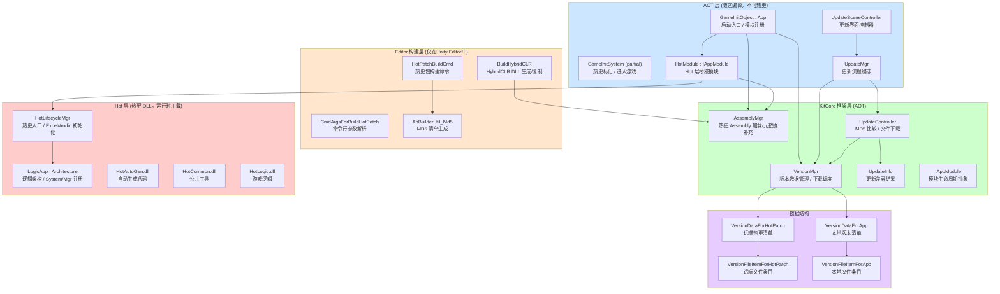
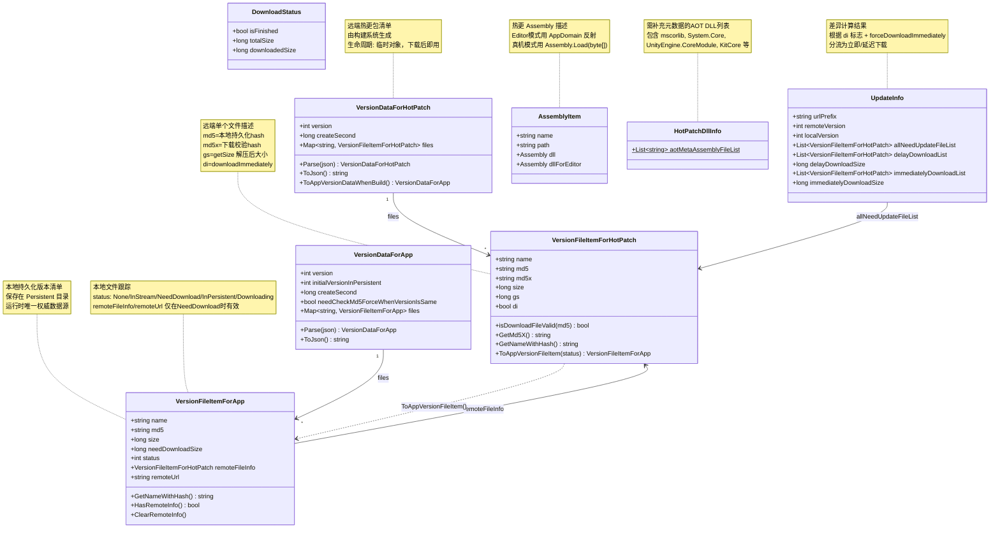
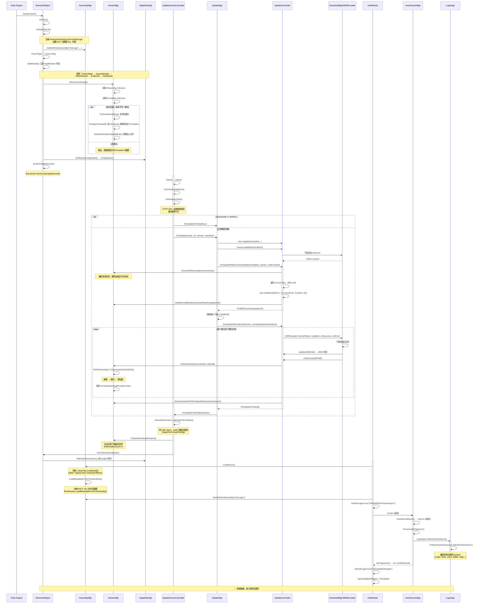
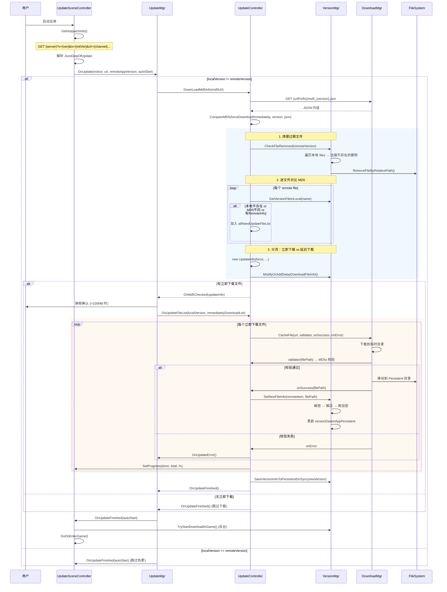
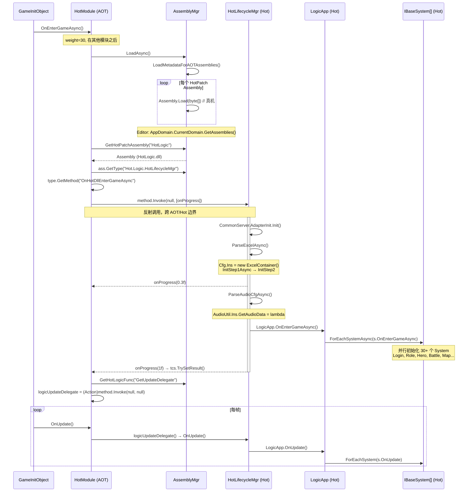
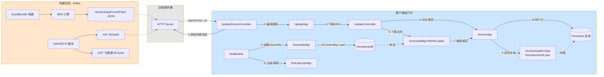
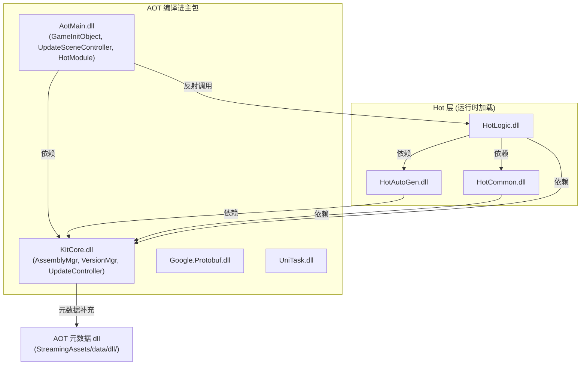

# 项目热更新子系统 — 架构文档

> 基于 HybridCLR + AssetBundle 的 Unity IL2CPP 热更新方案。  
> 生成日期: 2026-06-24 | 分支: main | 提交: ea42c48ae

---

## 目录

1. [总览](#1-总览)
2. [核心数据结构](#2-核心数据结构)
3. [初始化流程](#3-初始化流程)
4. [核心业务流程](#4-核心业务流程)
5. [模块间交互](#5-模块间交互)
6. [附录](#6-附录)
7. [完整源代码](#7-完整源代码)

---

## 1. 总览

### 1.1 分层架构图



### 1.2 模块职责一览表

| 层级 | 模块 | 职责 | 关键文件 |
|------|------|------|----------|
| **Editor 构建** | `HotPatchBuildCmd` | 打包 iOS/Android/Windows 热更包，备份到 dist 目录 | `Assets/Scripts/Editor/BuildApp/BuildCmd/HotPatchBuildCmd.cs` |
| | `BuildHybridCLR` | 调用 HybridCLR 生成热更 DLL + 裁剪元数据 DLL，复制到目标目录 | `Assets/Scripts/Editor/BuildApp/BuildHyBridCLR/BuildHybridCLR.cs` |
| | `CmdArgsForBuildHotPatch` | 解析构建命令行参数（版本号覆盖、资源级别） | `Assets/Scripts/Editor/BuildApp/BuildCmd/CmdArgsForBuildHotPatch.cs` |
| | `AbBuilderUtil_Md5` | 构建时计算所有输出文件的 MD5，生成 `VersionDataForHotPatch` JSON | `Assets/Libs/KitCore/Scripts/FrameEditor/Builder/AbBuilderUtil_Md5.cs` |
| **AOT 启动** | `GameInitObject` | 应用启动入口：初始化 HybridCLR、注册模块、跳转更新场景 | `Assets/Scripts/AOT/Main/Init/GameInitObject.cs` |
| | `GameInitSystem_HotPatch` | 记录"是否完成过游戏内下载"标记，控制强制全量下载策略 | `Assets/Scripts/AOT/Main/Init/GameInitSystem_HotPatch.cs` |
| | `HotPatchDllInfo` | 声明需要补充 AOT 元数据的 DLL 列表 | `Assets/Scripts/AOT/Main/Init/HotPatchDllInfo.cs` |
| **AOT 更新** | `UpdateSceneController` | 更新 UI 场景：获取远端热更信息、显示进度、触发修复、进入游戏 | `Assets/Scripts/AOT/Main/Update/UpdateSceneController.cs` |
| | `UpdateMgr` | 更新流程编排：下载 MD5、版本比较、分发下载、错误处理 | `Assets/Scripts/AOT/Main/Update/UpdateMgr.cs` |
| **AOT 桥接** | `HotModule` | AOT ↔ Hot 层桥接：通过反射调用 `HotLifecycleMgr`，管理 Hot 层生命周期 | `Assets/Scripts/AOT/Main/AppModule/HotModule/HotModule.cs` |
| **框架层** | `AssemblyMgr` | 热更 Assembly 注册/加载；HybridCLR AOT 元数据补充 | `Assets/Libs/KitCore/Scripts/Frame/HybridCLR/AssemblyMgr/AssemblyMgr.cs` |
| | `VersionMgr` (主文件) | 首次安装检测、文件清理、延迟下载标记、文件解密+解压+再加密 | `Assets/Libs/KitCore/Scripts/Frame/VersionMgr/VersionMgr.cs` |
| | `VersionMgr_DownloadInGame` | 游戏内后台下载（边玩边下）：并发控制、优先级下载、进度查询 | `Assets/Libs/KitCore/Scripts/Frame/VersionMgr/VersionMgr_DownloadInGame.cs` |
| | `VersionMgr_Util` | 工具方法：路径计算、MD5 解析/保存、文件校验、缓存清理 | `Assets/Libs/KitCore/Scripts/Frame/VersionMgr/VersionMgr_Util.cs` |
| | `UpdateController` | MD5 差异对比、生成 `UpdateInfo`、逐文件下载并回调 | `Assets/Libs/KitCore/Scripts/Frame/VersionMgr/UpdateController.cs` |
| | `UpdateController_Doc` | Doc 服务器模式（开发/测试用）：下载压缩的 MD5、差异对比 | `Assets/Libs/KitCore/Scripts/Frame/VersionMgr/UpdateController_Doc.cs` |
| **Hot 层** | `HotLifecycleMgr` | Hot 层总入口：Excel 配置解析 → Audio 配置解析 → LogicApp 初始化 | `Assets/Scripts/Hot/Logic/HotLifecycle/HotLifecycleMgr.cs` |
| | `HotLifecycleMgr_ExcelData` | Excel 配置数据初始化（`Cfg.Ins`） | `Assets/Scripts/Hot/Logic/HotLifecycle/HotLifecycleMgr_ExcelData.cs` |
| | `HotLifecycleMgr_AudioCfg` | 音频配置初始化 | `Assets/Scripts/Hot/Logic/HotLifecycle/HotLifecycleMgr_AudioCfg.cs` |
| | `LogicApp` | 热更层 IoC 架构：注册所有 System/Manager，管理生命周期和对象池 | `Assets/Scripts/Hot/Logic/Architecture/LogicApp.cs` |

---

## 2. 核心数据结构

### 2.1 类图



### 2.2 字段用途与生命周期

| 字段 | 所在类 | 用途 | 生命周期 |
|------|--------|------|----------|
| `md5` | `VersionFileItemForHotPatch` | 文件的持久化存储 hash（加密后计算的）；用于本地文件命名和版本比对 | 构建时生成，运行时只读 |
| `md5x` | `VersionFileItemForHotPatch` | 下载校验 hash（压缩+加密后计算）；用于验证下载完整性 | 构建时生成，下载后校验一次即丢弃 |
| `gs` (getSize) | `VersionFileItemForHotPatch` | 压缩前的原始大小；非 0 表示文件需要解压 | 构建时生成，解压后不再使用 |
| `di` (download Immediately) | `VersionFileItemForHotPatch` | 是否必须在热更界面下载完成才能进入游戏 | 构建时根据资源配置设定 |
| `status` | `VersionFileItemForApp` | 文件当前状态 (None→InStream→NeedDownload→Downloading→InPersistent) | 整个应用生命周期，持久化到 md5.json |
| `remoteFileInfo` / `remoteUrl` | `VersionFileItemForApp` | 仅在 status=NeedDownload 时有值，下载完成即清空 | 从 MD5 对比到下载完成 |
| `needCheckMd5ForceWhenVersionIsSame` | `VersionDataForApp` | 非整包构建时设为 true，强制同版本号也检查 MD5 | 构建时设定，下次全量下载后清除 |
| `dllForEditor` | `AssemblyItem` | Editor 模式下的 Assembly 缓存，避免重复反射查找 | Editor 进程生命周期 |
| `dll` | `AssemblyItem` | 真机模式下的 Assembly 实例 | 加载后常驻，直到进程退出 |

### 2.3 文件状态机

```mermaid
stateDiagram-v2
    [*] --> None : 精简包默认状态
    [*] --> InStream : 完整包初始状态
    None --> NeedDownload : 远端有该文件
    InStream --> NeedDownload : 远端版本不同
    InStream --> InPersistent : 复用已有缓存
    NeedDownload --> Downloading : 开始下载
    Downloading --> InPersistent : 下载+解密+解压成功
    Downloading --> NeedDownload : 下载失败(重试)
    InPersistent --> [*] : 被远端删除(CheckFileRemoved)
    Note right of Downloading : 并发控制: limitParallelCount=3
```

---

## 3. 初始化流程

### 3.1 从启动到就绪 — 完整时序图



### 3.2 关键时机标注

| 步骤 | 触发时机 | Editor/真机差异 |
|------|----------|-----------------|
| `InitHybridCLR()` | `GameInitObject.InitCore()` 同步调用 | 无差异 |
| `CheckIsFirstInstall()` | 模块 `OnAppStart()` 之前 | Editor `asRealClient=false` 时跳过 |
| `GetHotpatchInfo()` | 进入 UpdateScene 后自动触发 | Debug 包显示手动更新按钮 |
| `AssemblyMgr.LoadAsync()` | `HotModule.OnEnterGameAsync()` | Editor: 从 AppDomain 反射获取 Assembly；真机: `Assembly.Load(byte[])` |
| `LoadMetadataForAOTAssemblies()` | `LoadAsync()` 内，仅 `!UNITY_EDITOR` | Editor 不需要（解释执行直接可用） |
| `HotLifecycleMgr.OnHotDllEnterGameAsync()` | HotModule 通过反射调用 | Assembly 来源不同，方法签名相同 |
| 边玩边下 `TryStartDownloadInGame()` | `OnUpdateFinished()` 之后 | WebGL 跳过所有 VersionMgr 逻辑 |

---

## 4. 核心业务流程

### 4.1 场景一：热更包下载完整流程



#### 源码片段：CompareMD5 — 差异对比核心逻辑

**文件**: `Assets/Libs/KitCore/Scripts/Frame/VersionMgr/UpdateController.cs:104-202`

```csharp
public void CompareMD5(bool forceDownloadImmediately, int remoteVersionCode, string md5StrDownload)
{
    int localVersionCode = VersionMgr.Ins.GetAppCacheVersion();
    VersionDataForHotPatch remoteVersionInfo = VersionMgr.Ins.ParseMD5ForHotPatch(md5StrDownload);
    Seq<VersionFileItemForHotPatch> remoteFileItems = remoteVersionInfo.files.ValueSeq;

    bool isModified = VersionMgr.Ins.CheckFileRemoved(remoteVersionInfo);
    if (isModified)
        VersionMgr.Ins.SaveVersionInfoToPersistentDirSync(localVersionCode, -1);

    List<VersionFileItemForHotPatch> allNeedUpdateFileList = new List<VersionFileItemForHotPatch>();
    for (int i = 0; i < remoteFileItems.Count; i++)
    {
        VersionFileItemForHotPatch v = remoteFileItems[i];
        if (IsBundleResourceAbManifest(v.name)) continue;  // 跳过 .ab.manifest

        VersionFileItemForApp itemInLocal = VersionMgr.Ins.GetVersionFileInLocal(v.name);
        if (IsLocalFileItemNeedUpdate(itemInLocal, v.md5))
            allNeedUpdateFileList.Add(v);
    }
    allNeedUpdateFileList.Sort((a, b) => a.name.CompareTo(b.name));

    UpdateInfo updateInfo = new UpdateInfo(forceDownloadImmediately, this.HTTP_URL_PREFIX,
        remoteVersionCode, localVersionCode, allNeedUpdateFileList);

    VersionMgr.Ins.ModifyOrAddDelayDownloadFileInfo(updateInfo);

    if (updateInfo.immediatelyDownloadList.Count == 0)
    {
        VersionMgr.Ins.SaveVersionInfoToPersistentDirSync(remoteVersionCode, -1);
        OnUpdateFinished();
        return;
    }
    needImmediatelyDownloadTotalSize = updateInfo.immediatelyDownloadSize;
    OnMd5Checked(updateInfo);
}
```

#### 源码片段：OnFileDownload_TryDecryptAndUnzipFile — 解密+解压+再加密

**文件**: `Assets/Libs/KitCore/Scripts/Frame/VersionMgr/VersionMgr.cs:190-292`

```csharp
public long OnFileDownload_TryDecryptAndUnzipFile(string relativeFileNameNoHash,
    string filePathInPersistentWithHash, long downloadFileSize, long gs)
{
    downloadCountFromLastSave++;
    downloadSizeFromLastSave += downloadFileSize;
    byte[] source = null;

    if (FileLoader.IsCryptoFile(relativeFileNameNoHash) || gs != 0)
        source = FS.ReadAllBytes(filePathInPersistentWithHash);

    if (FileLoader.IsCryptoFile(relativeFileNameNoHash))
        source = CryptoUtil.DecryptByte(source);

    bool needReSave = false;
    byte[] finalData = source;
    if (gs != 0)
    {
        finalData = new byte[gs];
        var decoded = ZipUtil.Decode(source, 0, source.Length, finalData, 0, finalData.Length);
        if (decoded <= 0) return -1;
        needReSave = true;
    }

    if (FileLoader.IsCryptoFile(relativeFileNameNoHash))
    {
        needReSave = true;
        finalData = CryptoUtil.EncryptByte(finalData);
    }

    if (needReSave)
        FS.WriteAllBytes(finalData, filePathInPersistentWithHash);

    return finalData == null ? -1 : finalData.Length;
}
```

> **设计意图**：文件在服务器上是"压缩→加密"的（热更包），下载后先解密→再解压→再加密持久化。本地持久化存储始终是加密态，读取时统一解密。压缩标记 `gs != 0` 表示原始大小，解压后按原大小分配 buffer。

### 4.2 场景二：从 AOT 到 Hot 层的完整调用链



#### 源码片段：HotModule.OnEnterGameAsync — AOT→Hot 桥接

**文件**: `Assets/Scripts/AOT/Main/AppModule/HotModule/HotModule.cs:30-57`

```csharp
public override async UniTask OnEnterGameAsync()
{
    isOnEnterGameAsyncCalled = true;
    var tcs = new UniTaskCompletionSource();
    ProfilerMgr.Ins.Start("HotModule");
    progress = 0;

    Action<float> onProgress = (subProgress) =>
    {
        progress = subProgress;
        if (subProgress > 0.999f)
            tcs.TrySetResult();
    };

    MethodInfo method = GetHotLogicFunc("OnHotDllEnterGameAsync");
    object[] parameters = new object[] { onProgress };
    method.Invoke(null, parameters);

    MethodInfo methodGetUpdateDelegate = GetHotLogicFunc("GetUpdateDelegate");
    logicUpdateDelegate = (Action)methodGetUpdateDelegate.Invoke(null, null);

    await tcs.Task;
    ProfilerMgr.Ins.End("HotModule");
}
```

#### 源码片段：AssemblyMgr.GetHotPatchAssembly — Editor/真机双模式

**文件**: `Assets/Libs/KitCore/Scripts/Frame/HybridCLR/AssemblyMgr/AssemblyMgr.cs:54-96`

```csharp
public static Assembly GetHotPatchAssembly(string name)
{
#if KITCORE_USE_HYBRIDCLR
    foreach (var item in hotPatchAssemblyList)
    {
        if (item.name == name)
        {
            Assembly ret = null;
#if !UNITY_EDITOR
            ret = item.dll;  // 真机: Assembly.Load(byte[]) 预先加载
#else
            if (item.dllForEditor == null)
            {
                item.dllForEditor = System.AppDomain.CurrentDomain.GetAssemblies()
                    .First(a => a.GetName().Name == name);
            }
            ret = item.dllForEditor;  // Editor: 直接反射当前 AppDomain
#endif
            if (ret == null)
                LogMgr.Error("LoadLogicAssembly failed", name);
            return ret;
        }
    }
#endif
    return null;
}
```

> **设计意图**：Editor 模式下热更 DLL 以普通 C# 工程存在，直接从 `AppDomain` 获取；真机 IL2CPP 下 DLL 被剥离出主包，需通过 `Assembly.Load(byte[])` 从文件加载。`#if !UNITY_EDITOR` 保证了这两个分支的实现完全不同。

---

## 5. 模块间交互

### 5.1 数据流图



### 5.2 依赖关系



**依赖顺序**（严格按加载顺序）:
1. `KitCore.dll` — 基础框架，必须最先可用
2. `AotMain.dll` — 依赖 KitCore
3. `HotAutoGen.dll` → `HotCommon.dll` → `HotLogic.dll` — 按依赖链依次加载

### 5.3 `VersionMgr` Partial Class 分布

`VersionMgr` 是核心类，通过 `partial` 分布在 3 个文件中：

| 文件 | 职责 |
|------|------|
| `VersionMgr.cs` | 首次安装检查、文件清理、缓存复用、延迟下载标记、文件解密解压 |
| `VersionMgr_DownloadInGame.cs` | 边玩边下调度、并发控制 (`UniTaskSemaphore`)、优先级下载、进度查询 |
| `VersionMgr_Util.cs` | 路径计算、JSON 解析/持久化、多线程安全写入、文件校验、缓存清理、平台判断 |

---

## 6. 附录

### 6.1 源码路径索引表

| 模块 | 文件路径 | 关键类/接口 |
|------|----------|-------------|
| **启动入口** | `Assets/Scripts/AOT/Main/Init/GameInitObject.cs` | `GameInitObject : App` |
| | `Assets/Scripts/AOT/Main/Init/GameInitSystem_HotPatch.cs` | `GameInitSystem` (partial) |
| | `Assets/Scripts/AOT/Main/Init/HotPatchDllInfo.cs` | `HotPatchDllInfo` |
| **更新界面** | `Assets/Scripts/AOT/Main/Update/UpdateSceneController.cs` | `UpdateSceneController : BaseSceneView` |
| | `Assets/Scripts/AOT/Main/Update/UpdateMgr.cs` | `UpdateMgr` |
| **AOT-Hot 桥接** | `Assets/Scripts/AOT/Main/AppModule/HotModule/HotModule.cs` | `HotModule : IAppModule` |
| **框架: Assembly 管理** | `Assets/Libs/KitCore/Scripts/Frame/HybridCLR/AssemblyMgr/AssemblyMgr.cs` | `AssemblyMgr`, `AssemblyItem` |
| **框架: 版本管理** | `Assets/Libs/KitCore/Scripts/Frame/VersionMgr/VersionMgr.cs` | `VersionMgr` (partial) |
| | `Assets/Libs/KitCore/Scripts/Frame/VersionMgr/VersionMgr_DownloadInGame.cs` | `VersionMgr` (partial), `DownloadStatus` |
| | `Assets/Libs/KitCore/Scripts/Frame/VersionMgr/VersionMgr_Util.cs` | `VersionMgr` (partial) |
| **框架: 更新控制** | `Assets/Libs/KitCore/Scripts/Frame/VersionMgr/UpdateController.cs` | `UpdateController` |
| | `Assets/Libs/KitCore/Scripts/Frame/VersionMgr/UpdateController_Doc.cs` | `UpdateController` (partial) |
| **框架: 数据结构** | `Assets/Libs/KitCore/Scripts/Frame/VersionMgr/VersionData/VersionFileItemForHotPatch.cs` | `VersionFileItemForHotPatch`, `VersionDataForHotPatch` |
| | `Assets/Libs/KitCore/Scripts/Frame/VersionMgr/VersionData/VersionFileItemForApp.cs` | `VersionFileItemForApp`, `VersionDataForApp`, `E_VersionFileStatus` |
| | `Assets/Libs/KitCore/Scripts/Frame/VersionMgr/UpdateInfo.cs` | `UpdateInfo` |
| **框架: 模块接口** | `Assets/Libs/KitCore/Scripts/Frame/App/IAppModule.cs` | `IAppModule` |
| **Hot 层入口** | `Assets/Scripts/Hot/Logic/HotLifecycle/HotLifecycleMgr.cs` | `HotLifecycleMgr` |
| | `Assets/Scripts/Hot/Logic/HotLifecycle/HotLifecycleMgr_ExcelData.cs` | `HotLifecycleMgr` (partial) |
| | `Assets/Scripts/Hot/Logic/HotLifecycle/HotLifecycleMgr_AudioCfg.cs` | `HotLifecycleMgr` (partial) |
| | `Assets/Scripts/Hot/Logic/HotLifecycle/HotLifecycleMgr_Func.cs` | `HotLifecycleMgr` (partial) |
| **Hot 层架构** | `Assets/Scripts/Hot/Logic/Architecture/LogicApp.cs` | `LogicApp : Architecture<LogicApp>` |
| **构建: 热更包** | `Assets/Scripts/Editor/BuildApp/BuildCmd/HotPatchBuildCmd.cs` | `HotPatchBuildCmd` |
| | `Assets/Scripts/Editor/BuildApp/BuildCmd/CmdArgsForBuildHotPatch.cs` | `CmdArgsForBuildHotPatch` |
| **构建: HybridCLR** | `Assets/Scripts/Editor/BuildApp/BuildHyBridCLR/BuildHybridCLR.cs` | `BuildHybridCLR` |
| **构建: MD5** | `Assets/Libs/KitCore/Scripts/FrameEditor/Builder/AbBuilderUtil_Md5.cs` | `AbBuilderUtil._CalcMd5()` |
| | `Assets/Libs/KitCore/Scripts/FrameEditor/Builder/AbBuilderUtil_Md5_Post.cs` | `AbBuilderUtil.CalcMd5Later_ForHotPatch()` |

### 6.2 常用 API 速查表

| API | 所在类 | 用途 |
|-----|--------|------|
| `AssemblyMgr.AddHotPatchAssembly(name, path)` | `AssemblyMgr` | 注册热更 Assembly |
| `AssemblyMgr.GetHotPatchAssembly(name)` | `AssemblyMgr` | 获取已加载的 Assembly |
| `AssemblyMgr.LoadAsync(hybridType)` | `AssemblyMgr` | 加载所有热更 DLL + AOT 元数据 |
| `VersionMgr.Ins.CheckIsFirstInstall()` | `VersionMgr` | 检测首次安装/换包 |
| `VersionMgr.Ins.CheckFileRemoved(remote)` | `VersionMgr` | 清理远端已删除的本地文件 |
| `VersionMgr.Ins.SetNewFileInfo(item, path)` | `VersionMgr` | 注册新下载的文件 |
| `VersionMgr.Ins.EnsureFileDownloaded(path)` | `VersionMgr` | 确保指定文件已下载 |
| `VersionMgr.Ins.TryStartDownloadInGame()` | `VersionMgr` | 启动边玩边下 |
| `VersionMgr.Ins.DownloadPriorityByList(paths)` | `VersionMgr` | 按优先级下载指定文件列表 |
| `VersionMgr.Ins.GetDownLoadStatus(paths)` | `VersionMgr` | 查询指定文件下载进度 |
| `VersionMgr.Ins.RemoveDownloadCache(withCheck)` | `VersionMgr` | 清空所有下载缓存（修复功能） |
| `HotModule.GetHotLogicFunc(funcName)` | `HotModule` | 通过反射获取 Hot 层静态方法 |

### 6.3 设计约定与注意事项

| 约定 | 说明 |
|------|------|
| **文件命名** | Persistent 目录中的文件名为 `{原文件名}_{md5}.{ext}`，md5 作为 hash 后缀实现版本化存储 |
| **双重 MD5** | `md5` 是持久化存储 hash（加密后计算），`md5x` 是下载校验 hash（压缩+加密后计算）。`md5x` 为空时回退到 `md5` |
| **加解密顺序** | 下载文件：解密→解压→再加密→持久化。本地文件始终以加密态存储，运行时透明解密 |
| **跳过 .ab.manifest** | `CompareMD5` 中显式跳过 `.ab.manifest` 文件，这些文件由 Unity AB 系统自动管理 |
| **WebGL 特殊处理** | `VersionMgr.IsWebglFlow()` / `IsSkip()` 使 WebGL 平台跳过所有版本管理逻辑（WebGL 直接从 StreamingAssets 加载） |
| **Editor 模拟** | `EnvSetting.asRealClient=false` 时跳过 `CheckIsFirstInstall` 和 `OnAppFirstInstall`，直接使用 Streaming 目录 |
| **并发下载控制** | 游戏内边玩边下并发数 `limitParallelCountForDownloadInGame=3`，优先级下载并发数 `limitParallelCountForPriorityDownload=5`，通过 `UniTaskSemaphore` 实现 |
| **多线程安全** | `SaveVersionInfoToPersistentDirAsync` 将 JSON 序列化放到线程池执行（`UniTask.RunOnThreadPool`），通过 `isInSaveVersionInfoInOhterThread` 标记防止并发写。`VersionFileItemForApp.status/size` 使用 `Interlocked.Exchange` 原子写入 |
| **下载中断保护** | `VersionFileItemForApp.status` 在 WebGL 外使用 `Interlocked.Exchange` 确保原子性；下载失败后状态回退到 `NeedDownload` 等待重试 |
| **缓存复用** | `TryReuseNoneItem()` 在重新安装时检查 Persistent 目录中是否已有相同的文件（md5 匹配 + 状态 InPersistent），避免重复下载 |
| **存盘节流** | `trySaveMd5FileThresholdOfFileCount=200` / `trySaveMd5FileThresholdOfSizeMB=100`，下载过程中累计超过阈值才触发 md5.json 存盘，避免频繁 I/O |
| **Doc 服务器模式** | `UpdateController_Doc` 用于开发测试环境，下载压缩的 MD5 数据（前 4 字节为解压后长度，剩余为 LZ4 压缩的 JSON） |

---

## 7. 完整源代码

### 7.1 框架层 — 数据结构

### 文件: Assets/Libs/KitCore/Scripts/Frame/VersionMgr/VersionData/VersionFileItemForHotPatch.cs

```csharp
using KitCore.Basic;
using KitCoreLitJson;

namespace KitCore.Frame
{
    public class VersionFileItemForHotPatch
    {
        public string name;
        public string md5;
        public string md5x;
        public long size;
        public long gs;
        public bool di;

        public VersionFileItemForHotPatch Copy()
        {
            VersionFileItemForHotPatch item = new VersionFileItemForHotPatch();
            item.name = this.name;
            item.md5 = this.md5;
            item.md5x = this.md5x;
            item.size = this.size;
            item.gs = this.gs;
            item.di = this.di;
            return item;
        }

        public long GetUnzipSize()
        {
            if (this.gs != 0) return this.gs;
            return this.size;
        }

        public bool isDownloadFileValid(string downloadFileMd5)
        {
            bool flag = downloadFileMd5 == this.GetMd5X();
            if (!flag)
                LogMgr.Error($"md5x file({this.name}) check error calc:{downloadFileMd5} remote: {this.GetMd5X()}");
            return flag;
        }

        public string GetMd5X()
        {
            if (string.IsNullOrEmpty(this.md5x)) return this.md5;
            return this.md5x;
        }

        public string GetNameWithHash()
        {
            return FS.AddHashStringInFileName(this.name, this.md5);
        }

        public VersionFileItemForApp ToAppVersionFileItem(int fileStatus)
        {
            VersionFileItemForApp ret = new VersionFileItemForApp();
            ret.name = this.name;
            ret.md5 = this.md5;
            if (this.gs != 0) ret.size = this.gs;
            else ret.size = size;
            ret.needDownloadSize = this.size;
            ret.status = fileStatus;
            return ret;
        }
    }

    public class VersionDataForHotPatch
    {
        public int version;
        public long createSecond;
        public Map<string, VersionFileItemForHotPatch> files;

        public VersionDataForHotPatch()
        {
            this.files = new Map<string, VersionFileItemForHotPatch>();
        }

        public static VersionDataForHotPatch Parse(string json)
        {
            var ret = JsonMapper.ToObject<VersionDataForHotPatch>(json);
            if (ret.files == null)
                ret.files = new Map<string, VersionFileItemForHotPatch>();
            return ret;
        }

        public string ToJson()
        {
            JsonWriter writer = new JsonWriter();
            writer.PrettyPrint = true;
            JsonMapper.ToJson(this, writer);
            return writer.ToString();
        }

        public VersionDataForApp ToAppVersionDataWhenBuild()
        {
            VersionDataForApp ret = new VersionDataForApp();
            ret.version = this.version;
            ret.createSecond = this.createSecond;
            foreach (var item in this.files)
            {
                VersionFileItemForApp t = item.Value.ToAppVersionFileItem(E_VersionFileStatus.InStream);
                ret.files[t.name] = t;
            }
            return ret;
        }
    }
}
```

---

### 文件: Assets/Libs/KitCore/Scripts/Frame/VersionMgr/VersionData/VersionFileItemForApp.cs

```csharp
using KitCore.Basic;
using KitCoreLitJson;

namespace KitCore.Frame
{
    public class E_VersionFileStatus
    {
        public const int None = 0;
        public const int InStream = 1;
        public const int NeedDownload = 2;
        public const int InPersistent = 3;
        public const int Downloading = 10;
    }

    public class VersionFileItemForApp
    {
        public string name;
        public string md5;
        public long size;
        public long needDownloadSize;
        public int status;
        public VersionFileItemForHotPatch remoteFileInfo;
        public string remoteUrl;

        public VersionFileItemForApp Copy()
        {
            VersionFileItemForApp item = new VersionFileItemForApp();
            item.name = this.name;
            item.md5 = this.md5;
            item.size = this.size;
            item.status = this.status;
            return item;
        }

        public string GetStatusDesc()
        {
            switch (status)
            {
                case E_VersionFileStatus.InStream: return "InStream";
                case E_VersionFileStatus.NeedDownload: return "NeedDownload";
                case E_VersionFileStatus.InPersistent: return "InPersistent";
                case E_VersionFileStatus.Downloading: return "Downloading";
                default: return "error";
            }
        }

        public void ClearRemoteInfo()
        {
            this.remoteFileInfo = null;
            this.remoteUrl = null;
        }

        public bool HasRemoteInfo()
        {
            return this.remoteFileInfo != null;
        }

        public string GetNameWithHash()
        {
            return FS.AddHashStringInFileName(this.name, this.md5);
        }
    }

    public class VersionDataForApp
    {
        public int version;
        public int initialVersionInPersistent;
        public long createSecond;
        public bool needCheckMd5ForceWhenVersionIsSame;
        public Map<string, VersionFileItemForApp> files;

        public VersionDataForApp()
        {
            files = new Map<string, VersionFileItemForApp>();
        }

        public static VersionDataForApp Parse(string json)
        {
            var ret = JsonMapper.ToObject<VersionDataForApp>(json);
            if (ret.files == null)
                ret.files = new Map<string, VersionFileItemForApp>();
            return ret;
        }

        public string ToJson(bool prettyPrint = true)
        {
            JsonWriter writer = new JsonWriter();
            writer.PrettyPrint = prettyPrint;
            JsonMapper.ToJson(this, writer);
            return writer.ToString();
        }
    }
}
```

---

### 文件: Assets/Libs/KitCore/Scripts/Frame/VersionMgr/UpdateInfo.cs

```csharp
using System.Collections.Generic;

namespace KitCore.Frame
{
    public class UpdateInfo
    {
        public string urlPrefix;
        public int remoteVersion;
        public int localVersion;
        public List<VersionFileItemForHotPatch> allNeedUpdateFileList;
        public List<VersionFileItemForHotPatch> delayDownloadList;
        public long delayDownloadSize;
        public List<VersionFileItemForHotPatch> immediatelyDownloadList;
        public long immediatelyDownloadSize;

        public UpdateInfo(bool forceDownloadImmediately, string urlPrefix, int remoteVersion, int localVersion,
            List<VersionFileItemForHotPatch> allNeedUpdateFileList)
        {
            this.urlPrefix = urlPrefix;
            this.remoteVersion = remoteVersion;
            this.localVersion = localVersion;
            this.allNeedUpdateFileList = allNeedUpdateFileList;
            this.delayDownloadList = new List<VersionFileItemForHotPatch>();
            this.immediatelyDownloadList = new List<VersionFileItemForHotPatch>();
            foreach (var item in allNeedUpdateFileList)
            {
                if (item.di == true || forceDownloadImmediately)
                {
                    immediatelyDownloadList.Add(item);
                    immediatelyDownloadSize += item.size;
                }
                else
                {
                    delayDownloadList.Add(item);
                    delayDownloadSize += item.size;
                }
            }
        }

        public override string ToString()
        {
            return
                $"TotalSize: {CoreUtil.GetReadableSize(immediatelyDownloadSize + delayDownloadSize)} = Imm({CoreUtil.GetReadableSize(immediatelyDownloadSize)}) + Delay({CoreUtil.GetReadableSize(delayDownloadSize)}) " +
                $"TotalCount: {immediatelyDownloadList.Count + delayDownloadList.Count} = Imm({immediatelyDownloadList.Count}) + Delay({delayDownloadList.Count})";
        }
    }
}
```

---

### 7.2 框架层 — Assembly 管理

### 文件: Assets/Libs/KitCore/Scripts/Frame/HybridCLR/AssemblyMgr/AssemblyMgr.cs

```csharp
using System.Collections.Generic;
using System.Linq;
using System.Reflection;
using Cysharp.Threading.Tasks;
#if KITCORE_USE_HYBRIDCLR
using HybridCLR;
#endif

namespace KitCore.Frame
{
    public class AssemblyItem
    {
        public string name;
        public string path;
        public Assembly dll;
        public Assembly dllForEditor;

        public AssemblyItem(string _name, string _path)
        {
            this.name = _name;
            this.path = _path;
        }
    }

    public static class AssemblyMgr
    {
        public static List<AssemblyItem> hotPatchAssemblyList = new List<AssemblyItem>();

        public static string GetHotPatchDllOutputDir()
        {
            return FS.Join(FS.EAssetPath, "Doc/dll");
        }

        public static string GetMetadataDllOutputDir()
        {
            return FS.Join(FS.GetStreamingPath(), GetMetadataDllRelativeDirInStreaming());
        }

        public static string GetMetadataDllRelativeDirInStreaming()
        {
            return "data/dll";
        }

        public static void AddHotPatchAssembly(string name, string path)
        {
            AssemblyItem item = new AssemblyItem(name, path);
            hotPatchAssemblyList.Add(item);
        }

        public static Assembly GetHotPatchAssembly(string name)
        {
#if KITCORE_USE_HYBRIDCLR
            foreach (var item in hotPatchAssemblyList)
            {
                if (item.name == name)
                {
                    Assembly ret = null;
#if !UNITY_EDITOR
                    ret = item.dll;
#else
                    if (item.dllForEditor == null)
                    {
                        item.dllForEditor = System.AppDomain.CurrentDomain.GetAssemblies()
                            .First(a =>
                            {
                                if (a.GetName().Name == name) return true;
                                return false;
                            });
                    }
                    ret = item.dllForEditor;
#endif
                    if (ret == null)
                        LogMgr.Error("LoadLogicAssembly failed", name);
                    return ret;
                }
            }
            LogMgr.Error("LoadLogicAssembly not found:", name);
#endif
            return null;
        }

        public static async UniTask LoadAsync(int hybridType)
        {
            LogMgr.Info("Start AssemblyMgr.LoadAsync");
#if !UNITY_EDITOR
            await LoadMetadataForAOTAssemblies();
            foreach (var item in hotPatchAssemblyList)
            {
                byte[] data = await FileLoader.LoadFileByRelativePathAsync_Task(item.path);
                item.dll = Assembly.Load(data);
            }
#endif
            LogMgr.Info("Finished AssemblyMgr.LoadAsync");
        }

        public static List<string> aotMetaAssemblyFileList = null;

        public static async UniTask LoadMetadataForAOTAssemblies()
        {
#if KITCORE_USE_HYBRIDCLR
            HomologousImageMode mode = HomologousImageMode.SuperSet;
            foreach (var aotDllName in aotMetaAssemblyFileList)
            {
                byte[] dllBytes = await FileLoader.LoadFileBytesFromStreamingAssetsPathAsync_Task(false,
                    AssemblyMgr.GetMetadataDllRelativePath(aotDllName));
                LoadImageErrorCode err = RuntimeApi.LoadMetadataForAOTAssembly(dllBytes, mode);
                LogMgr.Debug($"LoadMetadataForAOTAssembly:{aotDllName}. mode:{mode} ret:{err}");
            }
#endif
        }

        public static string GetMetadataDllRelativePath(string aotDllName)
        {
            int hardCodeVersion = EnvSetting.GetAppVersionInHardCode();
            if (hardCodeVersion == 0)
                LogMgr.Error("hardCodeVersion need be set!!!");
            string withVersionName =
                FS.AddHashStringInFileName($"{aotDllName}.bytes", hardCodeVersion.ToString());
            return $"{AssemblyMgr.GetMetadataDllRelativeDirInStreaming()}/{withVersionName}";
        }
    }
}
```

---

### 7.3 框架层 — 版本管理（主文件）

### 文件: Assets/Libs/KitCore/Scripts/Frame/VersionMgr/VersionMgr.cs

```csharp
using System;
using System.Collections.Generic;
using Cysharp.Threading.Tasks;
using KitCore.Basic;

namespace KitCore.Frame
{
    public partial class VersionMgr
    {
        private static VersionMgr _versionMgr;
        public VersionDataForApp versionDataInAppPersistent;
        public long createSecondInStreamingMd5;

        public static VersionMgr Ins
        {
            get
            {
                if (_versionMgr == null)
                    _versionMgr = new VersionMgr();
                return _versionMgr;
            }
        }

        public static string GetMd5FileName(int version)
        {
            return $"md5_{version}.json";
        }

        public static bool IsMd5File(string fileName)
        {
            if (fileName.EndsWith(".json") && fileName.StartsWith("md5"))
                return true;
            return false;
        }

        public static string GetMd5FileNameWithoutVersion()
        {
            return "md5.json";
        }

        public bool CheckFileRemoved(VersionDataForHotPatch remoteVersion)
        {
            List<string> needDeleteFromFileWithHash = new List<string>();
            List<string> needDeleteFromMd5NoHash = new List<string>();
            int md5NotMatchCount = 0;
            int fileNotExitInRemoteCount = 0;
            versionDataInAppPersistent.files.ForEachPairs((nameNoHash, itemInLocal) =>
            {
                VersionFileItemForHotPatch remoteItem = remoteVersion.files.GetIfExist(nameNoHash, null);
                if (remoteItem == null)
                {
                    fileNotExitInRemoteCount++;
                    needDeleteFromMd5NoHash.Add(nameNoHash);
                    if (itemInLocal.status == E_VersionFileStatus.InPersistent)
                        needDeleteFromFileWithHash.Add(itemInLocal.GetNameWithHash());
                    return;
                }
                if (remoteItem.md5 != itemInLocal.md5 || itemInLocal.HasRemoteInfo())
                {
                    md5NotMatchCount++;
                    needDeleteFromMd5NoHash.Add(nameNoHash);
                    if (itemInLocal.status == E_VersionFileStatus.InPersistent)
                        needDeleteFromFileWithHash.Add(itemInLocal.GetNameWithHash());
                    return;
                }
            });

            bool isModified = false;
            for (int i = 0; i < needDeleteFromMd5NoHash.Count; i++)
            {
                versionDataInAppPersistent.files.Remove(needDeleteFromMd5NoHash[i]);
                isModified = true;
            }
            for (int i = 0; i < needDeleteFromFileWithHash.Count; i++)
            {
                FileLoader.RemoveFileByRelativePath(needDeleteFromFileWithHash[i]);
                isModified = true;
            }
            return isModified;
        }

        public void ModifyOrAddDelayDownloadFileInfo(UpdateInfo info)
        {
            List<VersionFileItemForApp> needAddList = new List<VersionFileItemForApp>();
            foreach (var delayItem in info.delayDownloadList)
            {
                bool isFound = false;
                foreach (var kv in versionDataInAppPersistent.files)
                {
                    VersionFileItemForApp itemInApp = kv.Value;
                    if (itemInApp.name == delayItem.name)
                    {
                        isFound = true;
                        itemInApp.status = E_VersionFileStatus.NeedDownload;
                        itemInApp.needDownloadSize = delayItem.size;
                        itemInApp.remoteFileInfo = delayItem;
                        itemInApp.remoteUrl = info.urlPrefix + delayItem.GetNameWithHash();
                        break;
                    }
                }
                if (!isFound)
                {
                    VersionFileItemForApp itemInApp = delayItem.ToAppVersionFileItem(E_VersionFileStatus.NeedDownload);
                    itemInApp.remoteFileInfo = delayItem;
                    itemInApp.remoteUrl = info.urlPrefix + delayItem.GetNameWithHash();
                    needAddList.Add(itemInApp);
                }
            }
            foreach (var needAddItem in needAddList)
                versionDataInAppPersistent.files[needAddItem.name] = needAddItem;
        }

        public long OnFileDownload_TryDecryptAndUnzipFile(string relativeFileNameNoHash,
            string filePathInPersistentWithHash, long downloadFileSize, long gs)
        {
            downloadCountFromLastSave++;
            downloadSizeFromLastSave += downloadFileSize;
            byte[] source = null;
            if (FileLoader.IsCryptoFile(relativeFileNameNoHash) || gs != 0)
                source = FS.ReadAllBytes(filePathInPersistentWithHash);
            if (FileLoader.IsCryptoFile(relativeFileNameNoHash))
                source = CryptoUtil.DecryptByte(source);

            bool needReSave = false;
            byte[] finalData = source;
            if (gs != 0)
            {
                finalData = new byte[gs];
                var decoded = ZipUtil.Decode(source, 0, source.Length, finalData, 0, finalData.Length);
                if (decoded <= 0) return -1;
                needReSave = true;
            }
            if (FileLoader.IsCryptoFile(relativeFileNameNoHash))
            {
                needReSave = true;
                finalData = CryptoUtil.EncryptByte(finalData);
            }
            if (needReSave)
                FS.WriteAllBytes(finalData, filePathInPersistentWithHash);
            if (finalData == null) return -1;
            return finalData.Length;
        }

        public bool SetNewFileInfo(VersionFileItemForHotPatch remoteItemInfo, string filePath)
        {
            string fullNameWithHash = FS.Join(FS.GetPersistentPathWithPlatform(), remoteItemInfo.GetNameWithHash());
            long fileNewSize = OnFileDownload_TryDecryptAndUnzipFile(remoteItemInfo.name, fullNameWithHash,
                remoteItemInfo.size, remoteItemInfo.gs);
            VersionFileItemForApp item = remoteItemInfo.ToAppVersionFileItem(E_VersionFileStatus.InPersistent);
            if (fileNewSize != -1)
                item.size = fileNewSize;
            versionDataInAppPersistent.files[remoteItemInfo.name] = item;
            return true;
        }

        public async UniTask CheckIsFirstInstall()
        {
            if (VersionMgr.IsSkip()) return;
#if UNITY_EDITOR
            if (!EnvSetting.asRealClient) return;
#endif
            string md5FileName = VersionMgr.GetMd5FileName(CoreGameLogicConfig.GetAppVersion(false));
            string code = await FileLoader.LoadFileStringFromStreamingAssetsPathAsync_Task(true, md5FileName, 45);
            VersionDataForApp versionDateInStreaming = ParseMD5ForApp(code);
            if (versionDateInStreaming != null)
                VersionMgr.Ins.createSecondInStreamingMd5 = versionDateInStreaming.createSecond;

            versionDataInAppPersistent = ParseVersionInPersistentDir();
            if (versionDataInAppPersistent == null
                || versionDataInAppPersistent.initialVersionInPersistent != VersionMgr.Ins.GetInitialAppVersion()
                || (versionDataInAppPersistent.initialVersionInPersistent == VersionMgr.Ins.GetInitialAppVersion() &&
                    versionDateInStreaming != null &&
                    versionDataInAppPersistent.createSecond < versionDateInStreaming.createSecond)
                || versionDataInAppPersistent.version < VersionMgr.Ins.GetInitialAppVersion()
                || (versionDataInAppPersistent.version == VersionMgr.Ins.GetInitialAppVersion() &&
                    versionDateInStreaming != null &&
                    versionDataInAppPersistent.createSecond < versionDateInStreaming.createSecond))
            {
                TryReuseNoneItem(versionDataInAppPersistent, versionDateInStreaming);
                await OnAppFirstInstall(versionDateInStreaming);
                if (EnvSetting.IsDebug())
                    DeleteFileNotExistInMd5File(versionDataInAppPersistent);
            }
        }

        public async UniTask OnAppFirstInstall(VersionDataForApp versionDateInStreaming)
        {
            if (!EnvSetting.asRealClient) return;
            if (VersionMgr.IsSkip()) return;
            versionDataInAppPersistent = versionDateInStreaming;
            versionDataInAppPersistent.initialVersionInPersistent = versionDateInStreaming.version;
            SaveVersionInfoToPersistentDirSync(GetInitialAppVersion(), versionDataInAppPersistent.createSecond);
        }

        public void DeleteFileNotExistInMd5File(VersionDataForApp dataInPersistent)
        {
            try
            {
                int deleteFileCount = 0;
                string parentDir = FS.Join(FS.GetPersistentPath(), FS.GetPlatformPathName()) + "/";
                List<string> fileList = FS.GetAllFile(parentDir);
                foreach (var fileFullPath in fileList)
                {
                    string relativePathWithHash = CoreUtil.StringTryGetSub(fileFullPath, parentDir, false);
                    string hash = FS.TryGetHashStringInFileName(relativePathWithHash);
                    if (hash == "") continue;
                    string relativePathNoHash = FS.GetFileNameWithoutHash(relativePathWithHash);
                    var itemInPersistent = dataInPersistent.files.GetIfExist(relativePathNoHash, null);
                    if (itemInPersistent == null || itemInPersistent.md5 != hash
                        || itemInPersistent.status == E_VersionFileStatus.InStream)
                    {
                        deleteFileCount++;
                        FS.TryDeleteFile(fileFullPath);
                    }
                }
                if (EnvSetting.IsDebug())
                {
                    foreach (var pairItem in dataInPersistent.files)
                    {
                        var item = pairItem.Value;
                        if (item.status == E_VersionFileStatus.InPersistent)
                        {
                            string fullPath = FS.Join(FS.GetPersistentPath(), FS.GetPlatformPathName(),
                                item.GetNameWithHash());
                            if (!FS.IsFileExist(fullPath))
                                LogMgr.Error("DeleteFileNotExistInMd5File: error, file not exist", fullPath);
                        }
                    }
                }
            }
            catch (Exception e)
            {
                LogMgr.Error("DeleteFileNotExistInMd5File:", e);
            }
        }

        public void TryReuseNoneItem(VersionDataForApp dataInPersistent, VersionDataForApp dataInStreaming)
        {
            int totalCount = dataInStreaming.files.Count;
            int reusedCount = 0;
            long reusedSize = 0;
            Seq<string> needDeleteInMd5List = new Seq<string>();
            foreach (var kv in dataInStreaming.files)
            {
                var itemInStream = kv.Value;
                if (itemInStream.status != E_VersionFileStatus.None) continue;
                if (dataInPersistent == null)
                {
                    needDeleteInMd5List.Add(itemInStream.name);
                    continue;
                }
                var itemInPersistent = dataInPersistent.files.GetIfExist(itemInStream.name, null);
                if (itemInPersistent != null && itemInPersistent.md5 == itemInStream.md5 &&
                    itemInPersistent.status == E_VersionFileStatus.InPersistent)
                {
                    itemInStream.status = E_VersionFileStatus.InPersistent;
                    reusedSize += itemInStream.size;
                    reusedCount++;
                }
                else
                {
                    needDeleteInMd5List.Add(itemInStream.name);
                }
            }
            foreach (var deleteItem in needDeleteInMd5List)
                dataInStreaming.files.Remove(deleteItem);
        }
    }
}
```

---

### 文件: Assets/Libs/KitCore/Scripts/Frame/VersionMgr/VersionMgr_DownloadInGame.cs

```csharp
using System;
using System.Collections.Generic;
using Cysharp.Threading.Tasks;
using KitCore.Basic;
using UnityEngine;

namespace KitCore.Frame
{
    public partial class VersionMgr
    {
        public bool IsAllFileDownload()
        {
            foreach (var kv in versionDataInAppPersistent.files)
            {
                if (kv.Value.status == E_VersionFileStatus.NeedDownload ||
                    kv.Value.status == E_VersionFileStatus.Downloading)
                    return false;
            }
            return true;
        }

        public async UniTask<long> EnsureFileDownloaded(string relativePathWithOutHash)
        {
            if (VersionMgr.IsSkip()) return 0;
            VersionFileItemForApp fileInfo = GetVersionFileItemForApp(relativePathWithOutHash, false);
            if (fileInfo == null) return 0;
            if (fileInfo.status == E_VersionFileStatus.NeedDownload ||
                fileInfo.status == E_VersionFileStatus.Downloading)
            {
                await TryDownloadByVersionFileItemForApp(fileInfo, E_TryDownloadCallFrom.EnsureFile);
                return fileInfo.size;
            }
            return 0;
        }

        public enum E_TryDownloadCallFrom
        {
            GamePlaying = 1,
            EnsureFile = 2,
        }

        public async UniTask TryDownloadByVersionFileItemForApp(VersionFileItemForApp item,
            E_TryDownloadCallFrom callFrom)
        {
            if (VersionMgr.IsSkip()) return;
            if (item.status == E_VersionFileStatus.NeedDownload)
            {
#if UNITY_WEBGL
                item.status = E_VersionFileStatus.Downloading;
#else
                System.Threading.Interlocked.Exchange(ref item.status, (int)E_VersionFileStatus.Downloading);
#endif
                bool success = await DownloadMgr.Ins().DownLoadByRoute(item.remoteUrl, item.name,
                    item.GetNameWithHash(),
                    (filePath) => { return VersionMgr.Ins.DownloadFileValidator(filePath, item.remoteFileInfo); });
                if (!success)
                {
                    item.status = E_VersionFileStatus.NeedDownload;
                    return;
                }
                long newSize = item.remoteFileInfo.GetUnzipSize();
                string fullNameWithHash = FS.Join(FS.GetPersistentPathWithPlatform(), item.GetNameWithHash());
                long fileNewSize = OnFileDownload_TryDecryptAndUnzipFile(item.name, fullNameWithHash,
                    item.remoteFileInfo.size, item.remoteFileInfo.gs);
                if (fileNewSize != -1) newSize = fileNewSize;
#if UNITY_WEBGL
                item.size = newSize;
                item.status = E_VersionFileStatus.InPersistent;
#else
                System.Threading.Interlocked.Exchange(ref item.size, newSize);
                System.Threading.Interlocked.Exchange(ref item.status, E_VersionFileStatus.InPersistent);
#endif
                while (isInSaveVersionInfoInOhterThread)
                    await UniTask.NextFrame();
                item.md5 = item.remoteFileInfo.md5;
                item.ClearRemoteInfo();
            }
            else if (item.status == E_VersionFileStatus.Downloading)
            {
                while (item.status == E_VersionFileStatus.Downloading)
                {
                    await UniTask.Delay(100, DelayType.UnscaledDeltaTime, PlayerLoopTiming.Update,
                        App.GetDestroyCancelToken());
                }
            }
            await TrySaveVersionInfoToPersistentDirAsync(versionDataInAppPersistent.version);
        }

        public bool isInDownloading = false;
        public bool needDelayForDownloading = false;

        public void SetNeedDelayForDownloading(bool flag)
        {
            if (flag)
            {
                needDelayForDownloading = true;
                return;
            }
            if (isInPriorityDownload) { }
            else
            {
                needDelayForDownloading = false;
            }
        }

        public int limitParallelCountForDownloadInGame = 3;
        public int limitParallelCountForPriorityDownload = 5;

        public async UniTask TryStartDownloadInGame()
        {
            if (IsSkip()) return;
            if (!EnvSetting.asRealClient) return;
            if (isInDownloading) return;

            {
                foreach (var kv in versionDataInAppPersistent.files)
                {
                    VersionFileItemForApp item = kv.Value;
                    if (item.status == E_VersionFileStatus.Downloading)
                        item.status = E_VersionFileStatus.NeedDownload;
                }
            }

            Seq<VersionFileItemForApp> needDownloadList = new Seq<VersionFileItemForApp>();
            long needDownloadSize = 0;
            foreach (var kv in versionDataInAppPersistent.files)
            {
                VersionFileItemForApp item = kv.Value;
                if (item.status == E_VersionFileStatus.NeedDownload)
                {
                    needDownloadList.Add(item);
                    needDownloadSize += item.remoteFileInfo.size;
                }
            }
            if (needDownloadList.Count == 0) return;

            isInDownloading = true;
            DateTime startTime = DateTime.Now;
            var tcs = new UniTaskCompletionSource();
            var semaphore = new UniTaskSemaphore(limitParallelCountForDownloadInGame);
            int finishedCount = 0;
            for (int i = 0; i < needDownloadList.Count; i++)
            {
                if (IsNotPlayingInEditor()) return;
                while (needDelayForDownloading)
                    await UniTask.NextFrame();
                await semaphore.WaitAsync();

                VersionFileItemForApp item = needDownloadList[i];
                if (item.status == E_VersionFileStatus.NeedDownload || item.status == E_VersionFileStatus.Downloading)
                {
                    TryDownloadByVersionFileItemForApp(item, E_TryDownloadCallFrom.GamePlaying).ContinueWith(() =>
                    {
                        semaphore.Release();
                        finishedCount++;
                        if (finishedCount == needDownloadList.Count)
                            tcs.TrySetResult();
                    }).Forget();
                }
                else if (item.status == E_VersionFileStatus.InPersistent)
                {
                    semaphore.Release();
                    finishedCount++;
                    if (finishedCount == needDownloadList.Count)
                        tcs.TrySetResult();
                }
            }
            await tcs.Task;

            bool isAllFinished = IsAllFileDownload();
            if (isAllFinished)
            {
                foreach (var kv in versionDataInAppPersistent.files)
                    kv.Value.ClearRemoteInfo();
            }
            await SaveVersionInfoToPersistentDirAsync(versionDataInAppPersistent.version, -1);

            if (isAllFinished)
            {
                TriggerManager.Trigger(E_TriggerTypeReserved.on_download_in_game_finished);
            }
            isInDownloading = false;
        }

        public bool isInPriorityDownload = false;

        public async UniTask DownloadPriorityByList(string[] filePathList)
        {
            this.isInPriorityDownload = true;
            this.SetNeedDelayForDownloading(true);
            var tcs = new UniTaskCompletionSource();
            var semaphore = new UniTaskSemaphore(limitParallelCountForPriorityDownload);
            int finishedCount = 0;
            foreach (var filePath in filePathList)
            {
                if (IsNotPlayingInEditor()) return;
                await semaphore.WaitAsync();
                EnsureFileDownloaded(filePath).ContinueWith((long downLoadSize) =>
                {
                    semaphore.Release();
                    finishedCount++;
                    if (finishedCount == filePathList.Length)
                        tcs.TrySetResult();
                    return downLoadSize;
                }).Forget();
            }
            await tcs.Task;
            this.isInPriorityDownload = false;
            this.SetNeedDelayForDownloading(false);
        }

        public DownloadStatus GetDownLoadStatus(string[] filePathList)
        {
            DownloadStatus ret = new DownloadStatus();
            ret.isFinished = true;
            if (IsSkip() || EnvSetting.asRealClient == false) return ret;
            foreach (var filePath in filePathList)
            {
                var item = versionDataInAppPersistent.files[filePath];
                if (item == null) continue;
                ret.totalSize += item.needDownloadSize;
                if (item.status == E_VersionFileStatus.InPersistent || item.status == E_VersionFileStatus.InStream)
                    ret.downloadedSize += item.needDownloadSize;
                else if (item.status == E_VersionFileStatus.Downloading)
                {
                    ret.isFinished = false;
                    var downloadingList = DownloadMgr.Ins().downloadingList;
                    foreach (var downloadingItem in downloadingList)
                    {
                        if (downloadingItem.relativePathNoHash == item.name)
                        {
                            ret.downloadedSize += (long)downloadingItem.request.downloadedBytes;
                            break;
                        }
                    }
                }
                else { ret.isFinished = false; }
            }
            return ret;
        }

        public DownloadStatus GetAllFileDownLoadStatus()
        {
            DownloadStatus ret = new DownloadStatus();
            ret.isFinished = true;
            if (IsSkip() || EnvSetting.asRealClient == false) return ret;
            foreach (var kv in versionDataInAppPersistent.files)
            {
                var item = kv.Value;
                ret.totalSize += item.needDownloadSize;
                if (item.status == E_VersionFileStatus.InPersistent || item.status == E_VersionFileStatus.InStream)
                    ret.downloadedSize += item.needDownloadSize;
                else if (item.status == E_VersionFileStatus.Downloading)
                {
                    ret.isFinished = false;
                    var downloadingList = DownloadMgr.Ins().downloadingList;
                    foreach (var downloadingItem in downloadingList)
                    {
                        if (downloadingItem.relativePathNoHash == item.name)
                        {
                            ret.downloadedSize += (long)downloadingItem.request.downloadedBytes;
                            break;
                        }
                    }
                }
                else { ret.isFinished = false; }
            }
            return ret;
        }
    }

    public class DownloadStatus
    {
        public bool isFinished;
        public long totalSize;
        public long downloadedSize;
    }
}
```

---

### 文件: Assets/Libs/KitCore/Scripts/Frame/VersionMgr/VersionMgr_Util.cs

```csharp
using System.IO;
using Cysharp.Threading.Tasks;
using KitCore.Basic;
using UnityEngine;

namespace KitCore.Frame
{
    public partial class VersionMgr
    {
        public static bool IsWebglFlow()
        {
#if UNITY_EDITOR || !UNITY_WEBGL
            return false;
#else
            return true;
#endif
        }

        public static bool IsSkip()
        {
            return IsWebglFlow();
        }

        public string GetMd5PathInStreamingDir()
        {
            return FS.Join(FS.GetStreamingPathWithPlatform(),
                VersionMgr.GetMd5FileName(CoreGameLogicConfig.GetAppVersion(false)));
        }

        public string GetMd5PathInPersistentDir()
        {
            return FS.Join(FS.GetPersistentPathWithPlatform(), VersionMgr.GetMd5FileNameWithoutVersion());
        }

        public int GetAppCacheVersion()
        {
            if (IsSkip()) return 0;
            if (versionDataInAppPersistent == null) return 0;
            return versionDataInAppPersistent.version;
        }

        public int GetInitialAppVersion()
        {
            return CoreGameLogicConfig.GetAppVersion(false);
        }

        public string GetMD5ByFileName(string name)
        {
            if (versionDataInAppPersistent.files.ContainsKey(name))
                return versionDataInAppPersistent.files[name].md5;
            return "";
        }

        public VersionFileItemForApp GetVersionFileInLocal(string name)
        {
            if (versionDataInAppPersistent.files.ContainsKey(name))
                return versionDataInAppPersistent.files[name];
            return null;
        }

        public VersionDataForHotPatch ParseMD5ForHotPatch(string code)
        {
            VersionDataForHotPatch versionData = VersionDataForHotPatch.Parse(code);
            return versionData;
        }

        public VersionDataForApp ParseMD5ForApp(string code)
        {
            if (string.IsNullOrEmpty(code)) return null;
            VersionDataForApp versionData = VersionDataForApp.Parse(code);
            return versionData;
        }

        public VersionDataForApp ParseVersionInPersistentDir()
        {
            string pathOfPersistentMd5 = GetMd5PathInPersistentDir();
            if (!FS.IsFileExist(pathOfPersistentMd5)) return null;
            string md5Content = FileLoader.ReadStringIfFileExist(pathOfPersistentMd5);
            if (!md5Content.Exist()) return null;
            VersionDataForApp versionData = ParseMD5ForApp(md5Content);
            return versionData;
        }

        public int downloadCountFromLastSave = 0;
        public long downloadSizeFromLastSave = 0;

        public void _SaveVersionInfoToPersistentDirSync(string savePath)
        {
            bool prettyPrint = false;
#if UNITY_EDITOR || UNITY_STANDALONE_WIN
            prettyPrint = true;
#endif
            string content = versionDataInAppPersistent.ToJson(prettyPrint);
            content.WriteAllText(savePath);
        }

        public void SaveVersionInfoToPersistentDirSync(int version, long createSecond)
        {
            if (VersionMgr.IsSkip()) return;
            versionDataInAppPersistent.version = version;
            if (createSecond != -1)
                versionDataInAppPersistent.createSecond = createSecond;
            downloadCountFromLastSave = 0;
            downloadSizeFromLastSave = 0;
            _SaveVersionInfoToPersistentDirSync(VersionMgr.Ins.GetMd5PathInPersistentDir());
        }

        private bool isInSaveVersionInfoInOhterThread = false;

        public async UniTask SaveVersionInfoToPersistentDirAsync(int version, long createSecond)
        {
            if (VersionMgr.IsSkip()) return;
            versionDataInAppPersistent.version = version;
            if (createSecond != -1)
                versionDataInAppPersistent.createSecond = createSecond;
            downloadCountFromLastSave = 0;
            downloadSizeFromLastSave = 0;
            string savePath = VersionMgr.Ins.GetMd5PathInPersistentDir();
#if UNITY_WEBGL
            _SaveVersionInfoToPersistentDirSync(savePath);
#else
            while (isInSaveVersionInfoInOhterThread)
                await UniTask.NextFrame();
            isInSaveVersionInfoInOhterThread = true;
            await UniTask.RunOnThreadPool(() => { _SaveVersionInfoToPersistentDirSync(savePath); });
            isInSaveVersionInfoInOhterThread = false;
#endif
        }

        public void TrySaveVersionInfoToPersistentDirSync(int version)
        {
            if (IsSkip()) return;
            if (NeedSaveMd5FileDuringDownload())
                SaveVersionInfoToPersistentDirSync(version, -1);
        }

        public async UniTask TrySaveVersionInfoToPersistentDirAsync(int version)
        {
            if (IsSkip()) return;
            if (NeedSaveMd5FileDuringDownload())
                await SaveVersionInfoToPersistentDirAsync(version, -1);
        }

        public int trySaveMd5FileThresholdOfFileCount = 150;
        public int trySaveMd5FileThresholdOfSizeMB = 50;

        public bool NeedSaveMd5FileDuringDownload()
        {
            if (downloadCountFromLastSave > trySaveMd5FileThresholdOfFileCount ||
                downloadSizeFromLastSave > 1024 * 1024 * trySaveMd5FileThresholdOfSizeMB)
                return true;
            return false;
        }

        public bool IsFileExist(string pathName, out string realPath, out int fileStatus)
        {
            realPath = pathName;
            fileStatus = 0;
            if (IsSkip()) return false;
            if (!versionDataInAppPersistent.files.ContainsKey(pathName)) return false;
            VersionFileItemForApp item = versionDataInAppPersistent.files[pathName];
            fileStatus = item.status;
            return true;
        }

        public VersionFileItemForApp GetVersionFileItemForApp(string relativePathWithoutHash, bool withLog)
        {
            if (IsSkip()) return null;
            VersionFileItemForApp ret = versionDataInAppPersistent.files.GetIfExist(relativePathWithoutHash, null);
            if (ret == null)
                LogMgr.Error("error in GetVersionFileItemForApp(file not found): ", relativePathWithoutHash);
            return ret;
        }

        public async UniTask RemoveDownloadCache(bool withCheck)
        {
            if (IsSkip()) return;
            string toRemoveDir = FS.GetPersistentPathWithPlatform();
            if (Directory.Exists(toRemoveDir))
            {
                foreach (string dir in Directory.GetDirectories(toRemoveDir))
                    Directory.Delete(dir, true);
                foreach (string file in Directory.GetFiles(toRemoveDir))
                    File.Delete(file);
            }
            if (File.Exists(GetMd5PathInPersistentDir()))
                File.Delete(GetMd5PathInPersistentDir());
            if (withCheck)
                await VersionMgr.Ins.CheckIsFirstInstall();
        }

        public bool DownloadFileValidator(string filePath, VersionFileItemForHotPatch remoteFileItem)
        {
            string downloadFileMd5 = EncodeUtil.HashByFile(filePath,
                CoreConfig.Ins.useXXHash ? EncodeUtil.E_HashType.xxHash : EncodeUtil.E_HashType.MD5);
            return remoteFileItem.isDownloadFileValid(downloadFileMd5);
        }

        private bool IsNotPlayingInEditor()
        {
            if (EnvSetting.IsUnityEditor() && !Application.isPlaying) return true;
            return false;
        }
    }
}
```

---

### 7.4 框架层 — 更新控制

### 文件: Assets/Libs/KitCore/Scripts/Frame/VersionMgr/UpdateController.cs

```csharp
using UnityEngine.Networking;
using System;
using System.Collections.Generic;
using Cysharp.Threading.Tasks;
using K4os.Compression.LZ4;
using KitCore.Basic;

namespace KitCore.Frame
{
    public partial class UpdateController
    {
        private const int ERROR_CODE_1 = 1;
        private const int ERROR_CODE_2 = 2;
        private const int ERROR_CODE_3 = 3;
        private const int ERROR_CODE_4 = 4;
        private const int ERROR_CODE_5 = 5;

        public string HTTP_URL_PREFIX;
        public int remoteAppVersion;
        public Action<string> LogToUI;
        public Action<int, string> OnUpdateError;
        public Action OnUpdateFinished;
        public Action<UpdateInfo> OnMd5Checked;
        public Action<int, int, float> SetProgress;

        public UpdateController(string httpUrlPrefix, Action<string> logToUI, Action<UpdateInfo> onMd5Checked,
            Action<int, string> onUpdateError, Action onUpdateFinished, Action<int, int, float> setProgress)
        {
            this.HTTP_URL_PREFIX = httpUrlPrefix;
            LogToUI = logToUI;
            this.OnUpdateError = onUpdateError;
            this.OnUpdateFinished = onUpdateFinished;
            SetProgress = setProgress;
            OnMd5Checked = onMd5Checked;
        }

        public async UniTask<string> DownLoadMd5Info(string md5Url)
        {
            var result = await DownloadMgr.Ins().DownLoadMd5Info(md5Url);
            if (string.IsNullOrEmpty(result.error)) return result.content;
            LogToUI(result.error);
            OnUpdateError(ERROR_CODE_1, "Error 0001");
            return null;
        }

        public bool IsBundleResourceAbManifest(string name)
        {
            if (name.EndsWith(".ab.manifest") &&
                name.IndexOf(CoreConfig.Ins.assetBundleConfig.assetBundleDirName.ToLower(), StringComparison.Ordinal) != -1)
                return true;
            return false;
        }

        public bool IsLocalFileItemNeedUpdate(VersionFileItemForApp itemInLocal, string remoteMd5)
        {
            if (itemInLocal == null) return true;
            if (itemInLocal.HasRemoteInfo()) return true;
            if (itemInLocal.md5 != remoteMd5) return true;
            return false;
        }

        public long needImmediatelyDownloadTotalSize = 0;

        public void CompareMD5(bool forceDownloadImmediately, int remoteVersionCode, string md5StrDownload)
        {
            int localVersionCode = VersionMgr.Ins.GetAppCacheVersion();
            VersionDataForHotPatch remoteVersionInfo = VersionMgr.Ins.ParseMD5ForHotPatch(md5StrDownload);
            Seq<VersionFileItemForHotPatch> remoteFileItems = remoteVersionInfo.files.ValueSeq;

            bool isModified = VersionMgr.Ins.CheckFileRemoved(remoteVersionInfo);
            if (isModified)
                VersionMgr.Ins.SaveVersionInfoToPersistentDirSync(localVersionCode, -1);

            List<VersionFileItemForHotPatch> allNeedUpdateFileList = new List<VersionFileItemForHotPatch>();
            for (int i = 0; i < remoteFileItems.Count; i++)
            {
                VersionFileItemForHotPatch v = remoteFileItems[i];
                if (IsBundleResourceAbManifest(v.name)) continue;
                VersionFileItemForApp itemInLocal = VersionMgr.Ins.GetVersionFileInLocal(v.name);
                if (IsLocalFileItemNeedUpdate(itemInLocal, v.md5))
                    allNeedUpdateFileList.Add(v);
            }

            allNeedUpdateFileList.Sort((a, b) => a.name.CompareTo(b.name));
            UpdateInfo updateInfo = new UpdateInfo(forceDownloadImmediately, this.HTTP_URL_PREFIX,
                remoteVersionCode, localVersionCode, allNeedUpdateFileList);

            VersionMgr.Ins.ModifyOrAddDelayDownloadFileInfo(updateInfo);

            if (updateInfo.immediatelyDownloadList.Count == 0)
            {
                VersionMgr.Ins.SaveVersionInfoToPersistentDirSync(remoteVersionCode, -1);
                OnUpdateFinished();
                return;
            }
            needImmediatelyDownloadTotalSize = updateInfo.immediatelyDownloadSize;
            if (needImmediatelyDownloadTotalSize == 0)
                needImmediatelyDownloadTotalSize = 1;
            OnMd5Checked(updateInfo);
        }

        public void EmptyTempDownloadDir()
        {
            FS.TryDeleteDir(WWWLoader.GetTempDownloadDir());
        }

        public void DoUpdateFileList(int localVersion, List<VersionFileItemForHotPatch> needUpdateFileList)
        {
            EmptyTempDownloadDir();
            DateTime startTime = DateTime.Now;
            int downloadCount = 0;
            string errorInfo = "";
            for (int i = 0; i < needUpdateFileList.Count; i++)
            {
                VersionFileItemForHotPatch remoteFileItem = needUpdateFileList[i];
                string fileNameWithHash = remoteFileItem.GetNameWithHash();
                WWWLoader.Ins.CacheFile(HTTP_URL_PREFIX + fileNameWithHash, fileNameWithHash,
                    (filePath) => { return VersionMgr.Ins.DownloadFileValidator(filePath, remoteFileItem); },
                    (filePath, info) =>
                    {
                        if (VersionMgr.Ins.SetNewFileInfo(remoteFileItem, filePath))
                        {
                            downloadCount++;
                            SetProgress(downloadCount, needUpdateFileList.Count,
                                WWWLoader.Ins.GetTotalDownloadSize() / (float)(needImmediatelyDownloadTotalSize));
                            if (needUpdateFileList.Count == downloadCount)
                            {
                                int newVersion = remoteAppVersion;
                                if (newVersion == 0) newVersion = localVersion;
                                VersionMgr.Ins.SaveVersionInfoToPersistentDirSync(newVersion, -1);
                                VersionMgr.Ins.versionDataInAppPersistent.needCheckMd5ForceWhenVersionIsSame = false;
                                SetProgress(needUpdateFileList.Count, needUpdateFileList.Count, 1);
                                EmptyTempDownloadDir();
                                OnUpdateFinished();
                            }
                            else
                            {
                                VersionMgr.Ins.TrySaveVersionInfoToPersistentDirSync(localVersion);
                            }
                        }
                        else
                        {
                            errorInfo = remoteFileItem.name + "error in save";
                            if (errorInfo.Exist())
                                LogToUI("下载出错:" + errorInfo);
                        }
                    }, (errorType, errorMsg) =>
                    {
                        string tempError = errorMsg + " " + errorType.ToString() + "\n" + remoteFileItem.name
                                           + "\nmd5: " + remoteFileItem.md5
                                           + "\nmd5x: " + remoteFileItem.GetMd5X();
                        LogToUI(tempError);
                        OnUpdateError(ERROR_CODE_5, tempError);
                    });
            }
        }
    }
}
```

---

### 文件: Assets/Libs/KitCore/Scripts/Frame/VersionMgr/UpdateController_Doc.cs

```csharp
using System.Collections;
using UnityEngine.Networking;
using System;
using System.Collections.Generic;
using K4os.Compression.LZ4;

namespace KitCore.Frame
{
    public partial class UpdateController
    {
        public IEnumerator DownLoadMd5Info_Doc(string md5Url)
        {
            int tryCount = 3;
            UnityWebRequest www = null;
            bool isError = false;
            byte[] md5Data = null;
            string content = "";
            do
            {
                isError = false;
                www = UnityWebRequest.Get(md5Url);
                yield return www.SendWebRequest();
                if (!www.error.Exist())
                {
                    try
                    {
                        md5Data = www.downloadHandler.data;
                        if (md5Data.Length <= 4) { isError = true; continue; }
                        int md5Len = Telepathy.Utils.BytesToIntLittleEndian(md5Data, 0);
                        if (md5Len <= 0) { isError = true; continue; }
                        var target = new byte[md5Len];
                        int decoded = ZipUtil.Decode(md5Data, 4, md5Data.Length - 4, target, 0, target.Length);
                        if (decoded <= 0) { isError = true; continue; }
                        content = EncodeUtil.GetUTF8String(target).Trim();
                        if (content.IndexOf("{", StringComparison.Ordinal) != 0)
                        { isError = true; continue; }
                    }
                    catch (Exception e) { isError = true; continue; }
                }
                else { isError = true; }
            } while (isError && --tryCount > 0);

            if (isError)
            {
                LogToUI($"StartDownloadJs md5 download error: {www.error} {md5Url}");
                OnUpdateError(ERROR_CODE_1, "Error 0001");
            }
            else
            {
                CompareMD5_Doc(false, content);
            }
            if (www != null) { www.Dispose(); www = null; }
        }

        public void CompareMD5_Doc(bool forceDownloadImmediately, string md5StrDownload)
        {
            int localVersion = VersionMgr.Ins.GetAppCacheVersion();
            VersionDataForHotPatch remoteVersion = VersionMgr.Ins.ParseMD5ForHotPatch(md5StrDownload);
            List<VersionFileItemForHotPatch> remoteFileItems = remoteVersion.files.ValueSeq;
            List<VersionFileItemForHotPatch> allNeedUpdateFileList = new List<VersionFileItemForHotPatch>();
            remoteAppVersion = remoteVersion.version;

            for (int i = 0; i < remoteFileItems.Count; i++)
            {
                VersionFileItemForHotPatch v = remoteFileItems[i];
                VersionFileItemForApp itemInLocal = VersionMgr.Ins.GetVersionFileInLocal(v.name);
                if (IsLocalFileItemNeedUpdate(itemInLocal, v.md5))
                    allNeedUpdateFileList.Add(v);
            }

            allNeedUpdateFileList.Sort((a, b) => a.name.CompareTo(b.name));
            UpdateInfo updateInfo = new UpdateInfo(forceDownloadImmediately, this.HTTP_URL_PREFIX,
                remoteVersion.version, localVersion, allNeedUpdateFileList);
            VersionMgr.Ins.ModifyOrAddDelayDownloadFileInfo(updateInfo);

            if (updateInfo.immediatelyDownloadList.Count == 0) return;
            needImmediatelyDownloadTotalSize = updateInfo.immediatelyDownloadSize;
            if (needImmediatelyDownloadTotalSize == 0) needImmediatelyDownloadTotalSize = 1;
            OnMd5Checked(updateInfo);
        }
    }
}
```

---

### 7.5 框架层 — 模块接口

### 文件: Assets/Libs/KitCore/Scripts/Frame/App/IAppModule.cs

```csharp
using Cysharp.Threading.Tasks;

namespace KitCore.Frame
{
    public abstract class IAppModule
    {
        public float progress = 0;

        public abstract void DomainReset();
        public abstract void OnAppStart();
        public abstract UniTask OnEnterGameAsync();
        public virtual void OnUpdate() { }
        public abstract void OnStartExitGame();
        public abstract void OnAfterExitGame();
        public abstract void OnAppExit();

        public virtual float GetWeight()
        {
            return 1;
        }
    }
}
```

---

### 7.6 AOT 层 — 启动入口

### 文件: Assets/Scripts/AOT/Main/Init/HotPatchDllInfo.cs

```csharp
using System.Collections.Generic;

namespace XKit
{
    public class HotPatchDllInfo
    {
        public static List<string> aotMetaAssemblyFileList = new List<string>()
        {
            "mscorlib.dll",
            "System.dll",
            "System.Core.dll",
            "UnityEngine.CoreModule.dll",
#if UNITY_WEBGL
#if PLATFORM_WEIXINMINIGAME
#else
            "UnityEngine.PropertiesModule.dll",
#endif
#endif
            "KitCore.dll",
            "AotMain.dll",
            "Google.Protobuf.dll",
            "UniTask.dll",
        };
    }
}
```

---

### 文件: Assets/Scripts/AOT/Main/Init/GameInitObject.cs (热更相关节选)

```csharp
using UnityEngine;
using XKit;
using KitCore.Frame;
using System;
using System.Collections;
using System.Collections.Generic;
using Cysharp.Threading.Tasks;

public partial class GameInitObject : App
{
    public new static GameInitObject Ins;

    public override void InitCore()
    {
        InitFramework.Init();
        InitHybridCLR();
    }

    public void InitHybridCLR()
    {
        AssemblyMgr.AddHotPatchAssembly("HotAutoGen", "Doc/dll/HotAutoGen.dll.bytes");
        AssemblyMgr.AddHotPatchAssembly("HotCommon", "Doc/dll/HotCommon.dll.bytes");
        AssemblyMgr.AddHotPatchAssembly("HotLogic", "Doc/dll/HotLogic.dll.bytes");
        AssemblyMgr.aotMetaAssemblyFileList = HotPatchDllInfo.aotMetaAssemblyFileList;
    }

    public override async UniTask AwakeAsync()
    {
        InitUnityGameObjectSetting();
        Debug.developerConsoleEnabled = false;
        EnvSetting.SetAppVersionInHardCode(ConstValueVersion.HardCodeVersion);
        InitCore();
        await CoreConfig.ParseConfigAsync();
        await base.AwakeAsync();
        Ins = this;
        await OnAppStart();
        isInitFinished = true;
    }

    public async UniTask OnAppStart()
    {
        await ParseCfg();
        {
            int currentLogLevel = LogMgr.GetLogLevel();
            LogMgr.SetLogLevel(0);
            PrintDeviceInfo();
            await VersionMgr.Ins.CheckIsFirstInstall();
            LogMgr.SetLogLevel(currentLogLevel);
        }
        AddModule();
        DoModuleOnAppStart();
    }

    public void AddModule()
    {
        this.moduleList.Add(ThirdLibMgr.Ins);
        this.moduleList.Add(AssetsModule.Ins);
        this.moduleList.Add(OtherModule.Ins);
        this.moduleList.Add(AudioUtil.Ins);
        this.moduleList.Add(HotModule.Ins);
    }

    private void DoModuleOnAppStart()
    {
        Action<string> onSdkInit = (string msg) =>
        {
            foreach (IAppModule m in moduleList)
                m.OnAppStart();
            JumpToUpdateSceneAfterInitFinished();
        };
        var channelMgr = GameInitSystem.Ins.gameInitObject.gameObject.AddComponent<ChannelMgr>();
#if !UNITY_EDITOR && !UNITY_STANDALONE_WIN && !UNITY_WEBGL && !UNITY_STANDALONE_OSX
        channelMgr.onInitFinish += onSdkInit;
        channelMgr.InitSDKAsync();
#else
        onSdkInit("");
#endif
    }

    public void JumpToUpdateSceneAfterInitFinished()
    {
        ScreenResolutionMgr.RecordOriginScreenSize();
        var renderScaleConfig = RenderQualityMgr.GetRenderScaleInfo();
        ScreenResolutionMgr.SetNewScreenScale(renderScaleConfig.screenScale);
        SetRenderQuality();
        JumpToUpdateScene();
    }

    public void JumpToUpdateScene()
    {
        SceneUtil.PushSceneAsync(E_SceneName.UpdateScene);
        GameInitSystem.Ins.ResetCamera();
    }

    public override void Update()
    {
        TimeMgr.Ins.UpdateRunningTime();
        base.Update();
        ThreadSynchronizationContext.Instance.Update();
        long localMilliSecond = TimeMgr.Ins.GetMachineMillisecond();
        float dt = TimeMgr.Ins.GetLastTimeDelta();
        if (dt > 1) dt = 1;
        GameInitSystem.GetInstance().Update(dt, true, localMilliSecond);
    }
}
```

---

### 文件: Assets/Scripts/AOT/Main/Init/GameInitSystem_HotPatch.cs

```csharp
using KitCore.Frame;

namespace XKit
{
    public partial class GameInitSystem
    {
        private const string KeyOfFinishedOnceInGameDownload = "FinishedOnceInGameDownload";

        public void OnDownloadInGameFinished(object obj)
        {
            LocalStore.Default.SetInt(KeyOfFinishedOnceInGameDownload, AotUtil.GetInitialAppVersion());
        }

        public bool IsFinishedOnceInGameDownload()
        {
            int v = LocalStore.Default.GetInt(KeyOfFinishedOnceInGameDownload, 0);
            if (v == 0) return false;
            return true;
        }

        public void ClearFinishedOnceInGameDownload()
        {
            LocalStore.Default.SetInt(KeyOfFinishedOnceInGameDownload, 0);
        }
    }
}
```

---

### 7.7 AOT 层 — 桥接模块

### 文件: Assets/Scripts/AOT/Main/AppModule/HotModule/HotModule.cs

```csharp
using System;
using System.Reflection;
using Cysharp.Threading.Tasks;
using KitCore.Frame;

namespace XKit
{
    public class HotModule : IAppModule
    {
        public static HotModule Ins = new HotModule();
        public Action logicUpdateDelegate;

        public override void DomainReset()
        {
            if (Ins != null)
            {
                Ins.logicUpdateDelegate = null;
                return;
            }
            Ins = new HotModule();
        }

        public override void OnAppStart() { }

        private bool isOnEnterGameAsyncCalled = false;
        private bool isOnExitGameCalled = false;

        public override async UniTask OnEnterGameAsync()
        {
            isOnEnterGameAsyncCalled = true;
            var tcs = new UniTaskCompletionSource();
            ProfilerMgr.Ins.Start("HotModule");
            progress = 0;

            Action<float> onProgress = (subProgress) =>
            {
                progress = subProgress;
                if (subProgress > 0.999f)
                    tcs.TrySetResult();
            };

            MethodInfo method = GetHotLogicFunc("OnHotDllEnterGameAsync");
            object[] parameters = new object[] { onProgress };
            method.Invoke(null, parameters);

            MethodInfo methodGetUpdateDelegate = GetHotLogicFunc("GetUpdateDelegate");
            logicUpdateDelegate = (Action)methodGetUpdateDelegate.Invoke(null, null);

            await tcs.Task;
            ProfilerMgr.Ins.End("HotModule");
        }

        public override void OnStartExitGame()
        {
            isOnExitGameCalled = true;
            MethodInfo method = GetHotLogicFunc("OnExitGame");
            method?.Invoke(null, null);
        }

        public override void OnUpdate()
        {
            if (logicUpdateDelegate == null) return;
            logicUpdateDelegate();
        }

        public override void OnAfterExitGame()
        {
            logicUpdateDelegate = null;
        }

        public override void OnAppExit() { }

        public override float GetWeight()
        {
            return 30;
        }

        public static MethodInfo GetHotLogicFunc(string funcName)
        {
            Assembly ass = AssemblyMgr.GetHotPatchAssembly("HotLogic");
            Type type = ass.GetType("Hot.Logic.HotLifecycleMgr");
            if (type == null)
            {
                LogMgr.Error("Not Found: HotLifecycleMgr");
                return null;
            }
            MethodInfo method = type.GetMethod(funcName);
            if (method == null)
            {
                LogMgr.Error("GetHotLogicFunc Not Found: " + funcName);
                return null;
            }
            return method;
        }
    }
}
```

---

### 7.8 AOT 层 — 更新场景

### 文件: Assets/Scripts/AOT/Main/Update/UpdateMgr.cs

```csharp
using System;
using Cysharp.Threading.Tasks;
using KitCore.Frame;
using XKit;
using XKit.UI;

public partial class UpdateMgr
{
    public static UpdateSceneController sceneController;
    public static UpdateController ctrl;

    public static string GetMd5Url(string url, int remoteAppVersion)
    {
        string httpPrefix = url + "/" + FS.GetPlatformPathName() + "/";
        return httpPrefix + VersionMgr.GetMd5FileName(remoteAppVersion);
    }

    public static async UniTask DoUpdate(string notice, string jumpUrl, string url,
        int remoteAppVersion, bool autoStart)
    {
        string httpPrefix = url + "/" + FS.GetPlatformPathName() + "/";
        ctrl = new UpdateController(httpPrefix, sceneController.SetUpdateText, OnMd5Checked,
            (errCode, errMsg) => { OnUpdateError(errMsg); }, () => { OnUpdateFinished(autoStart); },
            sceneController.SetProgress);
        ctrl.remoteAppVersion = remoteAppVersion;
        int localAppVersion = VersionMgr.Ins.GetAppCacheVersion();

        if (notice != "")
        {
            MessageBoxOkCancelConst.CreateConst(notice, (box) =>
            {
                if (jumpUrl.Length > 0) AotUtil.OpenUrl(jumpUrl);
                else { AotUtil.ApplicationQuit(); box.Close(); }
            }, (box) => { AotUtil.ApplicationQuit(); box.Close(); }, null, false)
                .SetTitle(I18N.getLang(AotUtil.GetLangType(), "key提示"));
            return;
        }

        bool needDoHotpatch = false;
        if (url.Exist())
        {
            if (localAppVersion != remoteAppVersion ||
                VersionMgr.Ins.versionDataInAppPersistent.needCheckMd5ForceWhenVersionIsSame)
                needDoHotpatch = true;
            else if (AotUtil.IsDebug())
                needDoHotpatch = true;
        }

        if (needDoHotpatch)
        {
            string md5Url = GetMd5Url(url, remoteAppVersion);
            string md5Content = await ctrl.DownLoadMd5Info(md5Url);
            if (md5Content.Exist())
                ctrl.CompareMD5(GameInitSystem.Ins.IsFinishedOnceInGameDownload(), remoteAppVersion, md5Content);
        }
        else
        {
            OnUpdateFinished(autoStart);
        }
    }

    public static bool isProxy = false;

    public static void OnMd5Checked(UpdateInfo info)
    {
        string msgTitle = I18N.getLang(AotUtil.GetLangType(), "key提示");
        string msgContent = I18N.getLang(AotUtil.GetLangType(), "key有##0##个文件需要更新\n总计大小##1##MB\n取消更新将退出游戏");
        float sizeMB = info.immediatelyDownloadSize / 1024f / 1024f;
        if (sizeMB < 0.01f) sizeMB = 0.01f;
        if (isProxy || sizeMB < 100 && !AotUtil.IsDebug())
        {
            sceneController.OnFileUpdateStart(info.immediatelyDownloadList.Count);
            ctrl.DoUpdateFileList(info.localVersion, info.immediatelyDownloadList);
        }
        else
        {
            MessageBoxOkCancelConst.CreateConst(
                AotUtil.ParseStr(msgContent, info.immediatelyDownloadList.Count, String.Format("{0:F}", sizeMB)),
                (o) =>
                {
                    o.Close();
                    sceneController.OnFileUpdateStart(info.immediatelyDownloadList.Count);
                    ctrl.DoUpdateFileList(info.localVersion, info.immediatelyDownloadList);
                }, (o) =>
                {
                    o.Close();
                    if (!AotUtil.IsDebugOrEditor()) AotUtil.ApplicationQuit();
                }).SetTitle(msgTitle);
        }
    }

    public static async UniTask OnUpdateFinished(bool autoStart)
    {
        sceneController.OnUpdateFinished(autoStart);
    }

    public static void OnUpdateError(string msg)
    {
        sceneController.SetDebugMsg(msg);
        sceneController.btnClean.SetTouchEnable(true);
    }

    public static void DoUpdate_Doc(string url)
    {
        string md5Url = url + "/md5";
        string httpPrefix = url + "/" + FS.GetPlatformPathName() + "/";
        ctrl = new UpdateController(httpPrefix, sceneController.SetUpdateText, OnMd5Checked,
            (errCode, errMsg) => { OnUpdateError(errMsg); },
            () => { OnUpdateFinished(false); },
            sceneController.SetProgress);
        App.Ins.StartCoroutine(ctrl.DownLoadMd5Info_Doc(md5Url));
    }
}
```

---

### 7.9 Hot 层 — 生命周期入口

### 文件: Assets/Scripts/Hot/Logic/HotLifecycle/HotLifecycleMgr.cs

```csharp
using System;
using Cysharp.Threading.Tasks;
using KitCore.Frame;
using XKit.UI;

namespace Hot.Logic
{
    public partial class HotLifecycleMgr
    {
        public static async UniTaskVoid OnHotDllEnterGameAsync(Action<float> onProgress)
        {
            CommonServer.AdapterInit.Init();
            try
            {
                await ParseExcelAsync();
                onProgress(0.3f);
                await ParseAudioCfgAsync();
            }
            catch (Exception e)
            {
                onProgress?.Invoke(0.95f);
                LogMgr.Error("OnEnterGameAsync Error", e.ToString());
                return;
            }
            await (LogicApp.Interface as LogicApp).OnEnterGameAsync();
            onProgress?.Invoke(1f);
        }

        public static void OnUpdate()
        {
            (LogicApp.Interface as LogicApp).OnUpdate();
        }

        public static Action GetUpdateDelegate()
        {
            return OnUpdate;
        }

        public static void OnExitGame()
        {
            (LogicApp.Interface as LogicApp).OnExitGame();
            UITextPro.GetTranslatedTextByOriginText = null;
        }
    }
}
```

---

### 文件: Assets/Scripts/Hot/Logic/HotLifecycle/HotLifecycleMgr_ExcelData.cs

```csharp
using System;
using Cysharp.Threading.Tasks;
using KitCore.Frame;
using XKit.UI;

namespace Hot.Logic
{
    public partial class HotLifecycleMgr
    {
        public static async UniTask ParseExcelAsync()
        {
            await HotLifecycleMgr.InitExcelProto();
            UITextPro.GetTranslatedTextByOriginText = UtilText.GetStrExtracter;
        }

        public static async UniTask InitExcelProto()
        {
            Cfg.Ins = new ExcelConfig.ExcelContainer();
            var initParam = new ExcelConfig.ExcelInitParam();
            initParam.loadAsync = FileLoader.LoadFileByRelativePathAsync_Task;
            initParam.languageType = "zh";
            initParam.excelDir = "Doc/data/excel_s1";
            initParam.logError = LogMgr.Error;
            await Cfg.Ins.InitStep1Async(initParam);
            Cfg.Ins.InitStep2(initParam);
            UtilText.ResetMapOfTextExtracter();
        }
    }
}
```

---

### 文件: Assets/Scripts/Hot/Logic/HotLifecycle/HotLifecycleMgr_AudioCfg.cs

```csharp
using System;
using Cysharp.Threading.Tasks;
using KitCore.Frame;
using XKit;

namespace Hot.Logic
{
    public partial class HotLifecycleMgr
    {
        public static async UniTask ParseAudioCfgAsync()
        {
            await HotLifecycleMgr.InitAudioCfg();
        }

        public static async UniTask InitAudioCfg()
        {
            AudioUtil.Ins.GetAudioData = (int id) =>
            {
                var config = Cfg.Ins.audio.get((uint)id);
                if (config == null) return default;
                return new AudioData()
                {
                    id = (int)config.AudioId,
                    type = config.Type,
                    name = config.Name,
                    prefabPath = config.PrefabPath,
                    playlist = config.Playlist,
                };
            };
        }
    }
}
```

---

### 文件: Assets/Scripts/Hot/Logic/HotLifecycle/HotLifecycleMgr_Func.cs

```csharp
using System;
using Cysharp.Threading.Tasks;
using Hot.Logic.UI;
using KitCore.Frame;
using XKit.Util;

namespace Hot.Logic
{
    public partial class HotLifecycleMgr
    {
        public static void OpenGM()
        {
            DebugDialogController.Create(AsyncContext.Create(AsyncContext.Scene)).Forget();
        }

        public static void ReSendGM()
        {
            GMController.ReSendGM();
        }
    }
}
```

---

### 7.10 Hot 层 — 逻辑架构

### 文件: Assets/Scripts/Hot/Logic/Architecture/LogicApp.cs

```csharp
using KitCore.Frame;
using System;
using System.Collections.Generic;
using Hot.Logic.UI;
using KitCore.Basic;
using Cysharp.Threading.Tasks;
using XKit;

namespace Hot.Logic
{
    public class LogicApp : Architecture<LogicApp>
    {
        public E_SystemState systemState = E_SystemState.UnLogin;
        public static LogicApp Ins => mArchitecture;
        public List<ISingleton> mgrList = new List<ISingleton>();

        public static void DomainReset()
        {
            if (Ins == null) return;
            mArchitecture = null;
        }

        protected override void Init()
        {
            this.RegisterSystem<TriggerAdapterSystem>(TriggerAdapterSystem.NewInstance());
            this.RegisterSystem<LoginSystem>(LoginSystem.NewInstance());
            this.RegisterSystem<RoleSystem>(RoleSystem.NewInstance());
            this.RegisterSystem<PlayerInfoSystem>(PlayerInfoSystem.NewInstance());
            this.RegisterSystem<SharedDataSystem>(SharedDataSystem.NewInstance());
            this.RegisterSystem<HeroSystem>(HeroSystem.NewInstance());
            this.RegisterSystem<MiscSystem>(MiscSystem.NewInstance());
            this.RegisterSystem<BattleSystem>(BattleSystem.NewInstance());
            this.RegisterSystem<RedPointSystem>(RedPointSystem.NewInstance());
            this.RegisterSystem<MapSystem>(MapSystem.NewInstance());
            this.RegisterSystem<StageSystem>(StageSystem.NewInstance());
            this.RegisterSystem<BuildingSystem>(BuildingSystem.NewInstance());
            this.RegisterSystem<RecordSystem>(RecordSystem.NewInstance());
            this.RegisterSystem<ItemSystem>(ItemSystem.NewInstance());
            this.RegisterSystem<MailSystem>(MailSystem.NewInstance());
            this.RegisterSystem<DrawCardSystem>(DrawCardSystem.NewInstance());
            this.RegisterSystem<ChatSystem>(ChatSystem.NewInstance());
            this.RegisterSystem<ShopSystem>(ShopSystem.NewInstance());
            this.RegisterSystem<GuideSystem>(GuideSystem.NewInstance());
            this.RegisterSystem<ActivitySystem>(ActivitySystem.NewInstance());
            this.RegisterSystem<CarSystem>(CarSystem.NewInstance());
            this.RegisterSystem<OrderSystem>(OrderSystem.NewInstance());
            this.RegisterSystem<RebirthSystem>(RebirthSystem.NewInstance());
            this.RegisterSystem<RecoverSystem>(RecoverSystem.NewInstance());
            this.RegisterSystem<BaiLianLuSystem>(BaiLianLuSystem.NewInstance());
            this.RegisterSystem<AttrSystem>(AttrSystem.NewInstance());
            this.RegisterSystem<EquipmentSystem>(EquipmentSystem.NewInstance());
            this.RegisterSystem<QuestSystem>(QuestSystem.NewInstance());
            this.RegisterSystem<PlantSystem>(PlantSystem.NewInstance());
            this.RegisterSystem<ShowNpcSystem>(ShowNpcSystem.NewInstance());
            this.RegisterSystem<SpiritSystem>(SpiritSystem.NewInstance());
            this.RegisterSystem<LingJingSystem>(LingJingSystem.NewInstance());
            this.RegisterSystem<MiniGameSystem>(MiniGameSystem.NewInstance());

            mgrList.Add(UIMgr.NewInstance());
            mgrList.Add(BackStackRecordMgr.NewInstance());
            mgrList.Add(ViewMgr.NewInstance());
            mgrList.Add(DialogMgr.NewInstance());
        }

        protected void ForEachSystem(Action<int, IBaseSystem> callback)
        {
            int index = 0;
            foreach (var tempSystem in mContainer.GetInstancesByType<ISystem>())
            {
                IBaseSystem s = (IBaseSystem)tempSystem;
                callback(index++, s);
            }
        }

        protected async UniTask ForEachSystemAsync(Func<int, IBaseSystem, UniTask> callback)
        {
            int index = 0;
            foreach (var tempSystem in mContainer.GetInstancesByType<ISystem>())
            {
                IBaseSystem s = (IBaseSystem)tempSystem;
                await callback(index++, s);
            }
        }

        public async UniTask OnEnterGameAsync()
        {
            await ForEachSystemAsync(async (index, s) => { await s.OnEnterGameAsync(); });
        }

        private bool isBeforeLoginCalled = false;

        public void OnRoleBeforeLogin()
        {
            isBeforeLoginCalled = true;
            systemState = E_SystemState.BeforeLoginGame;
            ForEachSystem((index, s) => s.OnRoleBeforeLogin());
            CreatePool();
        }

        public void OnRoleAfterLoginGame()
        {
            systemState = E_SystemState.AfterLoginGame;
            ForEachSystem((index, s) => s.OnRoleAfterLogin());
        }

        public void OnUpdate()
        {
            ForEachSystem((index, s) => s.OnUpdate(systemState));
        }

        public void TryOnRoleLogout()
        {
            this.TryOnRoleAfterLogout();
        }

        private void TryOnRoleAfterLogout()
        {
            systemState = E_SystemState.UnLogin;
            if (!isBeforeLoginCalled) return;
            isBeforeLoginCalled = false;
            ForEachSystem((index, s) => s.OnRoleAfterLogout());
            ClearPool();
            CreatePool();
        }

        public void OnExitGame()
        {
            TryOnRoleLogout();
            ForEachSystem((index, s) => s.OnBeforeExitGame());
            ForEachSystem((index, s) => s.OnAfterExitGame());
            foreach (var mgr in this.mgrList)
                mgr.Dispose();
            ClearPool();
            mArchitecture = null;
        }

        void CreatePool()
        {
            if (GameObjectPool.Default == null)
            {
                var count = 100;
                GameObjectPool.InitDefaultPool(count);
            }
            if (GameObjectPool.UI == null)
            {
                var count = 100;
                GameObjectPool.InitUIPool(count);
            }
            if (GameObjectPool.UI3D == null)
            {
                var count = 100;
                GameObjectPool.InitUI3DPool(count);
            }
        }

        void ClearPool()
        {
            GameObjectPool.Default?.Clear();
            GameObjectPool.UI?.Clear();
            GameObjectPool.UI3D?.Clear();
        }
    }
}
```

---

### 7.11 Editor 构建层

### 文件: Assets/Scripts/Editor/BuildApp/BuildHyBridCLR/BuildHybridCLR.cs

```csharp
using HybridCLR.Editor.Commands;
using KitCore.Frame;
using UnityEditor;

namespace XKit.BuildCmd
{
    public class BuildHybridCLR
    {
        public static void GenerateAll(bool isDev)
        {
            EditorUserBuildSettings.development = isDev;
            PrebuildCommand.GenerateAll();
        }

        public static void GenerateHotPatchDll(BuildTarget target)
        {
            CompileDllCommand.CompileDll(target, EditorUserBuildSettings.development);
        }

        public static void CopyDllByTarget(BuildTarget target, bool buildApp)
        {
            int count = 0;
            if (buildApp)
            {
                var targetDir = AssemblyMgr.GetMetadataDllOutputDir();
                FS.TryDeleteDir(targetDir);
                FS.TryCreateDir(targetDir);
                int hardCodeVersion = ConstValueVersion.HardCodeVersion;
                foreach (var aotDllName in HotPatchDllInfo.aotMetaAssemblyFileList)
                {
                    string dllNameWithVersion =
                        FS.AddHashStringInFileName($"{aotDllName}.bytes", hardCodeVersion.ToString());
                    string fromPath = FS.Join(FS.EAssetPath,
                        "../HybridCLRData/AssembliesPostIl2CppStrip/" + target + "/" + aotDllName);
                    if (!FS.IsFileExist(fromPath)) continue;
                    string toPath = FS.Join(targetDir, dllNameWithVersion);
                    if (!FS.CopyFile(fromPath, toPath)) return;
                    count++;
                }
            }
            {
                string[] dllList = new[] { "HotAutoGen.dll", "HotCommon.dll", "HotLogic.dll" };
                var targetDir = AssemblyMgr.GetHotPatchDllOutputDir();
                FS.TryDeleteDir(targetDir);
                FS.TryCreateDir(targetDir);
                foreach (var dllName in dllList)
                {
                    if (!FS.CopyFile(
                            FS.Join(FS.EAssetPath, "../HybridCLRData/HotUpdateDlls/" + target + "/" + dllName),
                            FS.Join(targetDir, $"{dllName}.bytes"))) return;
                    count++;
                }
            }
        }
    }
}
```

---

> 文档结束。所有代码均来自项目实际源文件，已去除注释和日志输出，保留全部业务逻辑。
