# 资源加载结构

> 生成日期: 2026-06-24
> 覆盖范围: AbLoader → FileLoader → AssetLoader → LogicLoader → UIMgr → UI Controller 完整调用链

---

## 1. 总览

### 1.1 分层架构图

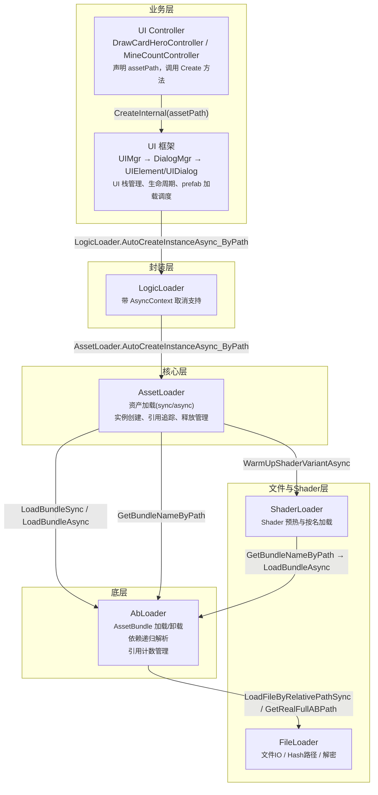

### 1.2 各模块职责一览表

| 模块 | 源文件（partial class 数量） | 核心职责 |
|---|---|---|
| **AbLoader** | 6 个文件 | AssetBundle 加载/卸载、依赖递归解析、引用计数、Shader预热 |
| **FileLoader** | 3 个文件 | 原始文件 IO（StreamingAssets/PersistentPath）、Hash 路径转换、加密解密 |
| **ShaderLoader** | 1 个文件 | Shader 名→路径映射、Shader 按名加载(sync/async) |
| **AssetLoader** | 5 个文件 | 资产级别加载(sync/async)、实例创建、引用追踪(4 个 Map)、释放管理、AutoRelease |
| **LogicLoader** | 1 个文件 | AssetLoader 业务封装，集成 AsyncContext 取消机制 |
| **UIMgr** | 4 个 partial class | UI 栈管理(Dialog/View/Widget)、异步操作队列、防重复创建 |
| **UIElement/UIDialog** | 3 个文件 | UI 生命周期基类、CreateInternal 模板方法、assetPath 约定 |

### 1.3 关键设计概念速览

| 概念 | 说明 |
|---|---|
| **AssetBundle 模式** | 真机(`asRealClient=true`)走 AB 包异步加载；Editor 下通过 `AssetDatabase` 直读 Assets 目录 |
| **引用计数** | AB 包和 Asset 各自维护引用计数，降到 0 后通过 `TryUnloadUnusedBundle` 自动卸载或手动释放 |
| **路径约定** | prefab 路径 `prefab/ui/draw_card/draw_card_hero.prefab` → AB 包名 `bundles/prefab/ui/draw_card.ab` |
| **异步排队** | 同一 path 的异步实例化通过 `CreateInstanceGroup` 回调队列保证 FIFO 顺序 |
| **Prefab 缓存** | `pathToPrefabInfo` 缓存已加载的 prefab，instanceCount 归零后自动移除 |
| **防重复创建** | UIMgr 使用 `_creatingUIPaths` HashSet 防止同一个 prefab 路径被同时创建多次 |

---

## 2. 核心数据结构

### 2.1 AbLoader 数据结构

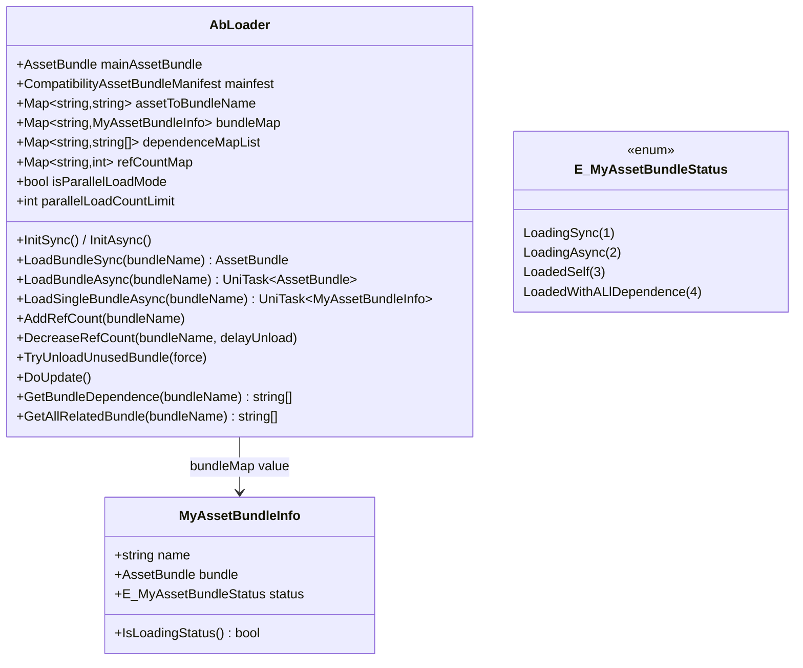

**字段说明:**

| 字段 | 用途 |
|---|---|
| `bundleMap` | 所有已加载/加载中的 AB 包 → 状态；Key 为 bundleName |
| `dependenceMapList` | bundleName → 完整递归依赖列表（不含自身）；由 `ParseDependencies` 从 mainfest 解析 |
| `refCountMap` | bundleName → 当前引用计数；包含自身+所有依赖；`AddRefCount` 时自增，`DecreaseRefCount` 自减 |
| `assetToBundleName` | BuildType2 模式：资产路径 → AB 包名查表；从 `asset2bundle.data` JSON 文件加载 |
| `isParallelLoadMode` | true=并行加载依赖(默认)，false=逐个加载 |
| `parallelLoadCountLimit` | 并行加载上限，默认 3，通过 `UniTaskSemaphore` 控制 |

### 2.2 AssetLoader 数据结构

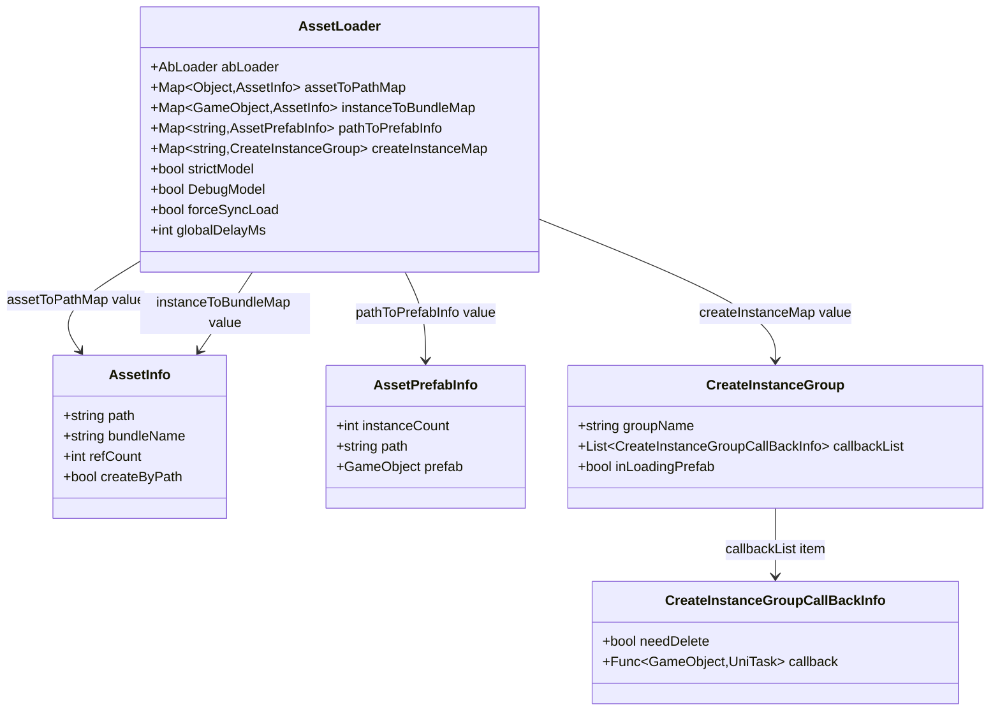

**四个核心 Map 的职责:**

| Map | Key | Value | 生命周期 |
|---|---|---|---|
| `assetToPathMap` | `Object` (加载的 Asset) | `AssetInfo` | `LoadAssetSync/Async` 时写入；`refCount` 归零 + `ReleaseAsset` 时移除 |
| `instanceToBundleMap` | `GameObject` (实例) | `AssetInfo` | `CreateInstance*` 时写入；`ReleaseInstance` 或 `AutoReleaseInstance.OnDestroy` 时移除 |
| `pathToPrefabInfo` | `string` (prefab 路径) | `AssetPrefabInfo` | 首次 `CreateInstanceAsync_ByPath` 写入 prefab；`instanceCount` 归零时移除 |
| `createInstanceMap` | `string` (prefab 路径) | `CreateInstanceGroup` | 异步创建时临时使用；队列中所有 callback 执行完且 `inLoadingPrefab=false` 后可清理 |

### 2.3 UI 框架数据结构

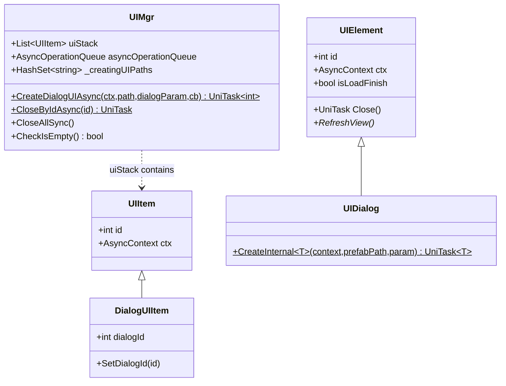

---

## 3. 初始化流程

### 3.1 启动时序

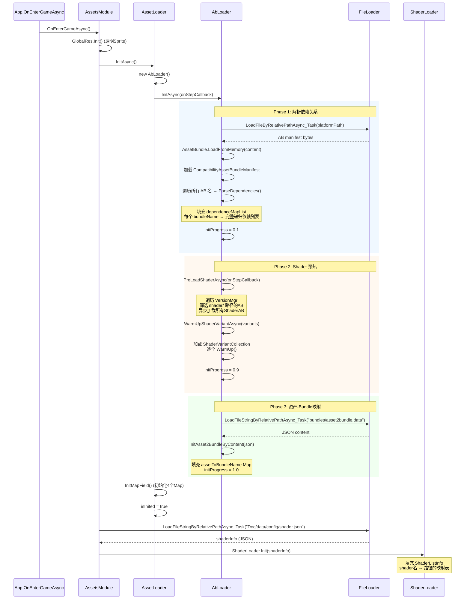

### 3.2 关键源码

**AssetsModule.OnEnterGameAsync** (`Assets/Scripts/AOT/Main/AppModule/OtherModule/AssetsModule.cs:31`):

```csharp
public override async UniTask OnEnterGameAsync()
{
    ProfilerMgr.Ins.Start("AssetsModule");
    progress = 0;
    await AssemblyMgr.LoadAsync(0);
    ScheduleUtil.Default.AddSchedule(this.DoUpdate, this);
    await AssetLoader.InitAsync();
    progress = progressStage[IdxOfProgress2_WarnupShader];
    string shaderInfo = await FileLoader.LoadFileStringByRelativePathAsync_Task("Doc/data/config/shader.json");
    ShaderLoader.Init(shaderInfo);
    ScreenFitness.ins.DoInit();
    progress = 1;
    ProfilerMgr.Ins.End("AssetsModule");
}
```

**AssetLoader.InitAsync** (`Assets/Libs/KitCore/Scripts/Frame/AssetLoader/AssetLoader.cs:151`):

```csharp
public static async UniTask InitAsync(Action<string> onStepCallback = null)
{
    isInited = false;
    if (EnvSetting.asRealClient)
    {
        AssetLoader.abLoader = new AbLoader();
        await AssetLoader.abLoader.InitAsync(onStepCallback);
    }
    InitMapField();
    isInited = true;
}
```

**AbLoader.InitAsync** (`Assets/Libs/KitCore/Scripts/Frame/AssetLoader/AbLoader.cs:83`):

```csharp
public async UniTask InitAsync(Action<string> onStepCallback = null)
{
    initProgress = 0;
    await ParseAllDependenceAsync();
    onStepCallback?.Invoke("ab loader parse dependence");
    initProgress = e_progress_1_parse_dependece;
    await PreLoadShaderAsync(onStepCallback);
    onStepCallback?.Invoke("ab loader preload shader");
    if (AssetLoader.IsUseBuildType2())
    {
        string jsonContent = await FileLoader.LoadFileStringByRelativePathAsync_Task(
            GetAssetToBundleNameRelativePath());
        InitAsset2BundleByContent(jsonContent);
        onStepCallback?.Invoke("ab loader load asset2bundle");
    }
    initProgress = 1;
}
```

**AbLoader.ParseAllDependenceAsync** (`Assets/Libs/KitCore/Scripts/Frame/AssetLoader/AbLoader.cs:152`):

```csharp
public async UniTask ParseAllDependenceAsync()
{
    var content = await FileLoader.LoadFileByRelativePathAsync_Task(FS.GetPlatformPathName());
    ParseAllDependenceByContent(content);
}

public void ParseAllDependenceByContent(byte[] content)
{
    mainAssetBundle = AssetBundle.LoadFromMemory(content);
    mainfest = mainAssetBundle.LoadAsset<CompatibilityAssetBundleManifest>("AssetBundleManifest");
    var nameList = mainfest.GetAllAssetBundles();
    foreach (var bundleName in nameList)
    {
        ParseDependencies(bundleName);
    }
}

private string[] ParseDependencies(string bundleName)
{
    string[] dependencies = mainfest.GetAllDependencies(bundleName);
    if (dependencies.Length == 0)
    {
        dependenceMapList[bundleName] = null;
        return null;
    }
    dependenceMapList[bundleName] = dependencies;
    return dependencies;
}
```

---

## 4. 核心业务流程

### 4.1 AssetBundle 加载 — 异步并行模式

`AbLoader.LoadBundleAsyncParallel` (`Assets/Libs/KitCore/Scripts/Frame/AssetLoader/ABloader_Load.cs:220`):

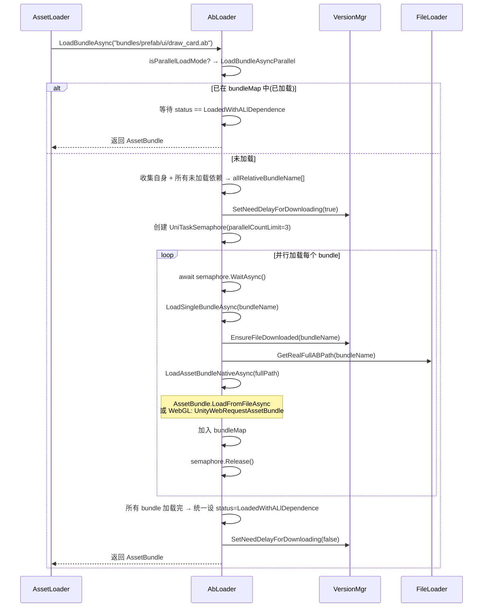

### 4.2 AssetLoader 加载 Asset（异步）

`AssetLoader.LoadAssetAsync<T>` (`Assets/Libs/KitCore/Scripts/Frame/AssetLoader/AssetLoader.cs:250`):

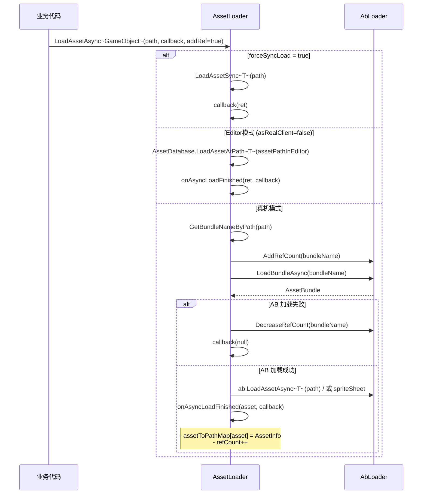

### 4.3 AssetLoader 创建 Instance（异步，带排队）

`AssetLoader.CreateInstanceAsync_ByPath` (`Assets/Libs/KitCore/Scripts/Frame/AssetLoader/AssetLoader_CreateInstance.cs:149`):

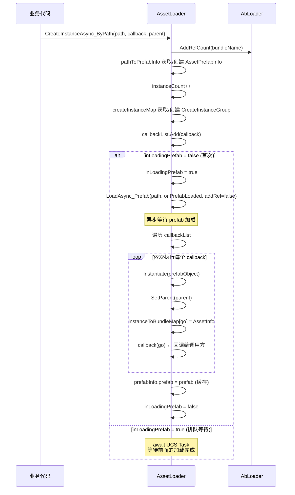

**排队机制的设计意图**: `CreateInstanceGroup` 保证同一 path 的异步实例化严格按调用顺序完成，避免先发起的请求后返回而导致业务状态错乱。

### 4.4 释放链

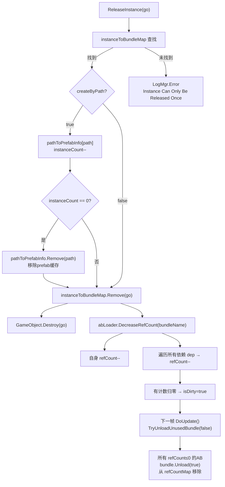

### 4.5 UI Dialog 创建完整调用链

以 `DrawCardHeroController` 为例:

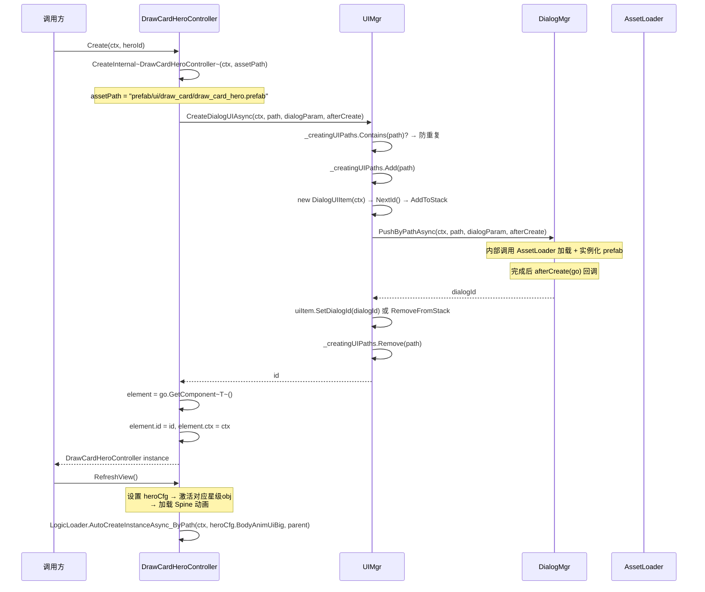

对应代码 (`DrawCardHeroController.cs:85`):

```csharp
public static async UniTask<DrawCardHeroController> Create(AsyncContext context, uint heroId)
{
    var ret = await CreateInternal<DrawCardHeroController>(context, assetPath);
    if (ret == null) return null;
    ret.heroId = heroId;
    ret.RefreshView();
    return ret;
}
```

---

## 5. 模块间交互

### 5.1 数据流图

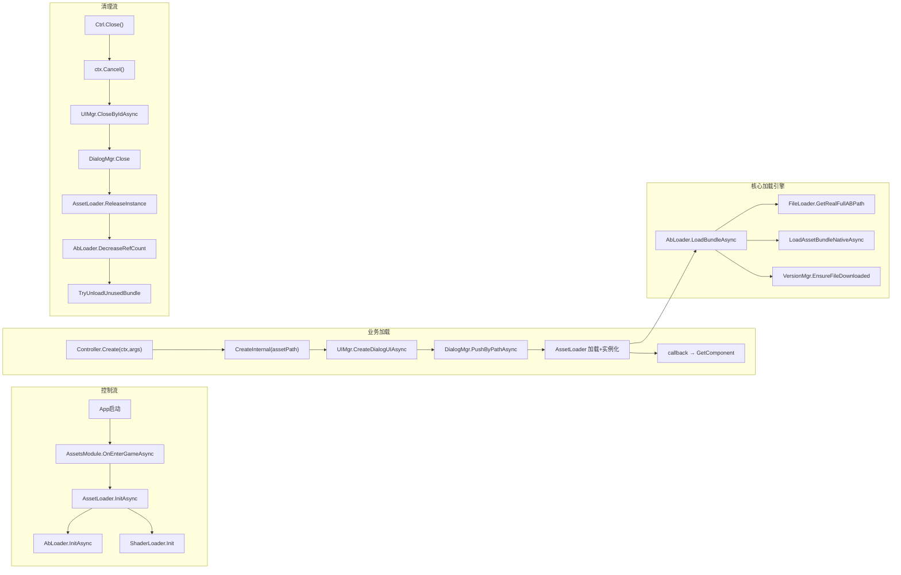

### 5.2 模块依赖关系

| 依赖方 | 被依赖方 | 依赖方式 |
|---|---|---|
| AssetsModule | AssetLoader, FileLoader, ShaderLoader, GlobalRes | 直接调用 static 方法 |
| UIMgr | DialogMgr (原生UI框架) | 通过 AsyncOperationQueue 串行化 |
| UIDialog | UIMgr.Ins.CreateDialogUIAsync | 模板方法 CreateInternal 中调用 |
| LogicLoader | AssetLoader (.AutoCreateInstanceAsync_ByPath, .LoadAssetAsync, .ReleaseAsset) | 薄封装，加 AsyncContext 检查 |
| AssetLoader | AbLoader (.LoadBundleSync/Async, .AddRefCount, .DecreaseRefCount) | partial class 的 static 成员 |
| AbLoader | FileLoader (.GetRealFullABPath, .LoadFileByRelativePathSync/Async) | 获取 AB 物理路径和文件内容 |
| AbLoader | VersionMgr (.EnsureFileDownloaded, .GetVersionFileItemForApp) | 文件下载和版本状态查询 |
| ShaderLoader | AssetLoader (.GetBundleNameByPath) → AbLoader (.LoadBundleSync/Async) | Shader 作为 AB 内的资源加载 |

---

## 6. 附录

### 6.1 源码路径索引表

| 模块 | 文件 | 主要内容 |
|---|---|---|
| **AbLoader** | `Assets/Libs/KitCore/Scripts/Frame/AssetLoader/AbLoader.cs` | 主类、构造函数、Init、Dependence解析、LoadBundleSync、引用计数、DoUpdate、OnDestroy |
| | `Assets/Libs/KitCore/Scripts/Frame/AssetLoader/ABloader_Load.cs` | 异步加载：LoadSingleBundleAsync、LoadBundleAsyncOneByOne、LoadBundleAsyncParallel、LoadAssetBundleNativeAsync |
| | `Assets/Libs/KitCore/Scripts/Frame/AssetLoader/AbLoader_AssetToBundlerName.cs` | asset2bundle.data 加载与解析 |
| | `Assets/Libs/KitCore/Scripts/Frame/AssetLoader/AbLoader_MyAssetBundleInfo.cs` | E_MyAssetBundleStatus 枚举、MyAssetBundleInfo 类 |
| | `Assets/Libs/KitCore/Scripts/Frame/AssetLoader/AbLoader_Shader.cs` | Shader AB 预加载（sync/async）、ShaderVariantCollection WarmUp |
| | `Assets/Libs/KitCore/Scripts/Frame/AssetLoader/AbLoader_Util.cs` | offsetForAssetBundle 常量、IsAssetBundleEncrypted |
| **AssetLoader** | `Assets/Libs/KitCore/Scripts/Frame/AssetLoader/AssetLoader.cs` | 主类、数据结构定义(AssetInfo/AssetPrefabInfo/CreateInstanceGroup)、Init、LoadAssetSync、LoadAssetAsync、ReleaseAsset、ReleaseInstance |
| | `Assets/Libs/KitCore/Scripts/Frame/AssetLoader/AssetLoader_LoadFunc.cs` | 类型化加载方法(Sync: Object/ScriptableObject/Prefab/Material/Mesh/Sprite/Texture 等; Async: 同上) |
| | `Assets/Libs/KitCore/Scripts/Frame/AssetLoader/AssetLoader_CreateInstance.cs` | 实例创建：CreateInstanceSync_ByPrefab/ByPath、CreateInstanceAsync_ByPath(Auto)、AutoRelease 变体 |
| | `Assets/Libs/KitCore/Scripts/Frame/AssetLoader/AssetLoader_Util.cs` | GetBundleNameByPath、GetFormulaBundleNameByPath、GetAssetsFileName、CheckPathLetterCase、_Print Debug |
| | `Assets/Libs/KitCore/Scripts/Frame/AssetLoader/AssetLoader_Deprecate.cs` | 废弃的 CreateInstanceAsync_ByPath_UnOrder (注释掉) |
| | `Assets/Libs/KitCore/Scripts/Frame/AssetLoader/AutoReleaseInstance.cs` | AutoReleaseInstance MonoBehaviour：OnDestroy 自动 ReleaseInstance |
| **FileLoader** | `Assets/Libs/KitCore/Scripts/Frame/FileSystem/FileLoader_Loader.cs` | 底层 IO：LoadFileBytesFromStreamingAssetsPathSync/Async、ReadAllBytesFromNormalPathSync、RequestFileData(UnityWebRequest)、平台分支(Android/WebGL) |
| | `Assets/Libs/KitCore/Scripts/Frame/FileSystem/FileLoader_Util.cs` | 工具：RemoveFileByRelativePath、IsCryptoFile、IsTextFile、GetRealFullABPath、IsFileExistByRelativePath |
| | `Assets/Libs/KitCore/Scripts/Frame/FileSystem/FileLoader_Loader_Public.cs` | 公共 API：LoadFileByRelativePathSync/Async、LoadFileStringByRelativePathSync/Async_Task、hookOnLoadBegin |
| **ShaderLoader** | `Assets/Libs/KitCore/Scripts/Frame/AssetLoader/ShaderLoader.cs` | ShaderItemInfo/ShaderListInfo 数据结构、Init、GetShaderPathByName、LoadByPathSync/Async、LoadByNameSync/Async |
| **LogicLoader** | `Assets/Scripts/Hot/Logic/LogicUtil/LogicLoader/LogicLoader.cs` | AutoCreateInstanceAsync_ByPath、LoadAssetAsync<T>、ReleaseAsset（均集成AsyncContext检查） |
| **UI框架** | `Assets/Scripts/Hot/Logic/LogicUtil/UIUtil/UIMgr/UIMgr.cs` | UIMgr 主类：uiStack、asyncOperationQueue、_creatingUIPaths、CloseByIdAsync、CloseAllSync、CloseUntil |
| | `Assets/Scripts/Hot/Logic/LogicUtil/UIUtil/UIMgr/UIMgr.Dialog.cs` | Dialog 创建：CreateDialogUIAsync → DialogMgr.PushByPathAsync |
| | `Assets/Scripts/Hot/Logic/LogicUtil/UIUtil/IUI/UIElement.cs` | UIElement 基类：id、ctx、isLoadFinish、Close()、RefreshView()* |
| | `Assets/Scripts/Hot/Logic/LogicUtil/UIUtil/IUI/UIDialog.cs` | UIDialog：CreateInternal<T> 模板方法 |
| **启动** | `Assets/Scripts/AOT/Main/AppModule/OtherModule/AssetsModule.cs` | IAppModule 实现：OnEnterGameAsync 中初始化 AssetLoader 和 ShaderLoader |
| | `Assets/Scripts/AOT/Main/AppModule/OtherModule/GlobalRes.cs` | 全局透明 Sprite 的创建与销毁 |

### 6.2 加载模式速查表

| 我要加载... | 用这个方法 | 释放方法 |
|---|---|---|
| UI Dialog (弹窗) | `MyController.Create(ctx, args)` | `.Close()` 自动关闭+释放 |
| UI 内动态 GameObject (Spine等) | `LogicLoader.AutoCreateInstanceAsync_ByPath(ctx, path, parent)` | `AssetLoader.ReleaseInstance(go)` 或挂 `AutoReleaseInstance` |
| GameObject (手动管理) | `AssetLoader.CreateInstanceAsync_ByPath(path, callback, parent)` | `AssetLoader.ReleaseInstance(go)` |
| Sprite 图片 | `AssetLoader.LoadAsync_Sprite(path, callback)` | `AssetLoader.ReleaseAsset(sprite)` |
| Material 材质 | `AssetLoader.LoadAsync_Material(path, callback)` | `AssetLoader.ReleaseAsset(mat)` |
| Texture 纹理 | `AssetLoader.LoadAsync_Texture(path, callback)` | `AssetLoader.ReleaseAsset(tex)` |
| TextAsset (文本资产) | `AssetLoader.LoadAsync_TextAsset(path, callback)` | `AssetLoader.ReleaseAsset(ta)` |
| AudioClip 音频 | `AssetLoader.LoadAsync_AudioClip(path, callback)` | `AssetLoader.ReleaseAsset(clip)` |
| SpriteSheet (图集) | `AssetLoader.LoadAsync_SpriteSheet(path, callback)` | `AssetLoader.ReleaseAsset(sheet)` |
| 预制体 Asset (不复用) | `AssetLoader.LoadSync_Prefab(path)` | `AssetLoader.ReleaseAsset(prefab)` |
| Shader (按名) | `ShaderLoader.LoadByNameAsync(shaderName)` | 无需释放 |
| Shader (按路径) | `ShaderLoader.LoadByPathAsync(shaderPath)` | 无需释放 |
| 原始文件 (配置/lua) | `FileLoader.LoadFileStringByRelativePathSync(path)` | 无需释放 (返回 string) |
| 原始文件 (二进制) | `FileLoader.LoadFileByRelativePathSync(path)` | 无需释放 (返回 byte[]) |
| AB 包 (常驻) | `AssetLoader.RetainBundle(bundleName)` | `AssetLoader.ReleaseBundle(bundleName)` |

### 6.3 常见问题

**Q: 为什么 LoadAssetAsync 用回调而不是直接返回 UniTask？**

A: `CreateInstanceAsync_ByPath` 需要保证同一路径的实例按调用顺序完成。如果直接返回 `UniTask<GameObject>`，异步时序不确定性会导致后发起的请求可能先完成。回调 + `CreateInstanceGroup` 队列机制保证了严格的 FIFO 顺序。

**Q: Editor 和真机的加载方式有什么不同？**

A: Editor 下 `EnvSetting.asRealClient == false`，通过 `AssetDatabase.LoadAssetAtPath` 直接读取 Assets 目录，跳过 AB 包系统，但会在回调前插入一帧延迟 (`UniTask.Delay(waitIntervalTime)`) 以模拟异步。真机通过 `AbLoader` 加载打包好的 AssetBundle。

**Q: 什么时候用 sync 加载，什么时候用 async？**

A: 业务代码中 UI 创建统一走 async (`CreateInternal` → `CreateDialogUIAsync`)。动态内容(Spine、特效等)走 async (`AutoCreateInstanceAsync_ByPath`)。配置读取走 sync FileLoader。sync 方法在 GAME_DEBUG 模式下会输出警告。

**Q: 为什么 AssetInfo.refCount > 1 是正常的？**

A: Unity 对于同一个 Asset（如 Sprite）的多次 `LoadAsset` 会返回同一个 Object 引用。因此多个调用方可能持有同一个 AssetInfo，refCount 跟踪实际引用数，只有降到 0 才从 assetToPathMap 移除。

**Q: `createByPath` 字段的作用？**

A: 标记这个 AssetInfo 对应的实例是直接通过路径创建的(`CreateInstance*_ByPath`)还是通过已有 prefab 创建的(`CreateInstance*_ByPrefab`)。释放时，只有 createByPath=true 才需要维护 `pathToPrefabInfo` 中的 instanceCount。

---

## 7. 完整源代码

### 文件: Assets/Libs/KitCore/Scripts/Frame/AssetLoader/AbLoader.cs

```csharp
using System;
using System.Collections.Generic;
using Cysharp.Threading.Tasks;
using KitCore.Basic;
using UnityEngine;
using UnityEngine.Build.Pipeline;
using UnityEngine.Pool;

namespace KitCore.Frame
{
    public partial class AbLoader
    {
        public AssetBundle mainAssetBundle;
        public CompatibilityAssetBundleManifest mainfest;
        public Map<string, string> assetToBundleName;
        public Map<string, MyAssetBundleInfo> bundleMap;
        public bool deleteImmediately = true;
        public Map<string, string[]> dependenceMapList = new Map<string, string[]>();
        public Map<string, int> refCountMap = new Map<string, int>();
        private bool isDirty;
        private ObjectPool<UniTaskSemaphore> semaphorePool;

        public AbLoader()
        {
            if (EnvSetting.asRealClient)
            {
                bundleMap = new Map<string, MyAssetBundleInfo>();
            }
            semaphorePool = new ObjectPool<UniTaskSemaphore>(
                createFunc: () => { return new UniTaskSemaphore(5); },
                actionOnRelease: (obj) => { obj.Clear(); }
            );
        }

        private float e_progress_1_parse_dependece = 0.1f;
        private float e_progress_2_warnup_shader = 0.9f;
        private float initProgress = 0;

        public float GetInitProgress() { return initProgress; }

        public void InitSync()
        {
            initProgress = 0;
            ParseAllDependenceSync();
            PreLoadShaderSync();
            if (AssetLoader.IsUseBuildType2())
            {
                string jsonContent = FileLoader.LoadFileStringByRelativePathSync(GetAssetToBundleNameRelativePath());
                InitAsset2BundleByContent(jsonContent);
            }
            initProgress = 1;
        }

        public async UniTask InitAsync(Action<string> onStepCallback = null)
        {
            initProgress = 0;
            await ParseAllDependenceAsync();
            onStepCallback?.Invoke("ab loader parse dependence");
            initProgress = e_progress_1_parse_dependece;
            await PreLoadShaderAsync(onStepCallback);
            onStepCallback?.Invoke("ab loader preload shader");
            if (AssetLoader.IsUseBuildType2())
            {
                string jsonContent = await FileLoader.LoadFileStringByRelativePathAsync_Task(
                    GetAssetToBundleNameRelativePath());
                InitAsset2BundleByContent(jsonContent);
                onStepCallback?.Invoke("ab loader load asset2bundle");
            }
            initProgress = 1;
        }

        public void OnDestroy()
        {
            if (bundleMap != null)
            {
                bundleMap.ForEachPairs((_, v) =>
                {
                    if (v.bundle == null)
                    {
                        if (EnvSetting.IsDebugOrEditor())
                            LogMgr.Error("OnDestroy bundle is null: ", v.name);
                        else
                            LogMgr.Info("Error OnDestroy bundle is null: ", v.name);
                        return;
                    }
                    v.bundle.Unload(true);
                });
                bundleMap = null;
            }
            if (mainAssetBundle != null)
            {
                mainAssetBundle.Unload(true);
                mainAssetBundle = null;
            }
        }

        public void ParseAllDependenceSync()
        {
            var content = FileLoader.LoadFileByRelativePathSync(FS.GetPlatformPathName());
            ParseAllDependenceByContent(content);
        }

        public async UniTask ParseAllDependenceAsync()
        {
            var content = await FileLoader.LoadFileByRelativePathAsync_Task(FS.GetPlatformPathName());
            ParseAllDependenceByContent(content);
        }

        public void ParseAllDependenceByContent(byte[] content)
        {
            mainAssetBundle = AssetBundle.LoadFromMemory(content);
            mainfest = mainAssetBundle.LoadAsset<CompatibilityAssetBundleManifest>("AssetBundleManifest");
            var nameList = mainfest.GetAllAssetBundles();
            foreach (var bundleName in nameList)
                ParseDependencies(bundleName);
        }

        private string[] ParseDependencies(string bundleName)
        {
            string[] dependencies = mainfest.GetAllDependencies(bundleName);
            if (dependencies.Length == 0)
            {
                dependenceMapList[bundleName] = null;
                return null;
            }
            dependenceMapList[bundleName] = dependencies;
            return dependencies;
        }

        public string[] GetBundleDependence(string bundleName)
        {
            return dependenceMapList.GetIfExist(bundleName, null);
        }

        public string[] GetAllRelatedBundle(string bundleName)
        {
            var dep = GetBundleDependence(bundleName);
            if (dep == null || dep.Length == 0)
                return new string[] { bundleName };
            else
            {
                List<string> ret = new List<string>();
                ret.Add(bundleName);
                ret.AddRange(dep);
                return ret.ToArray();
            }
        }

        public AssetBundle LoadBundleSync(string bundleName)
        {
            if (mainAssetBundle == null) return null;
            var retBundleInfo = bundleMap.GetIfExist(bundleName, null);
            bool isError = false;
            if (retBundleInfo != null)
            {
                if (retBundleInfo.status != E_MyAssetBundleStatus.LoadedWithALlDependence)
                {
                    LogMgr.Error("LoadBundle status error(is in async loading)", bundleName, retBundleInfo.status);
                    return null;
                }
                return retBundleInfo.bundle;
            }
            retBundleInfo = new MyAssetBundleInfo(bundleName, null, E_MyAssetBundleStatus.LoadingSync);
            bundleMap[bundleName] = retBundleInfo;
            string abPath = FileLoader.GetRealFullABPath(bundleName);
            AssetBundle ab = AbLoader.LoadAssetBundleSync(abPath);
            if (ab == null)
            {
                bundleMap.Remove(bundleName);
                return null;
            }
            retBundleInfo.bundle = ab;
            retBundleInfo.status = E_MyAssetBundleStatus.LoadedWithALlDependence;
            var dependenceList = GetBundleDependence(bundleName);
            if (dependenceList != null)
            {
                LogMgr.indent++;
                foreach (var depItemName in dependenceList)
                {
                    var bundleDepInfo = bundleMap.GetIfExist(depItemName, null);
                    if (bundleDepInfo != null)
                    {
                        if (bundleDepInfo.status == E_MyAssetBundleStatus.LoadedWithALlDependence) continue;
                        else { LogMgr.Error("LoadBundle status error", depItemName, bundleDepInfo.status); isError = true; continue; }
                    }
                    bundleDepInfo = new MyAssetBundleInfo(bundleName, null, E_MyAssetBundleStatus.LoadingSync);
                    bundleMap[depItemName] = bundleDepInfo;
                    string depAbPath = FileLoader.GetRealFullABPath(depItemName);
                    var depAbFile = AbLoader.LoadAssetBundleSync(depAbPath);
                    if (depAbFile == null) { bundleMap.Remove(depItemName); isError = true; }
                    bundleDepInfo.bundle = depAbFile;
                    bundleDepInfo.status = E_MyAssetBundleStatus.LoadedWithALlDependence;
                }
                LogMgr.indent--;
            }
            if (isError) { bundleMap.Remove(bundleName); return null; }
            return retBundleInfo.bundle;
        }

        public void UnloadBundle(string bundleName, bool force)
        {
            MyAssetBundleInfo bundleInfo = bundleMap.GetIfExist(bundleName, null);
            if (bundleInfo == null) return;
            if (bundleInfo.status != E_MyAssetBundleStatus.LoadedWithALlDependence)
                LogMgr.Error("UnloadBundle error", bundleInfo.name, bundleInfo.status);
            else
            {
                if (bundleInfo.bundle != null) bundleInfo.bundle.Unload(true);
                else LogMgr.Error("UnloadBundle error, bundle is null", bundleInfo.name);
            }
            bundleMap.Remove(bundleName);
        }

        private List<string> _toBeRemovedList = new List<string>();

        public void TryUnloadUnusedBundle(bool force)
        {
            foreach (var pair in refCountMap)
                if (pair.Value <= 0) _toBeRemovedList.Add(pair.Key);
            if (_toBeRemovedList.Count > 0)
            {
                foreach (var bundleName in _toBeRemovedList)
                {
                    try { UnloadBundle(bundleName, force); refCountMap.Remove(bundleName); }
                    catch (Exception e) { LogMgr.Error("TryUnloadUnusedBundle error:", bundleName, e.ToString()); }
                }
                _toBeRemovedList.Clear();
            }
        }

        public void AddRefCount(string bundleName)
        {
            AddSingleRefCount(bundleName);
            var depList = GetBundleDependence(bundleName);
            if (depList != null)
                foreach (var depItemName in depList)
                    AddSingleRefCount(depItemName);
        }

        public void AddSingleRefCount(string bundleName)
        {
            if (refCountMap.ContainsKey(bundleName)) refCountMap[bundleName]++;
            else refCountMap[bundleName] = 1;
        }

        public void DecreaseRefCount(string bundleName, bool delayUnload)
        {
            DecreaseSingleRefCount(bundleName);
            var depList = GetBundleDependence(bundleName);
            if (depList != null)
                foreach (var depItemName in depList)
                    DecreaseSingleRefCount(depItemName);
        }

        public int DecreaseSingleRefCount(string bundleName)
        {
            if (!refCountMap.ContainsKey(bundleName)) { LogMgr.Error("DecreaseRefCount not found:", bundleName); return 0; }
            var currentCount = refCountMap[bundleName];
            if (currentCount <= 0) { LogMgr.Error("DecreaseRefCount count error:", bundleName, currentCount); return currentCount - 1; }
            currentCount--;
            if (currentCount == 0) isDirty = true;
            refCountMap[bundleName] = currentCount;
            return currentCount;
        }

        public int GetRefCount(string bundleName)
        {
            if (refCountMap.ContainsKey(bundleName)) return refCountMap[bundleName];
            return 0;
        }

        public void DoUpdate()
        {
            if (!isDirty) return;
            isDirty = false;
            TryUnloadUnusedBundle(false);
        }
    }
}
```

---

### 文件: Assets/Libs/KitCore/Scripts/Frame/AssetLoader/ABloader_Load.cs

```csharp
using System;
using System.Collections.Generic;
using Cysharp.Threading.Tasks;
using KitCore.Basic;
using UnityEngine;

namespace KitCore.Frame
{
    public partial class AbLoader
    {
        public bool isParallelLoadMode = true;
        public int parallelLoadCountLimit = 3;

        public async UniTask<MyAssetBundleInfo> LoadSingleBundleAsync(string bundleNameNoHash)
        {
            var bundleDepInfo = bundleMap.GetIfExist(bundleNameNoHash, null);
            if (bundleDepInfo != null)
            {
                while (bundleDepInfo.IsLoadingStatus())
                    await UniTask.DelayFrame(AssetLoader.waitIntervalFrame, PlayerLoopTiming.Update,
                        App.GetDestroyCancelToken());
                return bundleDepInfo;
            }
            bundleDepInfo = new MyAssetBundleInfo(bundleNameNoHash, null, E_MyAssetBundleStatus.LoadingAsync);
            bundleMap[bundleNameNoHash] = bundleDepInfo;
            string abFullPathWithHash = FileLoader.GetRealFullABPath(bundleNameNoHash);
            await VersionMgr.Ins.EnsureFileDownloaded(bundleNameNoHash);
            var depAbFile = await AbLoader.LoadAssetBundleNativeAsync(abFullPathWithHash, bundleNameNoHash);
            if (depAbFile == null)
                LogMgr.Error("LoadSingleBundleAsync not found", bundleNameNoHash, abFullPathWithHash);
            if (bundleDepInfo.status == E_MyAssetBundleStatus.LoadedWithALlDependence)
                return bundleDepInfo;
            bundleDepInfo.bundle = depAbFile;
            if (bundleDepInfo.status != E_MyAssetBundleStatus.LoadedWithALlDependence)
                bundleDepInfo.status = E_MyAssetBundleStatus.LoadedSelf;
            return bundleDepInfo;
        }

        public async UniTask<AssetBundle> LoadBundleAsync(string bundleName)
        {
            if (mainAssetBundle == null) { LogMgr.Error("mainAssetBundle is null", bundleName); return null; }
            if (isParallelLoadMode)
                return await LoadBundleAsyncParallel(bundleName, parallelLoadCountLimit);
            else
                return await LoadBundleAsyncOneByOne(bundleName);
        }

        public async UniTask<AssetBundle> LoadBundleAsyncOneByOne(string bundleName)
        {
            var retBundleInfo = bundleMap.GetIfExist(bundleName, null);
            if (retBundleInfo == null)
            {
                long downloadSize = 0;
                string abFullPathWithHash = FileLoader.GetRealFullABPath(bundleName);
                retBundleInfo = new MyAssetBundleInfo(bundleName, null, E_MyAssetBundleStatus.LoadingAsync);
                bundleMap[bundleName] = retBundleInfo;
                VersionMgr.Ins.SetNeedDelayForDownloading(true);
                downloadSize += await VersionMgr.Ins.EnsureFileDownloaded(bundleName);
                AssetBundle ab = await AbLoader.LoadAssetBundleNativeAsync(abFullPathWithHash, bundleName);
                if (ab == null) bundleMap.Remove(bundleName);
                var dependenceList = GetBundleDependence(bundleName);
                if (dependenceList != null)
                {
                    LogMgr.indent++;
                    Seq<MyAssetBundleInfo> needBeSetBundleList = new Seq<MyAssetBundleInfo>();
                    foreach (var depItemName in dependenceList)
                    {
                        var bundleDepInfo = bundleMap.GetIfExist(depItemName, null);
                        if (bundleDepInfo != null)
                        {
                            while (bundleDepInfo.IsLoadingStatus())
                                await UniTask.DelayFrame(AssetLoader.waitIntervalFrame, PlayerLoopTiming.Update,
                                    App.GetDestroyCancelToken());
                            continue;
                        }
                        bundleDepInfo = new MyAssetBundleInfo(bundleName, null, E_MyAssetBundleStatus.LoadingAsync);
                        bundleMap[depItemName] = bundleDepInfo;
                        string depAbFullPathWithHash = FileLoader.GetRealFullABPath(depItemName);
                        downloadSize += await VersionMgr.Ins.EnsureFileDownloaded(depItemName);
                        var depAbFile = await AbLoader.LoadAssetBundleNativeAsync(depAbFullPathWithHash, depItemName);
                        if (depAbFile == null) LogMgr.Error("dep not found", depItemName, depAbFullPathWithHash);
                        bundleDepInfo.bundle = depAbFile;
                        if (bundleDepInfo.status != E_MyAssetBundleStatus.LoadedWithALlDependence)
                            bundleDepInfo.status = E_MyAssetBundleStatus.LoadedSelf;
                        needBeSetBundleList.Add(bundleDepInfo);
                    }
                    foreach (var depBundleInfo in needBeSetBundleList)
                        depBundleInfo.status = E_MyAssetBundleStatus.LoadedWithALlDependence;
                    LogMgr.indent--;
                }
                VersionMgr.Ins.SetNeedDelayForDownloading(false);
                retBundleInfo.bundle = ab;
                retBundleInfo.status = E_MyAssetBundleStatus.LoadedWithALlDependence;
            }
            else
            {
                while (retBundleInfo.status != E_MyAssetBundleStatus.LoadedWithALlDependence)
                    await UniTask.DelayFrame(AssetLoader.waitIntervalFrame, PlayerLoopTiming.Update,
                        App.GetDestroyCancelToken());
            }
            return retBundleInfo.bundle;
        }

        private UniTaskSemaphore SemaphoreGet(int parallelCount) { var ret = semaphorePool.Get(); ret.SetCount(parallelCount); return ret; }
        private void SemaphoreReturn(UniTaskSemaphore s) { s.Clear(); semaphorePool.Release(s); }

        public async UniTask<AssetBundle> LoadBundleAsyncParallel(string bundleName, int parallelCount)
        {
            var retBundleInfo = bundleMap.GetIfExist(bundleName, null);
            if (retBundleInfo == null)
            {
                List<string> allRelativeBundleName = new List<string> { bundleName };
                var dependenceList = GetBundleDependence(bundleName);
                if (dependenceList != null)
                    foreach (var depItemName in dependenceList)
                    {
                        var bundleDepInfo = bundleMap.GetIfExist(depItemName, null);
                        if (bundleDepInfo == null || bundleDepInfo.IsLoadingStatus())
                            allRelativeBundleName.Add(depItemName);
                    }
                List<MyAssetBundleInfo> allRelativeBundle = new List<MyAssetBundleInfo>();
                VersionMgr.Ins.SetNeedDelayForDownloading(true);
                int finishedCount = 0;
                var tcs = new UniTaskCompletionSource();
                var semaphore = SemaphoreGet(parallelCount);
                foreach (var itemBundleName in allRelativeBundleName)
                {
                    await semaphore.WaitAsync();
                    LoadSingleBundleAsync(itemBundleName).ContinueWith((itemBundle) =>
                    {
                        semaphore.Release();
                        finishedCount++;
                        allRelativeBundle.Add(itemBundle);
                        if (finishedCount == allRelativeBundleName.Count)
                            tcs.TrySetResult();
                    });
                }
                await tcs.Task;
                SemaphoreReturn(semaphore);
                foreach (var myBundle in allRelativeBundle)
                    myBundle.status = E_MyAssetBundleStatus.LoadedWithALlDependence;
                retBundleInfo = bundleMap.GetIfExist(bundleName, null);
                VersionMgr.Ins.SetNeedDelayForDownloading(false);
            }
            else
            {
                while (retBundleInfo.status != E_MyAssetBundleStatus.LoadedWithALlDependence)
                    await UniTask.DelayFrame(AssetLoader.waitIntervalFrame, PlayerLoopTiming.Update,
                        App.GetDestroyCancelToken());
            }
            return retBundleInfo.bundle;
        }

        private static UniTaskSemaphore globalABLoadSemaphore = new UniTaskSemaphore(5);
        public static bool useGlobalSemaphore = false;

        public static async UniTask<AssetBundle> LoadAssetBundleNativeAsync(string abFullPathWithHash,
            string relativePathNoHash)
        {
            FileLoader.hookOnLoadBegin?.Invoke(relativePathNoHash);
            if (useGlobalSemaphore) await globalABLoadSemaphore.WaitAsync();
            try
            {
                if (IsAssetBundleEncrypted())
                {
                    var ret = await AssetBundle.LoadFromFileAsync(abFullPathWithHash, 0, offsetForAssetBundle);
                    if (ret == null)
                    {
                        await UniTask.Delay(1000);
                        ret = await AssetBundle.LoadFromFileAsync(abFullPathWithHash, 0, offsetForAssetBundle);
                    }
                    if (useGlobalSemaphore) globalABLoadSemaphore.Release();
                    return ret;
                }
                else
                {
                    var ret = await AssetBundle.LoadFromFileAsync(abFullPathWithHash);
                    if (ret == null)
                    {
                        await UniTask.Delay(1000);
                        ret = await AssetBundle.LoadFromFileAsync(abFullPathWithHash);
                    }
                    if (useGlobalSemaphore) globalABLoadSemaphore.Release();
                    return ret;
                }
            }
            catch (Exception)
            {
                if (useGlobalSemaphore) globalABLoadSemaphore.Release();
            }
            return null;
        }

        public static AssetBundle LoadAssetBundleSync(string abPath)
        {
            if (IsAssetBundleEncrypted())
                return AssetBundle.LoadFromFile(abPath, 0, offsetForAssetBundle);
            else
                return AssetBundle.LoadFromFile(abPath);
        }
    }
}
```

---

### 文件: Assets/Libs/KitCore/Scripts/Frame/AssetLoader/AbLoader_MyAssetBundleInfo.cs

```csharp
using UnityEngine;

namespace KitCore.Frame
{
    public enum E_MyAssetBundleStatus
    {
        LoadingSync = 1,
        LoadingAsync = 2,
        LoadedSelf = 3,
        LoadedWithALlDependence = 4,
    }

    public class MyAssetBundleInfo
    {
        public string name;
        public AssetBundle bundle;
        public E_MyAssetBundleStatus status;

        public bool IsLoadingStatus()
        {
            return this.status == E_MyAssetBundleStatus.LoadingAsync
                || this.status == E_MyAssetBundleStatus.LoadingSync;
        }

        public MyAssetBundleInfo(string name, AssetBundle b, E_MyAssetBundleStatus s)
        {
            this.name = name;
            this.bundle = b;
            this.status = s;
        }
    }
}
```

---

### 文件: Assets/Libs/KitCore/Scripts/Frame/AssetLoader/AbLoader_AssetToBundlerName.cs

```csharp
using KitCore.Basic;

namespace KitCore.Frame
{
    public partial class AbLoader
    {
        public static string GetAssetToBundleNameRelativePath()
        {
            return FS.Join(CoreConfig.Ins.assetBundleConfig.assetBundleDirName, "asset2bundle.data");
        }

        public void InitAsset2BundleByContent(string jsonContent)
        {
            assetToBundleName = KitCoreLitJson.JsonMapper.ToObject<Map<string, string>>(jsonContent);
        }
    }
}
```

---

### 文件: Assets/Libs/KitCore/Scripts/Frame/AssetLoader/AbLoader_Util.cs

```csharp
namespace KitCore.Frame
{
    public partial class AbLoader
    {
        public const ulong offsetForAssetBundle = 16;

        public static bool IsAssetBundleEncrypted()
        {
            return CoreConfig.Ins.assetBundleConfig.encrypted;
        }
    }
}
```

---

### 文件: Assets/Libs/KitCore/Scripts/Frame/AssetLoader/AbLoader_Shader.cs

```csharp
using System;
using Cysharp.Threading.Tasks;
using UnityEngine;

namespace KitCore.Frame
{
    public partial class AbLoader
    {
        public string ShaderRelativePath => CoreConfig.Ins.assetBundleConfig.assetBundleDirName + "/shader/";
        public string VariantsDirPath => CoreConfig.Ins.assetBundleConfig.assetBundleDirName + "/shader/variants.ab";

        public void PreLoadShaderSync()
        {
            if (VersionMgr.IsSkip()) { return; }
            int loadedCount = 0;
            VersionMgr.Ins.GetNameToPathMap().ForEachPairs((key, value) =>
            {
                string bundleName = value.name;
                if (bundleName.StartsWith(ShaderRelativePath) &&
                    value.name.EndsWith(CoreConfig.Ins.assetBundleConfig.assetBundleSuffix) &&
                    value.name != VariantsDirPath)
                {
                    if (bundleMap.ContainsKey(bundleName)) return;
                    string abPath = FileLoader.GetRealFullABPath(bundleName);
                    AssetBundle ab = AbLoader.LoadAssetBundleSync(abPath);
                    if (ab != null)
                    {
                        loadedCount++;
                        bundleMap[bundleName] = new MyAssetBundleInfo(bundleName, ab,
                            E_MyAssetBundleStatus.LoadedWithALlDependence);
                    }
                }
            });
            int warmupVariantFileCount = 0, warmupShaderCount = 0, warmupVariantCount = 0;
            if (FileLoader.IsFileExistByRelativePath(VariantsDirPath))
            {
                string abPath = FileLoader.GetRealFullABPath(VariantsDirPath);
                AssetBundle ab = AbLoader.LoadAssetBundleSync(abPath);
                if (ab != null)
                {
                    bundleMap[VariantsDirPath] = new MyAssetBundleInfo(abPath, ab,
                        E_MyAssetBundleStatus.LoadedWithALlDependence);
                    var list = ab.LoadAllAssets<ShaderVariantCollection>();
                    foreach (var item in list)
                    {
                        warmupVariantFileCount++;
                        warmupShaderCount += item.shaderCount;
                        warmupVariantCount += item.variantCount;
                        item.WarmUp();
                    }
                }
            }
        }

        public async UniTask PreLoadShaderAsync(Action<string> onStepCallback = null)
        {
            if (VersionMgr.IsSkip()) { return; }
            int loadedCount = 0;
            var valueSeq = VersionMgr.Ins.GetNameToPathMap().ValueSeq;
            foreach (var value in valueSeq)
            {
                string bundleName = value.name;
                if (bundleName.StartsWith(ShaderRelativePath) &&
                    value.name.EndsWith(CoreConfig.Ins.assetBundleConfig.assetBundleSuffix) &&
                    value.name != VariantsDirPath)
                {
                    if (bundleMap.ContainsKey(bundleName)) return;
                    string abFullPathWithHash = FileLoader.GetRealFullABPath(bundleName);
                    AssetBundle ab = await AbLoader.LoadAssetBundleNativeAsync(abFullPathWithHash, bundleName);
                    if (ab != null)
                    {
                        loadedCount++;
                        bundleMap[bundleName] = new MyAssetBundleInfo(bundleName, ab,
                            E_MyAssetBundleStatus.LoadedWithALlDependence);
                    }
                }
            }
            onStepCallback?.Invoke("load shader 1");
            await this.WarmUpShaderVariantAsync(VariantsDirPath, ((current, total) =>
            {
                if (total == 0) this.initProgress = e_progress_2_warnup_shader;
                else this.initProgress = e_progress_1_parse_dependece +
                    (e_progress_2_warnup_shader - e_progress_1_parse_dependece) * current / total;
                onStepCallback?.Invoke(current.ToString());
            }));
        }

        public async UniTask WarmUpShaderVariantAsync(string variantBundlerName, Action<int, int> onProgress)
        {
            if (!FileLoader.IsFileExistByRelativePath(variantBundlerName)) return;
            long lastYieldTime = TimeMgr.Ins.GetMachineMillisecond();
            int warmupVariantFileCount = 0, warmupShaderCount = 0, warmupVariantCount = 0;
            string abFullPathWithHash = FileLoader.GetRealFullABPath(variantBundlerName);
            AssetBundle ab = await AbLoader.LoadAssetBundleNativeAsync(abFullPathWithHash, variantBundlerName);
            if (ab != null)
            {
                bundleMap[variantBundlerName] = new MyAssetBundleInfo(variantBundlerName, ab,
                    E_MyAssetBundleStatus.LoadedWithALlDependence);
                var list = ab.LoadAllAssets<ShaderVariantCollection>();
                int totalVariantCount = list.Length;
                int currentFinishedVariantCount = 0;
                if (list.Length == 0) onProgress(0, 0);
                foreach (var item in list)
                {
                    warmupVariantFileCount++;
                    warmupShaderCount += item.shaderCount;
                    warmupVariantCount += item.variantCount;
                    item.WarmUp();
                    currentFinishedVariantCount++;
                    onProgress?.Invoke(currentFinishedVariantCount, totalVariantCount);
                    if (TimeMgr.Ins.GetMachineMillisecond() - lastYieldTime > 200)
                    {
                        await UniTask.NextFrame();
                        lastYieldTime = TimeMgr.Ins.GetMachineMillisecond();
                    }
                }
            }
        }
    }
}
```

---

### 文件: Assets/Libs/KitCore/Scripts/Frame/AssetLoader/AssetLoader.cs

(已在上文第4章中摘录核心方法，此处省略数据结构部分避免重复。完整代码见源文件。)

核心方法清单:
- `InitSync()` / `InitAsync()` — 初始化 AbLoader 和 Map 字段
- `DomainReset()` — 域重置
- `DoUpdate()` — 帧更新，触发 AB 包清理
- `LoadAssetSync<T>(path, addRef, isSpriteSheet)` — 同步加载资产
- `LoadAssetAsync<T>(path, onFinished, addRef, isSpriteSheet)` — 异步加载资产
- `LoadAssetAsyncTask<T>(path, addRef, isSpriteSheet)` — 异步加载(Task返回值)
- `ReleaseAsset(Object asset, delayUnload)` — 释放资产
- `ReleaseInstance(GameObject instance, delayUnload)` — 释放实例
- `ReleaseInstanceImmediate(GameObject instance, delayUnload)` — 立即释放实例
- `RetainBundle(bundleName)` / `ReleaseBundle(bundleName)` — AB 包常驻
- `GetBundleNameByPath(relativeAssetPath)` — 路径→AB包名
- `GetAllRelatedBundleByAsset(assetPath)` — 获取资产关联的所有AB包名

---

### 文件: Assets/Libs/KitCore/Scripts/Frame/AssetLoader/AssetLoader_LoadFunc.cs

核心方法清单 (Sync):
- `LoadSync_Object(path)` — `LoadAssetSync<Object>`
- `LoadSync_ScriptableObject(path)` — `LoadAssetSync<ScriptableObject>`
- `LoadSync_Prefab(path)` — `LoadAssetSync<GameObject>`
- `LoadSync_Material(path)` — `LoadAssetSync<Material>`
- `LoadSync_Mesh(path)` — `LoadAssetSync<Mesh>`
- `LoadSync_Animation(path)` — `LoadAssetSync<Animation>`
- `LoadSync_Animator(path)` — `LoadAssetSync<Animator>`
- `LoadSync_Sprite(path)` — `LoadAssetSync<Sprite>`
- `LoadSync_SpriteSheet(path)` — `LoadAssetSync<SpriteSheet>(isSpriteSheet:true)`
- `LoadSync_Texture(path)` — `LoadAssetSync<Texture>`
- `LoadSync_Texture2D(path)` — `LoadAssetSync<Texture2D>`
- `LoadSync_SpriteAtlas(path)` — `LoadAssetSync<SpriteAtlas>`
- `LoadSync_AudioClip(path)` — `LoadAssetSync<AudioClip>`
- `LoadSync_VideoClip(path)` — `LoadAssetSync<VideoClip>`
- `LoadSync_TerrainData(path)` — `LoadAssetSync<TerrainData>`
- `LoadSync_TextAsset(path)` — `LoadAssetSync<TextAsset>`
- `LoadSync_RenderPipelineAsset(path)` — `LoadAssetSync<RenderPipelineAsset>`

核心方法清单 (Async) — 对应上述所有类型的 `LoadAsync_*` 变体，统一通过 `LoadAssetAsync<T>` 回调方式实现。

---

### 文件: Assets/Libs/KitCore/Scripts/Frame/AssetLoader/AssetLoader_CreateInstance.cs

核心方法清单:
- `CreateInstanceSync_ByPrefab(prefab, parent)` — 从已有 prefab 同步创建实例
- `CreateInstanceSync_ByPath(path, parent)` — 从路径同步创建实例（缓存 prefab）
- `AutoCreateInstanceSync_ByPrefab/ByPath` — 自动释放变体（添加 AutoReleaseInstance 组件）
- `CreateInstanceAsync_ByPath(path, onFinished, parent, delayMs)` — 异步创建实例（带排队机制）
- `AutoCreateInstanceAsync_ByPath(path, onFinished, parent, delayMs)` — 自动释放变体

---

### 文件: Assets/Libs/KitCore/Scripts/Frame/AssetLoader/AssetLoader_Util.cs

核心方法清单:
- `GetBundleNameByPath(relativeAssetPath)` — 依据 buildType 选择查表或公式计算
- `GetFormulaBundleNameByPath(relativeAssetPath)` — 公式: `bundles/{dir}.ab`
- `GetFormulaBundleNameByDir(relativeDir)` — 目录→AB包名
- `GetAssetsFileName(path)` — 路径中提取文件名
- `_Print(printError)` — Debug 打印未释放的 Asset/Instance/AB 包信息

---

### 文件: Assets/Libs/KitCore/Scripts/Frame/AssetLoader/AutoReleaseInstance.cs

```csharp
using UnityEngine;

namespace KitCore.Frame
{
    [DisallowMultipleComponent]
    public class AutoReleaseInstance : MonoBehaviour
    {
        [HideInInspector]
        public bool isAutoRelease = true;

        private string debugName = "";

        void Awake()
        {
            debugName = this.gameObject.name;
        }

        void OnDestroy()
        {
            if (isAutoRelease)
            {
                if (!AssetLoader.ReleaseInstance(this.gameObject))
                {
                    LogMgr.Error("AutoReleaseInstance OnDestroy ReleaseInstance failed, name: {0}", debugName);
                }
            }
        }
    }
}
```

---

### 文件: Assets/Libs/KitCore/Scripts/Frame/FileSystem/FileLoader_Loader_Public.cs

核心方法清单:
- `LoadFileByRelativePathSync(relativePathNoHash)` — 同步读文件(byte[])，自动判断 Stream/Persist 来源
- `LoadFileByRelativePathAsync_Task(relativePath)` — 异步读文件(byte[])
- `LoadFileStringByRelativePathSync(relativePath)` — 同步读文本(UTF8 string)
- `LoadFileStringByRelativePathAsync_Task(path)` — 异步读文本(UTF8 string)
- `hookOnLoadBegin` — 加载开始回调 hook

**同步加载核心流程** (`FileLoader_Loader_Public.cs:58`):

```csharp
public static byte[] LoadFileByRelativePathSync(string relativePathNoHash)
{
    hookOnLoadBegin?.Invoke(relativePathNoHash);
    if (!EnvSetting.asRealClient)
    {
#if UNITY_EDITOR
        return ReadAllBytesFromNormalPathSync(FS.Join(Application.dataPath, relativePathNoHash));
#endif
    }
    bool isInStream = false;
    if (VersionMgr.IsSkip()) { isInStream = true; }
    else
    {
        var versionFileInfo = VersionMgr.Ins.GetVersionFileItemForApp(relativePathNoHash, true);
        if (versionFileInfo.status == E_VersionFileStatus.InStream) isInStream = true;
    }
    byte[] content;
    if (isInStream)
        content = LoadFileBytesFromStreamingAssetsPathSync(true, relativePathNoHash);
    else
    {
        string relativePathWithHash = OriginFileToHashFileMgr.CovertToHashRelativePath(relativePathNoHash);
        content = ReadAllBytesFromNormalPathSync(
            FS.Join(FS.GetPersistentPath(), FS.GetPlatformPathName(), relativePathWithHash));
    }
    if (IsCryptoFile(relativePathNoHash))
        content = CryptoUtil.DecryptByte(content);
    return content;
}
```

---

### 文件: Assets/Libs/KitCore/Scripts/Frame/FileSystem/FileLoader_Loader.cs

核心方法清单:
- `LoadFileBytesFromStreamingAssetsPathSync(needAddPlatform, relativePathNoHash)` — 从 StreamingAssets 读 byte[], 含 Android/OpenHarmony 平台分支
- `LoadFileBytesFromStreamingAssetsPathAsync_Task(needAddPlatform, relativePathNoHash)` — 异步版, WebGL 走 HTTP Request
- `LoadFileStringFromStreamingAssetsPathSync/Async` — 同上但返回 string
- `ReadAllBytesFromNormalPathSync(fullPath)` — `FS.ReadAllBytes`
- `RequestFileData(url, timeoutSecond)` — UnityWebRequest 下载文件
- `RequestFileData_Task/RequestFileString_Task` — Task 包装

---

### 文件: Assets/Libs/KitCore/Scripts/Frame/FileSystem/FileLoader_Util.cs

核心方法清单:
- `RemoveFileByRelativePath(relativePathWithHash)` — 删除 PersistentPath 文件
- `IsCryptoFile(pathNoHash)` — 判断是否需要解密
- `IsTextFile(pathNoHash)` — 判断是否为文本文件
- `GetRealFullABPath(relativePathWithoutHash)` — 获取 AB 包完整物理路径（含 hash），处理 Stream/Persist、jar 路径修正
- `IsFileExistByRelativePath(path)` — 文件存在性判断

---

### 文件: Assets/Libs/KitCore/Scripts/Frame/AssetLoader/ShaderLoader.cs

```csharp
using System;
using System.Collections.Generic;
using Cysharp.Threading.Tasks;
using UnityEngine;

namespace KitCore.Frame
{
    [System.Serializable]
    public class ShaderItemInfo
    {
        public string name;
        public string path;
    }

    [System.Serializable]
    public class ShaderListInfo
    {
        public List<ShaderItemInfo> list;
    }

    public static class ShaderLoader
    {
        public static ShaderListInfo listInfo;
        public static int fakeDelayMS = 60;

        public static void Init(string jsonString)
        {
            listInfo = JsonUtility.FromJson<ShaderListInfo>(jsonString);
        }

        public static string GetShaderPathByName(string shaderName)
        {
            if (listInfo == null) return null;
            for (int i = 0; i < listInfo.list.Count; i++)
                if (listInfo.list[i].name == shaderName)
                    return listInfo.list[i].path;
            return "";
        }

        public static Shader LoadByPathSync(string shaderPath)
        {
#if UNITY_EDITOR
            if (!EnvSetting.asRealClient)
                return UnityEditor.AssetDatabase.LoadAssetAtPath<Shader>(shaderPath);
#endif
            string bundleName = AssetLoader.GetBundleNameByPath(shaderPath);
            string shaderFileName = AssetLoader.GetAssetsFileName(shaderPath);
            AssetBundle bundle = AssetLoader.abLoader.LoadBundleSync(bundleName);
            return bundle.LoadAsset<Shader>(shaderFileName);
        }

        public static async UniTask<Shader> LoadByPathAsync(string shaderPath)
        {
#if UNITY_EDITOR
            if (!EnvSetting.asRealClient)
            {
                var ret = UnityEditor.AssetDatabase.LoadAssetAtPath<Shader>(shaderPath);
                await UniTask.Delay(fakeDelayMS);
                return ret;
            }
#endif
            string bundleName = AssetLoader.GetBundleNameByPath(shaderPath);
            string shaderFileName = AssetLoader.GetAssetsFileName(shaderPath);
            AssetBundle bundle = await AssetLoader.abLoader.LoadBundleAsync(bundleName);
            return bundle.LoadAsset<Shader>(shaderFileName);
        }

        public static Shader LoadByNameSync(string shaderName)
        {
            string shaderPath = GetShaderPathByName(shaderName);
            if (!EnvSetting.asRealClient)
                return Shader.Find(shaderName);
            if (shaderPath == "") return null;
            string bundleName = AssetLoader.GetBundleNameByPath(shaderPath);
            string shaderFileName = AssetLoader.GetAssetsFileName(shaderPath);
            AssetBundle bundle = AssetLoader.abLoader.LoadBundleSync(bundleName);
            return bundle.LoadAsset<Shader>(shaderFileName);
        }

        public static async UniTask<Shader> LoadByNameAsync(string shaderName)
        {
            string shaderPath = GetShaderPathByName(shaderName);
            if (!EnvSetting.asRealClient)
                return Shader.Find(shaderName);
            if (shaderPath == "") return null;
            string bundleName = AssetLoader.GetBundleNameByPath(shaderPath);
            string shaderFileName = AssetLoader.GetAssetsFileName(shaderPath);
            AssetBundle bundle = await AssetLoader.abLoader.LoadBundleAsync(bundleName);
            return bundle.LoadAsset<Shader>(shaderFileName);
        }
    }
}
```

---

### 文件: Assets/Scripts/Hot/Logic/LogicUtil/LogicLoader/LogicLoader.cs

```csharp
using Cysharp.Threading.Tasks;
using KitCore.Frame;
using UnityEngine;

namespace Hot.Logic
{
    public class LogicLoader
    {
        public static async UniTask<GameObject> AutoCreateInstanceAsync_ByPath(AsyncContext ctx, string path,
            Transform parent = null, int delayMs = 0)
        {
            ctx.StartCreate();
            GameObject ret = null;
            await AssetLoader.AutoCreateInstanceAsync_ByPath(path, (go) =>
            {
                if (ctx.IsCancel)
                {
                    if (go != null) Object.DestroyImmediate(go);
                    return;
                }
                ctx.EndCreate();
                ret = go;
            }, parent, delayMs);
            return ret;
        }

        public static async UniTask<T> LoadAssetAsync<T>(AsyncContext ctx, string path) where T : UnityEngine.Object
        {
            ctx.StartCreate();
            T ret = null;
            await AssetLoader.LoadAssetAsync<T>(path, (t => { ret = t; }));
            if (ctx.IsCancel)
            {
                LogicLoader.ReleaseAsset(ret);
                return null;
            }
            ctx.EndCreate();
            return ret;
        }

        public static void ReleaseAsset(UnityEngine.Object obj)
        {
            AssetLoader.ReleaseAsset(obj);
        }

        public static UniTask<byte[]> LoadFileByRelativePathAsync_Task(AsyncContext ctx, string path)
        {
            return FileLoader.LoadFileByRelativePathAsync_Task(path);
        }
    }
}
```

---

### 文件: Assets/Scripts/Hot/Logic/LogicUtil/UIUtil/IUI/UIElement.cs

```csharp
using System;
using UnityEngine;
using XKit.Util;
using Cysharp.Threading.Tasks;
using Hot.Logic.UI;

namespace Hot.Logic
{
    public abstract class UIElement : MonoBehaviour, IController
    {
        public IArchitecture GetArchitecture() { return LogicApp.Interface; }

        [NonSerialized]
        public int id;
        protected bool isLoadFinish = false;
        public AsyncContext ctx;

        public virtual bool CheckItemExist()
        {
            if (!isLoadFinish && ctx != null && ctx.IsCancel) return false;
            return gameObject != null && gameObject.activeInHierarchy;
        }

        protected virtual void OnDestroy() { ctx?.Cancel(); }

        public UniTask Close()
        {
            ctx?.Cancel();
            return UIMgr.Ins.CloseByIdAsync(id);
        }

        public abstract void RefreshView();

        public virtual E_EscapeResult OnEscape() { return E_EscapeResult.AutoClose; }
    }
}
```

---

### 文件: Assets/Scripts/Hot/Logic/LogicUtil/UIUtil/IUI/UIDialog.cs

```csharp
using Cysharp.Threading.Tasks;
using Hot.Logic.UI;
using XKit.Util;

namespace Hot.Logic
{
    public abstract class UIDialog : UIElement
    {
        protected static async UniTask<T> CreateInternal<T>(
            AsyncContext context,
            string prefabPath,
            DialogParam dialogParam = null) where T : UIDialog
        {
            T element = null;
            var id = await UIMgr.Ins.CreateDialogUIAsync(
                context, prefabPath, dialogParam,
                (go) =>
                {
                    if (context.IsCancel) return;
                    element = go.GetComponent<T>();
                });
            if (element == null) return null;
            element.id = id;
            element.ctx = context;
            return element;
        }
    }
}
```

---

### 文件: Assets/Scripts/Hot/Logic/LogicUtil/UIUtil/UIMgr/UIMgr.Dialog.cs

```csharp
using System;
using Cysharp.Threading.Tasks;
using Hot.Logic.UI;
using UnityEngine;
using XKit.Util;

namespace Hot.Logic
{
    public partial class UIMgr
    {
        public async UniTask<int> CreateDialogUIAsync(
            AsyncContext ctx, string path, DialogParam dialogParam = null,
            Action<GameObject> afterCreate = null)
        {
            if (_creatingUIPaths.Contains(path))
            {
                ctx.Cancel();
                return -1;
            }
            _creatingUIPaths.Add(path);
            try
            {
                return await asyncOperationQueue.Execute(async () =>
                {
                    var uiItem = new DialogUIItem(ctx);
                    uiItem.id = NextId();
                    AddToStack(uiItem);
                    var dialogParamToUse = dialogParam ?? DialogParam.Default;
                    var dialogId = await DialogMgr.Ins.PushByPathAsync(ctx, path, dialogParamToUse, afterCreate);
                    if (!ctx.IsCancel) uiItem.SetDialogId(dialogId);
                    else RemoveFromStack(uiItem);
                    return uiItem.id;
                });
            }
            finally
            {
                _creatingUIPaths.Remove(path);
            }
        }
    }
}
```

---

### 文件: Assets/Scripts/AOT/Main/AppModule/OtherModule/AssetsModule.cs

```csharp
using Cysharp.Threading.Tasks;
using KitCore.Frame;
using KitCore.UI;
using XKit.UI;

namespace XKit
{
    public class AssetsModule : IAppModule
    {
        public static AssetsModule Ins = new AssetsModule();
        public int IdxOfProgress2_WarnupShader = 2;
        public float[] progressStage = new float[] { 0, 0.1f, 0.95f, 1 };

        public override void DomainReset() { Ins = new AssetsModule(); }

        public override void OnAppStart() { GlobalRes.Init(); }

        public override async UniTask OnEnterGameAsync()
        {
            ProfilerMgr.Ins.Start("AssetsModule");
            progress = 0;
            await AssemblyMgr.LoadAsync(0);
            ScheduleUtil.Default.AddSchedule(this.DoUpdate, this);
            await AssetLoader.InitAsync();
            progress = progressStage[IdxOfProgress2_WarnupShader];
            string shaderInfo = await FileLoader.LoadFileStringByRelativePathAsync_Task(
                "Doc/data/config/shader.json");
            ShaderLoader.Init(shaderInfo);
            ScreenFitness.ins.DoInit();
            progress = 1;
            ProfilerMgr.Ins.End("AssetsModule");
        }

        public override void OnStartExitGame() { }

        public override void OnAfterExitGame()
        {
            ScheduleUtil.Default.RemoveScheduleByTargetDelay(this);
            AssetLoader.OnDestroy();
        }

        public override void OnAppExit() { GlobalRes.Destroy(); }

        public override float GetWeight() { return 30; }

        public void DoUpdate(float _dt)
        {
            if (!AssetLoader.isInited)
            {
                if (progress < progressStage[IdxOfProgress2_WarnupShader])
                {
                    if (AssetLoader.abLoader != null)
                    {
                        float baseProgress = progressStage[IdxOfProgress2_WarnupShader - 1];
                        progress = baseProgress + (progressStage[IdxOfProgress2_WarnupShader] - baseProgress) *
                            AssetLoader.abLoader.GetInitProgress();
                    }
                }
                return;
            }
            AssetLoader.DoUpdate();
        }
    }
}
```

---

### 文件: Assets/Scripts/AOT/Main/AppModule/OtherModule/GlobalRes.cs

```csharp
using UnityEngine;

namespace XKit
{
    public class GlobalRes
    {
        public static Sprite transparentSprite;

        public static void Init()
        {
            Texture2D texture = new Texture2D(4, 4, TextureFormat.RGBA32, false);
            Color[] pixels = new Color[4 * 4];
            for (int i = 0; i < pixels.Length; i++)
                pixels[i] = Color.clear;
            texture.SetPixels(pixels);
            texture.Apply();
            transparentSprite = Sprite.Create(texture, new Rect(0, 0, texture.width, texture.height),
                new Vector2(0.5f, 0.5f), 100f);
        }

        public static void Destroy()
        {
            if (transparentSprite != null)
            {
                UnityEngine.Object.Destroy(transparentSprite);
                transparentSprite = null;
            }
        }
    }
}
```

---

### 文件: Assets/Scripts/Hot/Logic/UI/Main/DrawCard/DrawCardHero/DrawCardHeroController.cs

```csharp
using Cysharp.Threading.Tasks;
using Hot.Logic.UI;
using UnityEngine;
using XKit.UI;
using XKit.Util;

namespace Hot.Logic.UI
{
    public partial class DrawCardHeroController : UIDialog
    {
        [SerializeField] SkillIconController[] skillIcons;
        private uint heroId;

        void Awake()
        {
            GuideSystem.Ins?.RegisterButtonTrigger("click_draw_card_hero", this.btn, GuideTriggerType.Click);
            this.btn.OnClick += (_) => { this.Close(); };
        }

        public override async void RefreshView()
        {
            var heroCfg = Cfg.Ins.hero.get(this.heroId);
            if (heroCfg.Rarity <= 3)
            {
                this.obj3x.gameObject.SetActive(true);
                this.obj3x.SetHero(heroCfg);
            }
            else if (heroCfg.Rarity == 4)
            {
                this.obj4x.gameObject.SetActive(true);
                this.obj4x.SetHero(heroCfg);
            }
            else
            {
                this.obj5x.gameObject.SetActive(true);
                this.obj5x.SetHero(heroCfg);
            }
            for (int i = 0; i < skillIcons.Length; i++)
            {
                var icon = skillIcons[i];
                var skillId = (uint)heroCfg.SkillsList[i];
                if (skillId > 0)
                {
                    const int InitStar = 1;
                    var level = InitStar / 4;
                    if (InitStar % 4 > i) level++;
                    icon.SetSkillData(skillId, level);
                }
            }
            LogicLoader.AutoCreateInstanceAsync_ByPath(AsyncContext.Create(this.ctx),
                heroCfg.BodyAnimUiBig, this.transSpinParent)
                .ContinueWith(go =>
                {
                    var spine = go.GetComponent<AvatarSpineUIController>();
                    spine.PlayAnimation("idle");
                }).Forget();
        }

        public override E_EscapeResult OnEscape() { return E_EscapeResult.AutoClose; }

        public static async UniTask<DrawCardHeroController> Create(AsyncContext context, uint heroId)
        {
            var ret = await CreateInternal<DrawCardHeroController>(context, assetPath);
            if (ret == null) return null;
            ret.heroId = heroId;
            ret.RefreshView();
            return ret;
        }
    }
}
```

---

### 文件: Assets/Scripts/Hot/Logic/UI/Main/DrawCard/DrawCardHero/DrawCardHeroController.Designer.cs

```csharp
using UnityEngine;
using UnityEngine.UI;
using KitCore.UI;
using XKit.UI;
using TMPro;
using SuperScrollView;

namespace Hot.Logic.UI
{
    public partial class DrawCardHeroController
    {
        public static string assetPath = "prefab/ui/draw_card/draw_card_hero.prefab";
        [SerializeField] private UIButton btn;
        [SerializeField] private DrawCardHeroInfoController obj3x;
        [SerializeField] private DrawCardHeroInfoController obj4x;
        [SerializeField] private DrawCardHeroInfoController obj5x;
        [SerializeField] private RectTransform transSpinParent;
    }
}
```

---

### 文件: Assets/Scripts/Hot/Logic/UI/Activity/MiniGame/UI/MineCountController.Designer.cs

```csharp
using UnityEngine;
using UnityEngine.UI;
using KitCore.UI;
using XKit.UI;
using TMPro;
using SuperScrollView;

namespace Hot.Logic.UI
{
    public partial class MineCountController
    {
        public static string assetPath = "prefab/ui/building/gumu/MineCount.prefab";
        [SerializeField] private CommonCostText textDigCount;
        [SerializeField] private UITextPro textRefreshTime;
        [SerializeField] private LoopListView2 getCountList;
    }
}
```
